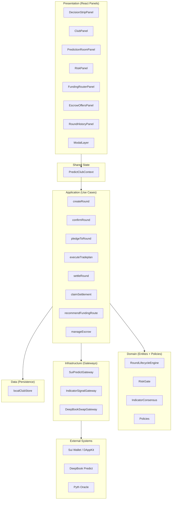
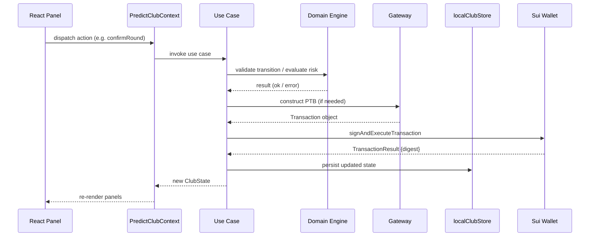
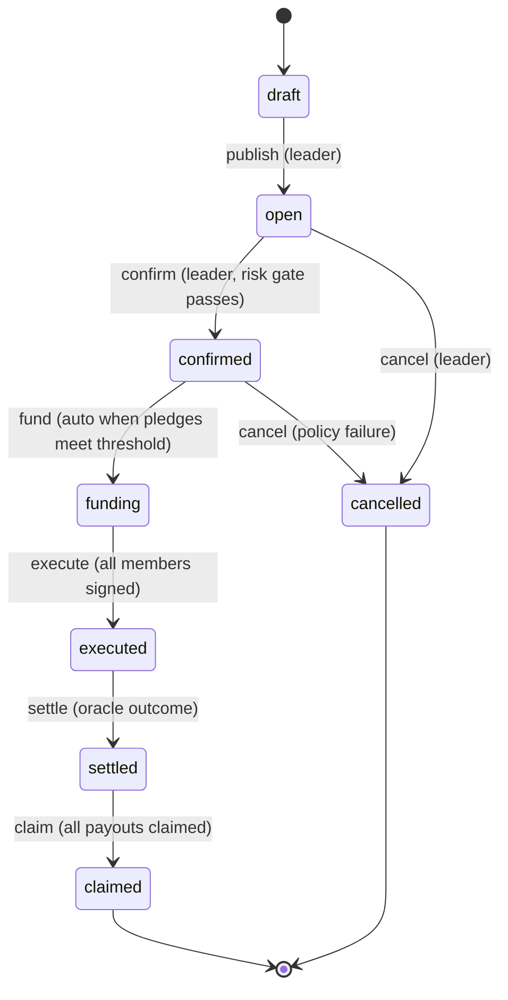

# Design Document: Predict Club V1

## Overview

Predict Club V1 is a non-custodial community trading cockpit built as a Vite + React plugin for DeepBook Predict on Sui Testnet. It enables a leader to create prediction rounds, members to pledge and self-sign trades via their own PredictManager, and coordinates the full lifecycle from draft through settlement with indicator consensus, risk gating, and a multi-path funding router with P2P escrow.

The system follows clean architecture: domain entities and policies are pure (no I/O), application use cases orchestrate workflows, infrastructure gateways handle Sui PTB construction and indicator feeds, and the data layer persists to localStorage with a versioned schema. The React presentation layer consumes shared state via `PredictClubContext` and mounts individual panels into HTML slot containers via the plugin architecture.

**Key Design Decisions:**
- V1 is self-sign only — no custody of member funds
- localStorage persistence with versioned JSON schema (migration-ready)
- State machine enforces round lifecycle transitions with explicit guards
- PTB construction happens in infrastructure gateways; wallet signing is delegated to `SuiHostAPI.signAndExecuteTransaction`
- Funding Router is a pure function recommending routes based on wallet balances
- P2P Escrow is modeled as local state in V1 (on-chain escrow deferred to V2 Move contract)

## Architecture



### Layer Responsibilities

| Layer | Responsibility | Dependencies |
|-------|---------------|--------------|
| **Domain** | Entities, value objects, state machine, policies, risk gate logic | None (pure) |
| **Application** | Use case orchestration, command validation, side-effect coordination | Domain |
| **Infrastructure** | PTB construction, indicator signal fetching, swap routing | Domain types, Sui SDK |
| **Data** | localStorage read/write, schema versioning, migration | Domain types |
| **Presentation** | React panels, context provider, modal orchestration | Application, Data |

### Data Flow



## Components and Interfaces

### Domain Layer

#### RoundLifecycleEngine

Enforces the state machine for round status transitions.

```typescript
// plugins/predict-club/domain/roundLifecycle.ts

interface TransitionResult {
  ok: boolean
  newStatus?: RoundStatus
  error?: string
}

interface RoundLifecycleEngine {
  /** Attempt a status transition. Returns new status or error. */
  transition(current: RoundStatus, event: LifecycleEvent): TransitionResult
  /** Get valid next events for a given status. */
  validEvents(status: RoundStatus): LifecycleEvent[]
}

type LifecycleEvent =
  | 'publish'       // draft → open
  | 'confirm'       // open → confirmed
  | 'fund'          // confirmed → funding
  | 'execute'       // funding → executed (all members signed)
  | 'settle'        // executed → settled
  | 'claim'         // settled → claimed
  | 'cancel'        // open|confirmed → cancelled
```

#### RiskGate

Evaluates pre-execution conditions and returns a composite risk assessment.

```typescript
// plugins/predict-club/domain/riskGate.ts

interface RiskCheck {
  id: string
  label: string
  passed: boolean
  severity: 'blocking' | 'warning'
  message?: string
}

interface RiskEvaluation {
  state: RiskState       // 'ready' | 'warning' | 'blocked'
  checks: RiskCheck[]
  canExecute: boolean
}

interface RiskGateInput {
  oracleLastUpdate: number
  oracleStaleThresholdMs: number
  expiryMinutes: number
  minSafeExpiryMinutes: number
  memberDusdc: number
  suggestedDusdc: number
  signalBias: SignalBias
  indicators: IndicatorSignal[]
}

function evaluateRiskGate(input: RiskGateInput): RiskEvaluation
```

#### IndicatorConsensus

Computes signal bias from a set of indicator signals.

```typescript
// plugins/predict-club/domain/indicatorConsensus.ts

interface ConsensusResult {
  bias: SignalBias
  confidence: 'Low' | 'Medium' | 'High'
  bullishCount: number
  bearishCount: number
  neutralCount: number
  blockedCount: number
}

function computeConsensus(indicators: IndicatorSignal[]): ConsensusResult
```

#### Policies

Pure validation functions for domain rules.

```typescript
// plugins/predict-club/domain/policies.ts

function validateRoundParams(params: CreateRoundParams): ValidationResult
function canMemberPledge(round: PredictionRound, memberState: MemberRoundState): boolean
function canMemberAccept(round: PredictionRound, memberState: MemberRoundState): boolean
function isOracleStale(lastUpdateMs: number, thresholdMs: number): boolean
function isExpirySafe(expiryMinutes: number, minSafe: number): boolean
```

### Application Layer (Use Cases)

Each use case is a pure function that takes inputs, validates via domain, and returns either a new state or an error.

```typescript
// plugins/predict-club/application/createRound.ts
interface CreateRoundParams {
  oracle: string
  market: string
  expiryMinutes: number
  direction: Direction
  strike: number
  lowerStrike?: number   // required when direction === 'RANGE'
  upperStrike?: number   // required when direction === 'RANGE'
  suggestedDusdc: number
  thesis: string
  indicators: IndicatorSignal[]
}

interface CreateRoundResult {
  ok: boolean
  round?: PredictionRound
  error?: string
}

function createRound(club: ClubState, params: CreateRoundParams, creatorId: string): CreateRoundResult
```

```typescript
// plugins/predict-club/application/confirmRound.ts
interface ConfirmRoundResult {
  ok: boolean
  club?: ClubState
  error?: string
}

function confirmRound(club: ClubState, riskInput: RiskGateInput): ConfirmRoundResult
```

```typescript
// plugins/predict-club/application/pledgeToRound.ts
interface PledgeParams {
  memberId: string
  amountDusdc: number
  walletBalance: number
}

function pledgeToRound(club: ClubState, params: PledgeParams): { ok: boolean; club?: ClubState; error?: string }
```

```typescript
// plugins/predict-club/application/executeTradeplan.ts
interface TradePlan {
  direction: Direction
  strike: number
  lowerStrike?: number
  upperStrike?: number
  amountDusdc: number
  oracle: string
  expiryMinutes: number
  predictManagerAddress: string
}

interface ExecuteResult {
  ok: boolean
  digest?: string
  club?: ClubState
  error?: string
}

// This use case coordinates: risk gate → PTB construction → wallet sign → state update
function executeTradeplan(
  club: ClubState,
  memberId: string,
  plan: TradePlan,
  gateway: SuiPredictGateway,
  signer: (tx: Transaction) => Promise<TransactionResult>
): Promise<ExecuteResult>
```

```typescript
// plugins/predict-club/application/settleRound.ts
function settleRound(club: ClubState, outcome: SettlementOutcome): { ok: boolean; club?: ClubState }

// plugins/predict-club/application/claimSettlement.ts
function claimSettlement(
  club: ClubState,
  claimId: string,
  gateway: SuiPredictGateway,
  signer: (tx: Transaction) => Promise<TransactionResult>
): Promise<{ ok: boolean; digest?: string; club?: ClubState; error?: string }>
```

### Infrastructure Layer (Gateways)

#### SuiPredictGateway

Constructs PTBs for DeepBook Predict operations. Does NOT sign — returns a `Transaction` object.

```typescript
// plugins/predict-club/infrastructure/suiPredictGateway.ts
import { Transaction } from '@mysten/sui/transactions'

interface SuiPredictGateway {
  /** Build a mint PTB for a directional prediction (UP/DOWN) */
  buildMintTx(params: {
    predictManagerId: string
    direction: Direction
    strike: number
    amountDusdc: number
    oracleId: string
    expiry: number
  }): Transaction

  /** Build a mint_range PTB for a RANGE prediction */
  buildMintRangeTx(params: {
    predictManagerId: string
    lowerStrike: number
    upperStrike: number
    amountDusdc: number
    oracleId: string
    expiry: number
  }): Transaction

  /** Build a claim PTB for settled positions */
  buildClaimTx(params: {
    predictManagerId: string
    positionId: string
  }): Transaction

  /** Build a DeepBook SUI→USDC swap PTB */
  buildSwapSuiToUsdcTx(params: {
    amountSui: number
    minUsdcOut: number
    preserveGasSui: number
  }): Transaction
}
```

#### IndicatorSignalGateway

Fetches indicator signals. In V1, returns configurable/simulated data.

```typescript
// plugins/predict-club/infrastructure/indicatorSignalGateway.ts

interface IndicatorSignalGateway {
  /** Fetch current indicator signals for a market */
  fetchSignals(market: string): Promise<IndicatorSignal[]>
  /** Check oracle health */
  checkOracleHealth(oracleId: string): Promise<{ lastUpdateMs: number; isHealthy: boolean }>
}
```

### Presentation Layer (React Panels)

All panels consume state from `PredictClubContext`. The context provider orchestrates use case invocations and persists state changes.

```typescript
// Enhanced PredictClubContext dispatch interface
interface PredictClubActions {
  createRound: (params: CreateRoundParams) => CreateRoundResult
  confirmRound: () => ConfirmRoundResult
  pledgeToRound: (params: PledgeParams) => { ok: boolean; error?: string }
  executeTradeplan: (plan: TradePlan) => Promise<ExecuteResult>
  settleRound: (outcome: SettlementOutcome) => { ok: boolean }
  claimSettlement: (claimId: string) => Promise<{ ok: boolean; error?: string }>
  createEscrowOffer: (params: CreateEscrowParams) => { ok: boolean }
  fillEscrowOffer: (offerId: string, payment: number) => { ok: boolean }
  cancelEscrowOffer: (offerId: string) => { ok: boolean }
}
```

### Panel → Use Case Mapping

| Panel | Actions | Use Cases |
|-------|---------|-----------|
| DecisionStripPanel | Primary CTA | Routes to appropriate modal/action |
| ClubPanel | View members | Read-only from context |
| PredictionRoomPanel | View indicators | Read-only, computeConsensus |
| RiskPanel | View risk state | evaluateRiskGate |
| FundingRouterPanel | Select route | recommendFundingRoute |
| EscrowOffersPanel | Fill/create offer | manageEscrow |
| RoundHistoryPanel | View history | Read-only |
| ModalLayer | Execute workflows | createRound, confirmRound, executeTradeplan, claimSettlement |

## Data Models

### Core Domain Types (existing in types.ts)

The existing type definitions in `plugins/predict-club/domain/types.ts` cover the primary entities:

- `PredictionRound` — full round state including market, direction, strike, indicators, risk
- `ClubMember` — member identity, role, state within current round
- `IndicatorSignal` — individual technical indicator snapshot
- `EscrowOfferView` — P2P escrow offer display state
- `FundingCard` — funding route display state
- `HistoryRow` — archived round result
- `ClaimItem` — claimable settlement position
- `ClubState` — aggregate root for all state

### Extended Types for V1 Implementation

```typescript
// Additional types needed for use case implementation

/** Round creation parameters (input to createRound use case) */
interface CreateRoundParams {
  oracle: string
  market: string
  expiryMinutes: number
  direction: Direction
  strike: number
  lowerStrike?: number
  upperStrike?: number
  suggestedDusdc: number
  thesis: string
  indicators: IndicatorSignal[]
}

/** Settlement outcome from oracle */
interface SettlementOutcome {
  roundId: string
  result: 'won' | 'lost' | 'void'
  settledPrice: number
  settledAt: number
}

/** Escrow offer creation parameters */
interface CreateEscrowParams {
  offerAsset: 'DUSDC' | 'USDC'
  wantAsset: 'DUSDC' | 'USDC'
  offerAmount: number
  wantAmount: number
  expiryMinutes: number
  roundId?: string
}

/** Validation result returned by domain policies */
interface ValidationResult {
  valid: boolean
  errors: string[]
}

/** Round lifecycle state machine transition map */
const TRANSITION_MAP: Record<RoundStatus, Partial<Record<LifecycleEvent, RoundStatus>>> = {
  draft:     { publish: 'open' },
  open:      { confirm: 'confirmed', cancel: 'cancelled' },
  confirmed: { fund: 'funding', cancel: 'cancelled' },
  funding:   { execute: 'executed' },
  executed:  { settle: 'settled' },
  settled:   { claim: 'claimed' },
  claimed:   {},
  cancelled: {},
}
```

### localStorage Schema (Versioned)

```typescript
interface PersistedClubStateV1 {
  _version: 1
  _updatedAt: number
  club: ClubState
}

// Storage key: 'predict-club:v1'
// On load: validate _version field, migrate if needed, fallback to demo state on corruption
```

### State Machine Diagram




## Correctness Properties

*A property is a characteristic or behavior that should hold true across all valid executions of a system — essentially, a formal statement about what the system should do. Properties serve as the bridge between human-readable specifications and machine-verifiable correctness guarantees.*

### Property 1: Valid State Machine Transitions

*For any* valid `(currentStatus, event)` pair defined in the transition map, calling `transition(currentStatus, event)` SHALL produce `{ ok: true, newStatus }` where `newStatus` matches the expected target status in the map.

**Validates: Requirements 1.2, 1.3, 1.4, 1.5, 1.6, 1.7**

### Property 2: Invalid State Machine Transitions Rejected

*For any* `(currentStatus, event)` pair that is NOT defined as a valid transition in the map, calling `transition(currentStatus, event)` SHALL produce `{ ok: false }` and the current status SHALL remain unchanged.

**Validates: Requirements 1.8**

### Property 3: Round Creation Validation

*For any* `CreateRoundParams` where all required fields (oracle, expiry, direction, strike) are present and valid (and lowerStrike + upperStrike are present when direction is RANGE), `createRound` SHALL succeed with a round having status `draft`. *For any* params missing a required field or having direction RANGE without both strikes, `createRound` SHALL fail with a validation error.

**Validates: Requirements 2.1, 2.2, 2.3, 2.5**

### Property 4: Indicator Snapshot Preservation

*For any* set of `IndicatorSignal[]` provided at round publish time, the resulting round record SHALL contain an indicator snapshot that is deeply equal to the input signals — preserving each indicator's id, name, state, value, and confidence.

**Validates: Requirements 2.4, 6.1, 6.3**

### Property 5: Signal Bias Consensus

*For any* set of `IndicatorSignal[]`, the computed `SignalBias` SHALL be `no-trade` when the majority of indicators have state `blocked`, `bullish` when the majority have state `bullish`, `bearish` when the majority have state `bearish`, and `neutral` otherwise.

**Validates: Requirements 6.2, 6.5**

### Property 6: Risk Gate Evaluation

*For any* `RiskGateInput`, if the oracle age exceeds the staleness threshold OR the expiry is below the minimum safe window OR the signal bias is `no-trade`, the evaluation SHALL return `{ state: 'blocked', canExecute: false }`. *For any* input where all checks pass (oracle fresh, expiry safe, bias not no-trade, balance sufficient), the evaluation SHALL return `{ state: 'ready', canExecute: true }`.

**Validates: Requirements 3.3, 3.4, 7.2, 7.3, 7.4, 7.5, 7.6, 14.2, 14.3**

### Property 7: Pledge Validation

*For any* member attempting to pledge to a round: if the round status is not `open`, the pledge SHALL be rejected; if the pledge amount exceeds the member's wallet balance, the pledge SHALL be rejected; otherwise the member's state SHALL transition to `pledged` with the correct amount stored.

**Validates: Requirements 4.1, 4.4, 4.5**

### Property 8: Execution State Transition

*For any* member in `accepted` state: if the wallet signing succeeds (returns a valid digest), the member state SHALL become `executed` with the digest stored; if the wallet signing fails or is rejected, the member state SHALL remain `accepted`.

**Validates: Requirements 5.4, 5.5**

### Property 9: Funding Route Recommendation

*For any* `AssetBalances` and `PredictionRound`, the `recommendFundingRoute` function SHALL return: `ready-with-dusdc` when `dusdc >= suggestedDusdc`, `club-escrow-usdc-to-dusdc` when `usdc >= suggestedDusdc`, `deepbook-sui-to-usdc` when `sui > gasReserve`, and `bridge-assets-to-sui` (blocked) otherwise. The priority order SHALL be deterministic and follow this exact sequence.

**Validates: Requirements 9.1, 9.2, 9.3, 9.6**

### Property 10: Escrow Offer Creation

*For any* valid `CreateEscrowParams` (positive amounts, valid assets, future expiry), creating an offer SHALL produce an offer with status `open`, the correct maker, and all specified fields preserved.

**Validates: Requirements 10.1, 10.2**

### Property 11: Escrow Fill with Overpayment Handling

*For any* open escrow offer and any fill payment: if payment >= wantAmount, the fill SHALL succeed with the maker receiving exactly `wantAmount` and the filler receiving the `offerAmount`. If payment > wantAmount, the excess `(payment - wantAmount)` SHALL be returned to the filler.

**Validates: Requirements 10.3, 10.6**

### Property 12: Escrow Expiry

*For any* escrow offer whose expiry time has passed and whose status is still `open`, evaluating the offer SHALL transition its status to `expired`.

**Validates: Requirements 10.4**

### Property 13: Settlement Payout Computation

*For any* settled round with a known outcome (won/lost/void) and a set of member positions, the computed payouts SHALL sum to no more than the total pool, each winning member SHALL receive a positive payout proportional to their stake, and losing members SHALL receive zero.

**Validates: Requirements 11.2**

### Property 14: ClubState Serialization Round-Trip

*For any* valid `ClubState` object, serializing it to JSON (via `saveClubState`) and then deserializing it (via `loadClubState`) SHALL produce a deeply equivalent `ClubState` object.

**Validates: Requirements 13.1, 13.2, 13.4, 13.5**

### Property 15: Corrupted localStorage Graceful Fallback

*For any* string that is not valid JSON or that is valid JSON but missing required `ClubState` fields, calling `loadClubState` SHALL return a valid default `ClubState` without throwing an exception.

**Validates: Requirements 13.3**

## Error Handling

### Error Categories

| Category | Trigger | Response | Recovery |
|----------|---------|----------|----------|
| **Validation Error** | Invalid round params, missing fields, out-of-range values | Display field-level error messages in modal | User corrects input |
| **State Transition Error** | Invalid lifecycle event for current status | Toast notification + action remains disabled | Await valid state |
| **Risk Gate Block** | Stale oracle, unsafe expiry, insufficient funds, no-trade consensus | Disable execute button, show all blocking reasons | Resolve conditions or cancel |
| **Wallet Error** | Not connected, wrong network, user rejected tx, tx failed | Display specific error message, preserve member state | Reconnect / retry |
| **Persistence Error** | localStorage quota exceeded, serialization failure | Log error, show warning badge, continue with in-memory state | Manual export or clear old data |
| **Gateway Error** | PTB construction failure, invalid parameters | Display error with technical details for debugging | Retry or adjust parameters |

### Error Handling Strategy

```typescript
// All use cases return a discriminated result type
type UseCaseResult<T> =
  | { ok: true; data: T }
  | { ok: false; error: UseCaseError }

interface UseCaseError {
  code: string           // Machine-readable: 'INVALID_TRANSITION', 'RISK_BLOCKED', etc.
  message: string        // Human-readable message
  details?: string[]     // Additional context (e.g., list of validation errors)
  recoverable: boolean   // Whether the user can retry
}
```

### Error Propagation Flow

1. **Domain layer** throws no exceptions — returns `ValidationResult` or `TransitionResult` with error fields
2. **Application layer** catches gateway/wallet errors and wraps them in `UseCaseResult`
3. **Presentation layer** displays errors via toast notifications or inline messages based on `error.code`
4. **Critical errors** (localStorage corruption) trigger fallback to default state with a console warning

### Wallet Error Handling

```typescript
// Wallet errors are caught at the application layer
try {
  const result = await signer(transaction)
  // Success path: update member state to executed
} catch (error) {
  if (error.message?.includes('rejected')) {
    return { ok: false, error: { code: 'USER_REJECTED', message: 'Transaction cancelled by user', recoverable: true } }
  }
  if (error.message?.includes('failed')) {
    return { ok: false, error: { code: 'TX_FAILED', message: `Transaction failed: ${error.message}`, recoverable: true } }
  }
  return { ok: false, error: { code: 'WALLET_ERROR', message: error.message, recoverable: true } }
}
// Member state remains 'accepted' on any failure — never partially committed
```

## Testing Strategy

### Overview

The testing strategy uses a dual approach:
- **Property-based tests** verify universal correctness properties across randomized inputs (domain logic, state machine, pure functions)
- **Example-based unit tests** verify specific scenarios, edge cases, and integration points

### Property-Based Testing

**Library:** [fast-check](https://github.com/dubzzz/fast-check) (TypeScript PBT library)
**Runner:** Vitest
**Configuration:** Minimum 100 iterations per property test

Each property test references its design document property:

```typescript
// Tag format example:
// Feature: predict-club-v1, Property 1: Valid State Machine Transitions
```

**Property tests to implement:**

| Property | Target Module | Generator Strategy |
|----------|--------------|-------------------|
| 1: Valid transitions | `domain/roundLifecycle.ts` | Generate from valid entries in TRANSITION_MAP |
| 2: Invalid transitions | `domain/roundLifecycle.ts` | Generate (status, event) pairs NOT in TRANSITION_MAP |
| 3: Round creation | `application/createRound.ts` | Arbitrary CreateRoundParams with valid/invalid variants |
| 4: Indicator snapshot | `application/createRound.ts` | Arbitrary IndicatorSignal[] arrays |
| 5: Signal bias | `domain/indicatorConsensus.ts` | Arbitrary IndicatorSignal[] with varying state distributions |
| 6: Risk gate | `domain/riskGate.ts` | Arbitrary RiskGateInput with various threshold combinations |
| 7: Pledge validation | `application/pledgeToRound.ts` | Arbitrary amounts, balances, and round statuses |
| 8: Execution state | `application/executeTradeplan.ts` | Mock signer that randomly succeeds/fails |
| 9: Funding route | `application/recommendFundingRoute.ts` | Arbitrary AssetBalances and PredictionRound |
| 10: Escrow creation | `application/manageEscrow.ts` | Arbitrary CreateEscrowParams |
| 11: Escrow fill | `application/manageEscrow.ts` | Arbitrary offers + fill amounts (including overpayment) |
| 12: Escrow expiry | `application/manageEscrow.ts` | Arbitrary offers with past/future expiry times |
| 13: Settlement payout | `application/settleRound.ts` | Arbitrary outcomes + member position arrays |
| 14: Serialization round-trip | `data/localClubStore.ts` | Arbitrary valid ClubState objects |
| 15: Corrupted fallback | `data/localClubStore.ts` | Arbitrary non-JSON strings and malformed JSON |

### Example-Based Unit Tests

| Area | Test Focus | Count |
|------|-----------|-------|
| Risk gate edge cases | Exact threshold boundaries (60s oracle, min expiry) | 3-4 |
| Wallet integration | Connected/disconnected states, network mismatch | 3-4 |
| UI rendering | Panel renders correct data from context | 5-6 |
| PTB construction | Correct move calls for mint, mint_range, claim, swap | 4 |
| Mobile responsive | Tab navigation below 768px, desktop layout above | 2-3 |

### Integration Tests

| Scenario | What's Tested |
|----------|--------------|
| Full round lifecycle | Create → publish → pledge → confirm → execute → settle → claim |
| Funding router end-to-end | Balance check → route recommendation → PTB construction |
| Escrow fill flow | Create offer → fill → verify state updates |
| Wallet connect/disconnect | DAppKit integration, context propagation |

### Test File Structure

```
plugins/predict-club/
  __tests__/
    domain/
      roundLifecycle.property.test.ts
      riskGate.property.test.ts
      indicatorConsensus.property.test.ts
    application/
      createRound.property.test.ts
      pledgeToRound.property.test.ts
      executeTradeplan.property.test.ts
      recommendFundingRoute.property.test.ts
      manageEscrow.property.test.ts
      settleRound.property.test.ts
    data/
      localClubStore.property.test.ts
    infrastructure/
      suiPredictGateway.test.ts
    presentation/
      panels.test.tsx
    integration/
      roundLifecycle.integration.test.ts
```
