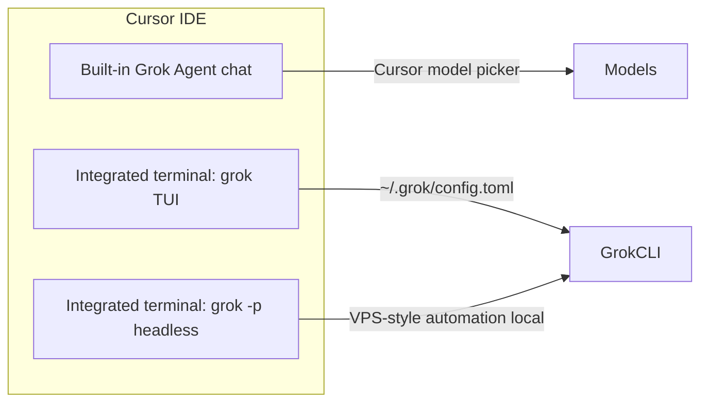

# Grok and Cursor IDE

Can you run Grok inside Cursor? **Yes**, in several ways. They are related but
not the same product surface.

## Three ways to use Grok with Cursor



| Mode | What it is | Config source |
| --- | --- | --- |
| **1. Cursor Agent (Grok)** | Chat panel in Cursor (Agent / Composer) | Cursor Settings → Models |
| **2. Grok TUI in terminal** | Full-screen `grok` inside Cursor terminal | `~/.grok/config.toml`, `.grok/` in repo |
| **3. Grok headless in terminal** | `grok -p "..."` scripts | Same as TUI + `-m` flag |

## 1. Built-in Grok in Cursor (this chat)

Cursor can host **Grok as a first-class agent** in the IDE chat UI. That is
separate from the Grok Build CLI binary.

**Pros:**

- Inline diff, file tree context, no terminal switching
- Same repo workspace Cursor already has open

**Cons:**

- Model default is controlled by **Cursor**, not `~/.grok/config.toml`
- Not the same session store as `~/.grok/sessions/`
- Cannot replace VPS headless automation by itself

**Set Composer 2.5:** use Cursor's model dropdown or Settings → Models. See
[MODEL-DEFAULT.md](./MODEL-DEFAULT.md#cursor-ide-built-in-grok-chat).

## 2. Grok Build CLI in Cursor terminal (recommended for parity with VPS)

Open Cursor's integrated terminal in your project folder and run:

```bash
grok
```

Grok detects **VS Code family** terminals (includes Cursor) and adjusts
shortcuts (for example interject via `Ctrl+L`, quit via `Ctrl+D`).

This uses:

- `AGENTS.md` / project rules
- `.agents/skills/` and `~/.grok/skills/`
- `[compat.cursor]` to reuse Cursor skills, rules, and MCP from `.cursor/`

Example compat block in `~/.grok/config.toml`:

```toml
[compat.cursor]
skills = true
rules = true
agents = true
mcps = true
hooks = true
```

Grok merges MCP from `.cursor/mcp.json` with `~/.grok/config.toml`. Run
`grok inspect` to see loaded servers.

## 3. Headless in Cursor terminal (local dry-run for VPS)

Test the same command your VPS worker will run:

```bash
grok -p "Read issue #1 and summarize" \
  -m grok-composer-2.5-fast \
  --cwd . \
  --yolo \
  --output-format json
```

Useful before deploying [TECHNICAL.md](./TECHNICAL.md) worker scripts.

## Cursor as full ACP host (external agent panel)

Grok supports **ACP (Agent Client Protocol)** for editors such as Zed, Neovim,
and Emacs via:

```bash
grok agent --model grok-composer-2.5-fast stdio
```

As of Grok Build docs, **Cursor is not listed** as a supported ACP client the way
Zed is. Cursor's primary Grok path is the **built-in agent**, not `grok agent
stdio` wired into a side panel.

Practical split:

| Goal | Use |
| --- | --- |
| Daily coding in IDE | Cursor built-in Grok **or** `grok` in terminal |
| Match VPS automation locally | `grok -p` in terminal |
| 24/7 GitHub worker | VPS + headless (not Cursor) |
| Zed-style external ACP agent | Zed + `grok agent stdio` |

## Shared context between Cursor and Grok CLI

| Asset | Shared? |
| --- | --- |
| Repo files, `AGENTS.md` | Yes |
| `.cursor/rules/`, `.cursor/skills/` | Yes (via `[compat.cursor]`) |
| `.cursor/mcp.json` | Yes (merged into Grok) |
| Chat history (Cursor ↔ Grok CLI) | **No** |
| `~/.grok/sessions/` | Grok CLI only |
| Cursor composer threads | Cursor only |

To carry decisions across environments, write them to git docs (this folder) or
`docs/agents/SESSION-CONTEXT.md`.

## Suggested workflow for this repo

1. **Cursor Grok chat:** planning, review, quick questions
2. **Terminal `grok`:** multi-file edits with full Grok TUI and skills
3. **VPS headless:** labeled GitHub issues → PR when you are offline

Align models:

- Cursor UI: Composer 2.5
- `~/.grok/config.toml`: `default = "grok-composer-2.5-fast"`
- VPS worker: `-m grok-composer-2.5-fast`

## Quick answers

| Question | Answer |
| --- | --- |
| Chạy Grok trên Cursor được không? | Có: built-in agent, terminal TUI, hoặc `grok -p` |
| Cùng config với VPS? | Terminal và VPS dùng `~/.grok/config.toml`; Cursor chat dùng Cursor settings |
| Cursor thay VPS 24/7? | Không. Cursor cần máy bạn mở IDE |
| Dùng chung session chat? | Không giữa Cursor panel và Grok CLI |

## Related

- [README.md](./README.md)
- [MODEL-DEFAULT.md](./MODEL-DEFAULT.md)
- [TECHNICAL.md](./TECHNICAL.md)
- Local: `~/.grok/docs/user-guide/15-agent-mode.md`
- Local: `~/.grok/docs/user-guide/05-configuration.md` (Harness compatibility)