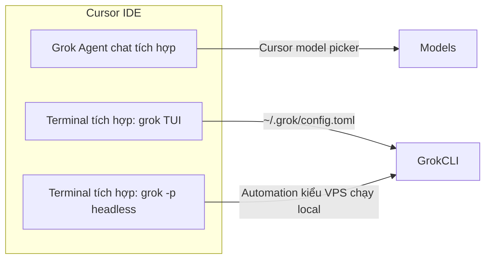

# Grok và Cursor IDE

Có chạy Grok trong Cursor được không? **Có**, theo nhiều cách. Chúng liên quan
nhưng không phải cùng một giao diện.

## Ba cách dùng Grok với Cursor



| Cách | Là gì | Nguồn cấu hình |
| --- | --- | --- |
| **1. Cursor Agent (Grok)** | Panel chat trong Cursor (Agent / Composer) | Cursor Settings → Models |
| **2. Grok TUI trong terminal** | `grok` full-screen trong terminal Cursor | `~/.grok/config.toml`, `.grok/` trong repo |
| **3. Grok headless trong terminal** | Script `grok -p "..."` | Giống TUI + flag `-m` |

## 1. Grok tích hợp sẵn trong Cursor (chat này)

Cursor có thể host **Grok như agent first-class** trong UI chat. Đây là luồng
**khác** binary Grok Build CLI.

**Ưu điểm:**

- Diff inline, context file tree, không đổi sang terminal
- Cùng workspace repo Cursor đang mở

**Hạn chế:**

- Model mặc định do **Cursor** quản lý, không đọc `~/.grok/config.toml`
- Không dùng chung session store `~/.grok/sessions/`
- Không thay thế automation headless 24/7 trên VPS

**Đặt Composer 2.5:** dropdown model trong Cursor hoặc Settings → Models. Xem
[MODEL-DEFAULT.vi.md](./MODEL-DEFAULT.vi.md#grok-chat-tích-hợp-trong-cursor-ide).

## 2. Grok Build CLI trong terminal Cursor (khuyên dùng để đồng bộ với VPS)

Mở terminal tích hợp của Cursor tại thư mục project và chạy:

```bash
grok
```

Grok nhận diện terminal **VS Code family** (gồm Cursor) và điều chỉnh phím tắt
(ví dụ interject bằng `Ctrl+L`, thoát bằng `Ctrl+D`).

Luồng này dùng:

- `AGENTS.md` / project rules
- `.agents/skills/` và `~/.grok/skills/`
- `[compat.cursor]` để tái sử dụng skill, rule, MCP từ `.cursor/`

Ví dụ trong `~/.grok/config.toml`:

```toml
[compat.cursor]
skills = true
rules = true
agents = true
mcps = true
hooks = true
```

Grok merge MCP từ `.cursor/mcp.json` với `~/.grok/config.toml`. Chạy
`grok inspect` để xem server đã nạp.

## 3. Headless trong terminal Cursor (dry-run trước khi lên VPS)

Thử lệnh worker sẽ chạy trên VPS:

```bash
grok -p "Đọc issue #1 và tóm tắt" \
  -m grok-composer-2.5-fast \
  --cwd . \
  --yolo \
  --output-format json
```

Hữu ích trước khi deploy script trong [TECHNICAL.vi.md](./TECHNICAL.vi.md).

## Cursor làm ACP host đầy đủ (external agent panel)

Grok hỗ trợ **ACP (Agent Client Protocol)** cho editor như Zed, Neovim, Emacs:

```bash
grok agent --model grok-composer-2.5-fast stdio
```

Theo tài liệu Grok Build hiện tại, **Cursor chưa được liệt kê** như ACP client
đầy đủ kiểu Zed. Đường Grok chính trên Cursor là **agent tích hợp**, không phải
`grok agent stdio` gắn vào side panel.

Tóm tắt thực tế:

| Mục tiêu | Dùng |
| --- | --- |
| Code hàng ngày trong IDE | Grok tích hợp Cursor **hoặc** `grok` trong terminal |
| Giống automation VPS khi dev | `grok -p` trong terminal |
| Worker GitHub 24/7 | VPS + headless (không phải Cursor) |
| External agent kiểu Zed | Zed + `grok agent stdio` |

## Context dùng chung giữa Cursor và Grok CLI

| Tài sản | Chia sẻ? |
| --- | --- |
| File repo, `AGENTS.md` | Có |
| `.cursor/rules/`, `.cursor/skills/` | Có (qua `[compat.cursor]`) |
| `.cursor/mcp.json` | Có (merge vào Grok) |
| Lịch sử chat (Cursor ↔ Grok CLI) | **Không** |
| `~/.grok/sessions/` | Chỉ Grok CLI |
| Thread Composer Cursor | Chỉ Cursor |

Để mang quyết định sang môi trường khác, ghi vào docs git (thư mục này) hoặc
`docs/agents/SESSION-CONTEXT.md`.

## Workflow gợi ý cho repo này

1. **Cursor Grok chat:** lên kế hoạch, review, hỏi nhanh
2. **Terminal `grok`:** sửa nhiều file với TUI đầy đủ và skills
3. **VPS headless:** issue có label trên GitHub → PR khi bạn offline

Đồng bộ model:

- UI Cursor: Composer 2.5
- `~/.grok/config.toml`: `default = "grok-composer-2.5-fast"`
- Worker VPS: `-m grok-composer-2.5-fast`

## Trả lời nhanh

| Câu hỏi | Trả lời |
| --- | --- |
| Chạy Grok trên Cursor được không? | Có: agent tích hợp, TUI terminal, hoặc `grok -p` |
| Cùng config với VPS? | Terminal và VPS dùng `~/.grok/config.toml`; chat Cursor dùng settings Cursor |
| Cursor thay VPS 24/7? | Không. Cursor cần máy bạn mở IDE |
| Dùng chung session chat? | Không giữa panel Cursor và Grok CLI |

## Liên quan

- [README.vi.md](./README.vi.md)
- [MODEL-DEFAULT.vi.md](./MODEL-DEFAULT.vi.md)
- [TECHNICAL.vi.md](./TECHNICAL.vi.md)
- Local: `~/.grok/docs/user-guide/15-agent-mode.md`
- Local: `~/.grok/docs/user-guide/05-configuration.md` (Harness compatibility)