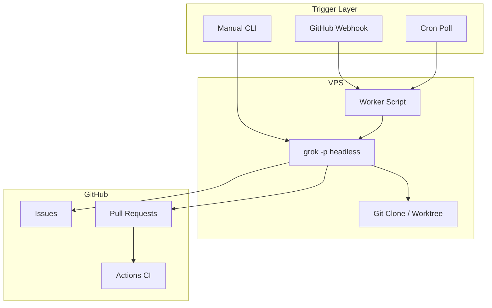

# Grok VPS + GitHub: Technical Reference

Detailed setup for running Grok Build CLI on a Linux VPS, connecting to GitHub,
and automating issue-to-PR workflows.

## 1. Mental Model

Grok Build is an **agentic CLI**. Each invocation:

1. Loads project context (`AGENTS.md`, skills, `.grok/config.toml`, git root)
2. Calls the xAI model with tool access (shell, file edit, MCP, web)
3. Exits when the turn completes (headless) or waits for user input (TUI)

There is **no built-in 24/7 service**. Production automation wraps repeated
headless calls:

| Layer | Role |
| --- | --- |
| Trigger | GitHub webhook, cron, or manual `grok -p` |
| Worker | Shell script that picks work, sets env, calls Grok |
| Agent | `grok -p` with `--yolo`, `--cwd`, optional `--resume` |
| GitHub | `gh` CLI or GitHub MCP for issues and PRs |
| Guardrails | Branch policy, CI, human review, permission rules |



## 2. VPS Requirements

| Resource | Minimum | Notes |
| --- | --- | --- |
| OS | Ubuntu 22.04+ / Debian 12+ | Any Linux with bash works |
| CPU | 2 vCPU | Builds and tests can be heavy |
| RAM | 4 GB | 8 GB if running browser MCP or large monorepos |
| Disk | 20 GB+ | Repo clones, `node_modules`, Grok sessions |
| Network | Outbound HTTPS | xAI API, GitHub, npm, package registries |

Software:

```bash
sudo apt update
sudo apt install -y git curl jq build-essential

# Node 20+ (example via NodeSource or nvm)
# GitHub CLI
sudo apt install -y gh

# Grok Build CLI
curl -fsSL https://x.ai/cli/install.sh | bash
```

Create a dedicated user (do not run the agent as root):

```bash
sudo useradd -m -s /bin/bash grokagent
sudo -u grokagent -H bash -lc 'mkdir -p ~/.grok ~/work'
```

## 3. Authentication

### 3.1 xAI (Grok)

For VPS without a browser, prefer an API key:

```bash
# /etc/grok-agent/env (mode 600, owned by grokagent)
export XAI_API_KEY="xai-..."
export GROK_DISABLE_AUTOUPDATER=1
```

Alternative: device code flow on first setup:

```bash
grok login --device-auth
```

Credentials cache: `~/.grok/auth.json`. Session transcripts:
`~/.grok/sessions/`.

### 3.2 GitHub

**Option A: `gh` CLI (recommended for workers)**

```bash
export GH_TOKEN="github_pat_..."
gh auth status
```

**Option B: GitHub MCP (recommended for rich agent tool use)**

See section 5. Token needs at least: `contents`, `issues`, `pull_requests`
(read/write as appropriate).

**Option C: GitHub App**

Better for org repos: install app, use installation token in worker. Rotate
credentials without sharing a user PAT.

## 4. Headless Mode

Non-interactive entry point:

```bash
grok -p "Your task" \
  --cwd /opt/repos/my-app \
  --yolo \
  --output-format json \
  --max-turns 50
```

### Important flags

| Flag | Purpose |
| --- | --- |
| `-p, --single` | Prompt (starts headless mode) |
| `--yolo` | Auto-approve tool calls (required for unattended runs) |
| `--cwd` | Working directory (scopes `AGENTS.md` and git root) |
| `--output-format json` | Machine-readable result + `sessionId` |
| `--resume <id>` | Continue a prior session |
| `--max-turns N` | Cap agent loops (cost and runaway guard) |
| `--allow / --deny` | Permission rules for Bash, Edit, Write, etc. |
| `--disallowed-tools` | Remove tools (for example `web_fetch`) |
| `--worktree [name]` | Isolate changes in a git worktree |
| `--no-auto-update` | Skip updater on servers |

Example with guardrails:

```bash
grok -p "Fix issue #42" \
  --cwd /opt/repos/my-app \
  --yolo \
  --max-turns 40 \
  --allow "Bash(git *)" \
  --allow "Bash(gh *)" \
  --allow "Bash(bun *)" \
  --deny "Bash(git push origin main*)" \
  --deny "Bash(git push origin master*)" \
  --output-format json
```

Exit codes: `0` success, `1` error, `130` SIGINT, `143` SIGTERM.

Environment variables:

| Variable | Description |
| --- | --- |
| `XAI_API_KEY` | API key when no browser session |
| `GROK_HOME` | Override config dir (default `~/.grok`) |
| `GROK_DISABLE_AUTOUPDATER=1` | Disable auto-update on servers |
| `RUST_LOG=debug` | Debug logging to stderr |

## 5. GitHub MCP Configuration

Add to `~/.grok/config.toml` (or repo `.grok/config.toml`):

```toml
[mcp_servers.github]
command = "npx"
args = ["-y", "@modelcontextprotocol/server-github"]
env = { GITHUB_PERSONAL_ACCESS_TOKEN = "${GITHUB_PERSONAL_ACCESS_TOKEN}" }
enabled = true
startup_timeout_sec = 30
```

MCP tool names are prefixed: `github__create_issue`, `github__list_pull_requests`,
`github__search_code`, etc.

Verify:

```bash
grok mcp doctor github
```

For headless workers that only use `gh`, MCP is optional but helps the agent
discover issue bodies, comments, and file paths without brittle shell parsing.

## 6. Worker Script Pattern

### 6.1 Cron poll worker

`/opt/grok-agent/bin/grok-issue-worker.sh`:

```bash
#!/usr/bin/env bash
set -euo pipefail

source /etc/grok-agent/env

REPO_DIR="/opt/repos/my-app"
REPO="owner/my-app"
LABEL="agent"
LOCK="/tmp/grok-issue-worker.lock"

exec 9>"$LOCK"
flock -n 9 || exit 0

cd "$REPO_DIR"
git fetch origin

ISSUE_JSON=$(gh issue list \
  --repo "$REPO" \
  --label "$LABEL" \
  --state open \
  --limit 1 \
  --json number,title,body)

ISSUE_NUM=$(echo "$ISSUE_JSON" | jq -r '.[0].number // empty')
[ -z "$ISSUE_NUM" ] && exit 0

BRANCH="agent/issue-${ISSUE_NUM}"
git checkout -B "$BRANCH" origin/main

PROMPT=$(cat <<EOF
You are working on GitHub issue #${ISSUE_NUM} in ${REPO}.

Steps:
1. Read the issue with gh issue view ${ISSUE_NUM}
2. Implement the smallest correct fix
3. Run: bun run test:unit (fix failures if any)
4. Commit with message: fix: resolve #${ISSUE_NUM} <short summary>
5. Push branch ${BRANCH} and open a PR with gh pr create
6. Comment on the issue with the PR link
7. Do not push to main

Issue context:
$(echo "$ISSUE_JSON" | jq -r '.[0].body // ""')
EOF
)

RESULT=$(grok -p "$PROMPT" \
  --cwd "$REPO_DIR" \
  --yolo \
  --max-turns 50 \
  --output-format json)

echo "$RESULT" | jq -r '.text // .message // .' >> /var/log/grok-agent/run.log

# Optional: remove label so the same issue is not picked again
gh issue edit "$ISSUE_NUM" --repo "$REPO" --remove-label "$LABEL"
```

Cron (every 10 minutes):

```cron
*/10 * * * * grokagent /opt/grok-agent/bin/grok-issue-worker.sh >> /var/log/grok-agent/cron.log 2>&1
```

### 6.2 Systemd service (webhook-triggered)

`/etc/systemd/system/grok-issue@.service`:

```ini
[Unit]
Description=Grok agent for GitHub issue %i
After=network-online.target

[Service]
Type=oneshot
User=grokagent
EnvironmentFile=/etc/grok-agent/env
ExecStart=/opt/grok-agent/bin/grok-run-issue.sh %i
WorkingDirectory=/opt/repos/my-app
StandardOutput=append:/var/log/grok-agent/issue-%i.log
StandardError=append:/var/log/grok-agent/issue-%i.log

[Install]
WantedBy=multi-user.target
```

Trigger from a webhook receiver:

```bash
sudo systemctl start grok-issue@42
```

### 6.3 Webhook listener (sketch)

Use a small HTTP server (Node, Python, or `webhook` from adnanh) that:

1. Verifies `X-Hub-Signature-256` with `GITHUB_WEBHOOK_SECRET`
2. Accepts `issues` events (`opened`, `labeled`)
3. Starts systemd unit or enqueues issue number

Do not expose Grok directly to the internet. Only the webhook endpoint should
be public, behind TLS and IP allowlisting if possible.

## 7. Repo Conventions for Agents

Point `--cwd` at the repository root (or subproject in a monorepo). Grok walks
up to find `.git` and loads:

- `AGENTS.md` / `CLAUDE.md` project rules
- `.agents/skills/` and `~/.grok/skills/`
- `.grok/config.toml` MCP and permissions

For this profile repo, agents should also read:

- `docs/HARNESS.md`
- `docs/CONTEXT_RULES.md`
- `docs/FEATURE_INTAKE.md` for risk classification

Include in the worker prompt when automating here:

```text
Follow AGENTS.md. Bump package.json patch/minor before commit.
Use Conventional Commits. Never push to main.
```

## 8. Security Checklist

| Risk | Mitigation |
| --- | --- |
| Arbitrary shell | `--allow` / `--deny`, dedicated Unix user, no sudo |
| Push to main | Deny `git push origin main`, branch protection on GitHub |
| Secret leak | Never pass secrets in prompts; use env files mode 600 |
| Token scope | Fine-grained PAT limited to one repo |
| Webhook forgery | HMAC signature verification |
| Runaway cost | `--max-turns`, issue labels, concurrency lock (`flock`) |
| Supply chain | Pin `gh`, Node, Grok versions; review agent diffs in PR |

Treat `--yolo` as **full autonomy** inside the allow rules. Always require CI +
human review before merge.

## 9. Operations

### Logging

```bash
export GROK_LOG_FILE=/var/log/grok-agent/grok.jsonl
export RUST_LOG=info
```

MCP stderr: `~/.grok/logs/mcp/github.stderr.log`

### Concurrency

Use `flock` or a queue so two issues do not write the same worktree. Prefer
`grok --worktree` for parallel tasks on different issues.

### Resume after failure

```bash
# Prior run returned sessionId in JSON
grok -p "Continue: finish tests and open the PR" --resume "<sessionId>" --yolo
```

### Cost control

- Trigger on label or webhook, not tight polling
- Keep prompts scoped (one issue per run)
- Lower `--max-turns` for small fixes
- Disable web search if not needed: `--disable-web-search`

## 10. Comparison with Alternatives

| Approach | Control | Ops burden | Best for |
| --- | --- | --- | --- |
| Grok VPS + worker | High | You maintain VPS | Custom skills, private repos |
| GitHub Actions only | Medium | Low | CI checks, no interactive agent |
| Cursor Cloud Agents | Low | Vendor managed | GitHub-native, not Grok |
| Interactive TUI on VPS | High | tmux session | Debugging, not production scale |

## 11. Troubleshooting

| Symptom | Check |
| --- | --- |
| Auth failed | `echo $XAI_API_KEY`, `grok logout` then key-only auth |
| MCP github down | `grok mcp doctor github`, stderr log under `~/.grok/logs/mcp/` |
| Wrong repo root | Set `--cwd` to subfolder in monorepos |
| Empty PR | Prompt must include `gh pr create` and push steps |
| Slow startup | Large monorepo: narrow `--cwd` to subproject |
| Permission denied | GitHub token scopes, branch protection, `gh auth status` |

## 12. Validation Before Production

1. Dry run on a fork with a test issue
2. Confirm agent opens PR to a non-main branch
3. Confirm CI runs on the PR
4. Confirm issue receives a comment with PR link
5. Confirm failed runs do not loop (label removed or idempotency key)
6. Document rollback: close PR, revert branch, re-add label

## 13. File Layout (Suggested)

```text
/opt/grok-agent/
  bin/
    grok-issue-worker.sh
    grok-run-issue.sh
    webhook-receiver.sh
/etc/grok-agent/
  env                    # secrets, mode 600
/opt/repos/
  my-app/                # git clone
/var/log/grok-agent/
  cron.log
  run.log
~/.grok/
  config.toml            # MCP servers
  auth.json              # or XAI_API_KEY only
```

## 14. Related docs in this folder

- [CURSOR-IDE.md](./CURSOR-IDE.md): Grok inside Cursor IDE
- [MODEL-DEFAULT.md](./MODEL-DEFAULT.md): Composer 2.5 as default model
- [config.toml.example](./config.toml.example): starter config template

## 15. References

- [Grok Build CLI](https://x.ai/cli)
- [xAI Build overview](https://docs.x.ai/build/overview)
- Local after install: `~/.grok/docs/user-guide/14-headless-mode.md`
- Local: `~/.grok/docs/user-guide/07-mcp-servers.md`
- Local: `~/.grok/docs/user-guide/20-background-tasks.md`
- [Model Context Protocol servers](https://github.com/modelcontextprotocol/servers)
- [GitHub CLI manual](https://cli.github.com/manual/)