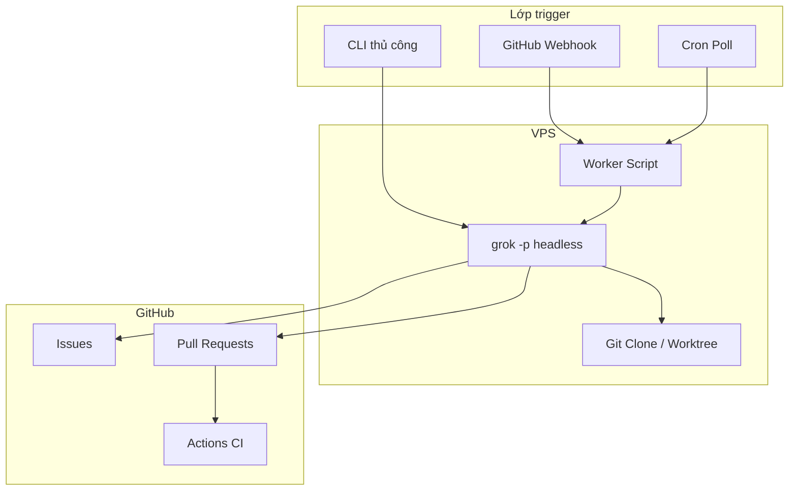

# Grok VPS + GitHub: Tài liệu kỹ thuật

Hướng dẫn chi tiết để chạy Grok Build CLI trên VPS Linux, kết nối GitHub, và
tự động hóa luồng issue → PR.

## 1. Mô hình tư duy

Grok Build là **CLI agentic**. Mỗi lần gọi:

1. Nạp ngữ cảnh dự án (`AGENTS.md`, skills, `.grok/config.toml`, git root)
2. Gọi model xAI kèm tool (shell, sửa file, MCP, web)
3. Thoát khi xong turn (headless) hoặc chờ input người dùng (TUI)

**Không có service 24/7 sẵn có**. Automation production bọc các lần gọi headless:

| Lớp | Vai trò |
| --- | --- |
| Trigger | GitHub webhook, cron, hoặc `grok -p` thủ công |
| Worker | Shell script chọn việc, set env, gọi Grok |
| Agent | `grok -p` với `--yolo`, `--cwd`, tùy chọn `--resume` |
| GitHub | `gh` CLI hoặc GitHub MCP cho issue và PR |
| Guardrails | Chính sách branch, CI, human review, permission rules |



## 2. Yêu cầu VPS

| Tài nguyên | Tối thiểu | Ghi chú |
| --- | --- | --- |
| OS | Ubuntu 22.04+ / Debian 12+ | Linux có bash là đủ |
| CPU | 2 vCPU | Build và test có thể nặng |
| RAM | 4 GB | 8 GB nếu dùng browser MCP hoặc monorepo lớn |
| Disk | 20 GB+ | Clone repo, `node_modules`, session Grok |
| Mạng | HTTPS ra ngoài | xAI API, GitHub, npm |

Phần mềm:

```bash
sudo apt update
sudo apt install -y git curl jq build-essential

# Node 20+ (NodeSource hoặc nvm)
# GitHub CLI
sudo apt install -y gh

# Grok Build CLI
curl -fsSL https://x.ai/cli/install.sh | bash
```

Tạo user riêng (không chạy agent bằng root):

```bash
sudo useradd -m -s /bin/bash grokagent
sudo -u grokagent -H bash -lc 'mkdir -p ~/.grok ~/work'
```

## 3. Xác thực

### 3.1 xAI (Grok)

VPS không có browser: dùng API key:

```bash
# /etc/grok-agent/env (mode 600, owner grokagent)
export XAI_API_KEY="xai-..."
export GROK_DISABLE_AUTOUPDATER=1
```

Hoặc device code lần đầu:

```bash
grok login --device-auth
```

Cache credential: `~/.grok/auth.json`. Transcript session:
`~/.grok/sessions/`.

### 3.2 GitHub

**Cách A: `gh` CLI (khuyên dùng cho worker)**

```bash
export GH_TOKEN="github_pat_..."
gh auth status
```

**Cách B: GitHub MCP (khuyên dùng cho agent dùng tool phong phú)**

Xem mục 5. Token cần ít nhất: `contents`, `issues`, `pull_requests`
(read/write tùy nhu cầu).

**Cách C: GitHub App**

Tốt cho org repo: cài app, dùng installation token trong worker. Xoay credential
không cần chia sẻ PAT cá nhân.

## 4. Headless mode

Điểm vào không tương tác:

```bash
grok -p "Nhiệm vụ của bạn" \
  --cwd /opt/repos/my-app \
  --yolo \
  --output-format json \
  --max-turns 50
```

### Flag quan trọng

| Flag | Mục đích |
| --- | --- |
| `-p, --single` | Prompt (bật headless) |
| `--yolo` | Tự duyệt tool call (bắt buộc khi chạy không giám sát) |
| `--cwd` | Thư mục làm việc (phạm vi `AGENTS.md` và git root) |
| `--output-format json` | Kết quả máy đọc được + `sessionId` |
| `--resume <id>` | Tiếp session trước |
| `--max-turns N` | Giới hạn vòng lặp agent (chi phí và chống chạy vô hạn) |
| `--allow / --deny` | Rule quyền cho Bash, Edit, Write, v.v. |
| `--disallowed-tools` | Gỡ tool (ví dụ `web_fetch`) |
| `--worktree [name]` | Cô lập thay đổi trong git worktree |
| `--no-auto-update` | Tắt updater trên server |

Ví dụ có guardrails:

```bash
grok -p "Sửa issue #42" \
  --cwd /opt/repos/my-app \
  --yolo \
  --max-turns 40 \
  --allow "Bash(git *)" \
  --allow "Bash(gh *)" \
  --allow "Bash(bun *)" \
  --deny "Bash(git push origin main*)" \
  --deny "Bash(git push origin master*)" \
  --output-format json
```

Exit code: `0` thành công, `1` lỗi, `130` SIGINT, `143` SIGTERM.

Biến môi trường:

| Biến | Mô tả |
| --- | --- |
| `XAI_API_KEY` | API key khi không có session browser |
| `GROK_HOME` | Ghi đè thư mục config (mặc định `~/.grok`) |
| `GROK_DISABLE_AUTOUPDATER=1` | Tắt auto-update trên server |
| `RUST_LOG=debug` | Log debug ra stderr |

## 5. Cấu hình GitHub MCP

Thêm vào `~/.grok/config.toml` (hoặc `.grok/config.toml` trong repo):

```toml
[mcp_servers.github]
command = "npx"
args = ["-y", "@modelcontextprotocol/server-github"]
env = { GITHUB_PERSONAL_ACCESS_TOKEN = "${GITHUB_PERSONAL_ACCESS_TOKEN}" }
enabled = true
startup_timeout_sec = 30
```

Tên tool MCP có prefix: `github__create_issue`, `github__list_pull_requests`,
`github__search_code`, v.v.

Kiểm tra:

```bash
grok mcp doctor github
```

Worker headless chỉ dùng `gh` thì MCP là tùy chọn, nhưng MCP giúp agent đọc
issue, comment, và đường dẫn file mà không cần parse shell mong manh.

## 6. Mẫu worker script

### 6.1 Worker poll cron

`/opt/grok-agent/bin/grok-issue-worker.sh`:

```bash
#!/usr/bin/env bash
set -euo pipefail

source /etc/grok-agent/env

REPO_DIR="/opt/repos/my-app"
REPO="owner/my-app"
LABEL="agent"
LOCK="/tmp/grok-issue-worker.lock"

exec 9>"$LOCK"
flock -n 9 || exit 0

cd "$REPO_DIR"
git fetch origin

ISSUE_JSON=$(gh issue list \
  --repo "$REPO" \
  --label "$LABEL" \
  --state open \
  --limit 1 \
  --json number,title,body)

ISSUE_NUM=$(echo "$ISSUE_JSON" | jq -r '.[0].number // empty')
[ -z "$ISSUE_NUM" ] && exit 0

BRANCH="agent/issue-${ISSUE_NUM}"
git checkout -B "$BRANCH" origin/main

PROMPT=$(cat <<EOF
Bạn đang làm GitHub issue #${ISSUE_NUM} trong ${REPO}.

Các bước:
1. Đọc issue bằng gh issue view ${ISSUE_NUM}
2. Implement fix nhỏ nhất đúng yêu cầu
3. Chạy: bun run test:unit (sửa nếu fail)
4. Commit: fix: resolve #${ISSUE_NUM} <tóm tắt ngắn>
5. Push branch ${BRANCH} và mở PR bằng gh pr create
6. Comment trên issue kèm link PR
7. Không push lên main

Ngữ cảnh issue:
$(echo "$ISSUE_JSON" | jq -r '.[0].body // ""')
EOF
)

RESULT=$(grok -p "$PROMPT" \
  --cwd "$REPO_DIR" \
  --yolo \
  --max-turns 50 \
  --output-format json)

echo "$RESULT" | jq -r '.text // .message // .' >> /var/log/grok-agent/run.log

# Tùy chọn: gỡ label để không pick lại cùng issue
gh issue edit "$ISSUE_NUM" --repo "$REPO" --remove-label "$LABEL"
```

Cron (mỗi 10 phút):

```cron
*/10 * * * * grokagent /opt/grok-agent/bin/grok-issue-worker.sh >> /var/log/grok-agent/cron.log 2>&1
```

### 6.2 Systemd service (kích hoạt bởi webhook)

`/etc/systemd/system/grok-issue@.service`:

```ini
[Unit]
Description=Grok agent for GitHub issue %i
After=network-online.target

[Service]
Type=oneshot
User=grokagent
EnvironmentFile=/etc/grok-agent/env
ExecStart=/opt/grok-agent/bin/grok-run-issue.sh %i
WorkingDirectory=/opt/repos/my-app
StandardOutput=append:/var/log/grok-agent/issue-%i.log
StandardError=append:/var/log/grok-agent/issue-%i.log

[Install]
WantedBy=multi-user.target
```

Kích hoạt từ webhook receiver:

```bash
sudo systemctl start grok-issue@42
```

### 6.3 Webhook listener (phác thảo)

Dùng HTTP server nhỏ (Node, Python, hoặc `webhook` của adnanh):

1. Xác minh `X-Hub-Signature-256` với `GITHUB_WEBHOOK_SECRET`
2. Nhận event `issues` (`opened`, `labeled`)
3. Start systemd unit hoặc enqueue số issue

Không expose Grok trực tiếp ra internet. Chỉ endpoint webhook public, có TLS
và allowlist IP nếu có thể.

## 7. Convention repo cho agent

Đặt `--cwd` tại root repo (hoặc subproject trong monorepo). Grok đi lên để tìm
`.git` và nạp:

- `AGENTS.md` / `CLAUDE.md`
- `.agents/skills/` và `~/.grok/skills/`
- `.grok/config.toml` cho MCP và permission

Với repo profile này, agent nên đọc thêm:

- `docs/HARNESS.md`
- `docs/CONTEXT_RULES.md`
- `docs/FEATURE_INTAKE.md` để phân loại rủi ro

Gợi ý chèn vào prompt worker khi automate repo này:

```text
Tuân theo AGENTS.md. Bump package.json patch/minor trước commit.
Dùng Conventional Commits. Không push lên main.
```

## 8. Checklist bảo mật

| Rủi ro | Giảm thiểu |
| --- | --- |
| Shell tùy ý | `--allow` / `--deny`, user Unix riêng, không sudo |
| Push main | Deny `git push origin main`, branch protection trên GitHub |
| Lộ secret | Không đưa secret vào prompt; env file mode 600 |
| Phạm vi token | Fine-grained PAT giới hạn một repo |
| Giả mạo webhook | Xác minh chữ ký HMAC |
| Chi phí vô hạn | `--max-turns`, label issue, lock đồng thời (`flock`) |
| Supply chain | Pin phiên bản `gh`, Node, Grok; review diff agent trong PR |

Coi `--yolo` là **toàn quyền** trong phạm vi allow rules. Luôn bắt buộc CI +
human review trước merge.

## 9. Vận hành

### Logging

```bash
export GROK_LOG_FILE=/var/log/grok-agent/grok.jsonl
export RUST_LOG=info
```

MCP stderr: `~/.grok/logs/mcp/github.stderr.log`

### Đồng thời

Dùng `flock` hoặc hàng đợi để hai issue không ghi cùng worktree. Ưu tiên
`grok --worktree` khi chạy song song nhiều issue.

### Resume sau lỗi

```bash
# Lần chạy trước trả sessionId trong JSON
grok -p "Tiếp tục: chạy test và mở PR" --resume "<sessionId>" --yolo
```

### Kiểm soát chi phí

- Trigger theo label hoặc webhook, không poll dày
- Prompt gọn (một issue mỗi lần chạy)
- Hạ `--max-turns` cho fix nhỏ
- Tắt web search nếu không cần: `--disable-web-search`

## 10. So sánh phương án

| Phương án | Kiểm soát | Gánh vận hành | Phù hợp khi |
| --- | --- | --- | --- |
| Grok VPS + worker | Cao | Bạn maintain VPS | Skills tùy chỉnh, repo private |
| Chỉ GitHub Actions | Trung bình | Thấp | CI check, không agent tương tác |
| Cursor Cloud Agents | Thấp | Vendor quản lý | Gắn GitHub sẵn, không phải Grok |
| TUI trên VPS | Cao | Session tmux | Debug, không scale production |

## 11. Troubleshooting

| Triệu chứng | Kiểm tra |
| --- | --- |
| Auth failed | `echo $XAI_API_KEY`, `grok logout` rồi chỉ dùng key |
| MCP github down | `grok mcp doctor github`, log stderr `~/.grok/logs/mcp/` |
| Sai repo root | Set `--cwd` vào subfolder trong monorepo |
| PR rỗng | Prompt phải có bước `gh pr create` và push |
| Khởi động chậm | Monorepo lớn: thu hẹp `--cwd` |
| Permission denied | Scope token GitHub, branch protection, `gh auth status` |

## 12. Validation trước production

1. Dry run trên fork với issue thử
2. Xác nhận agent mở PR vào branch không phải main
3. Xác nhận CI chạy trên PR
4. Xác nhận issue có comment kèm link PR
5. Xác nhận lỗi không lặp vô hạn (gỡ label hoặc idempotency key)
6. Ghi rollback: đóng PR, revert branch, gắn lại label

## 13. Bố cục thư mục (gợi ý)

```text
/opt/grok-agent/
  bin/
    grok-issue-worker.sh
    grok-run-issue.sh
    webhook-receiver.sh
/etc/grok-agent/
  env                    # secret, mode 600
/opt/repos/
  my-app/                # git clone
/var/log/grok-agent/
  cron.log
  run.log
~/.grok/
  config.toml            # MCP servers
  auth.json              # hoặc chỉ XAI_API_KEY
```

## 14. Tài liệu liên quan trong thư mục này

- [CURSOR-IDE.vi.md](./CURSOR-IDE.vi.md): Grok trong Cursor IDE
- [MODEL-DEFAULT.vi.md](./MODEL-DEFAULT.vi.md): Composer 2.5 làm model mặc định
- [config.toml.example](./config.toml.example): mẫu config khởi đầu

## 15. Tham chiếu

- [Grok Build CLI](https://x.ai/cli)
- [xAI Build overview](https://docs.x.ai/build/overview)
- Sau khi cài: `~/.grok/docs/user-guide/14-headless-mode.md`
- `~/.grok/docs/user-guide/07-mcp-servers.md`
- `~/.grok/docs/user-guide/20-background-tasks.md`
- [Model Context Protocol servers](https://github.com/modelcontextprotocol/servers)
- [GitHub CLI manual](https://cli.github.com/manual/)