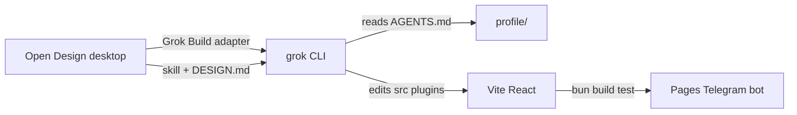

# Open Design + Grok Workflow (Profile Repo)

**Status:** Adopted practice (July 2026)  
**Companion:** [WORKFLOW.vi.md](./WORKFLOW.vi.md)  
**Upstream:** [Open Design Grok adapter](https://open-design.ai/agents/grok-design/)

## What this stack is

| Layer | Tool | Role in `profile` |
|-------|------|-------------------|
| Design workspace | [Open Design](https://open-design.ai/) desktop | Design systems, skills, templates, `DESIGN.md`, local preview |
| Coding agent | [Grok Build](https://x.ai/cli) CLI | Read repo, plan, edit files, run shell, image-aware UI |
| Ship / debug | Cursor + Grok (or Grok alone) | Tests, Convex, Telegram bot, plugin boundaries |
| Production | GitHub Pages + optional Convex | Users never install Open Design |

Open Design is **not** an npm dependency. Grok is **not** bundled in `bun run build`.
Both are **developer tools** on your machine.



## Prerequisites

- macOS, Windows, or Linux dev machine
- This repo cloned locally
- SuperGrok / X Premium+ **or** [xAI API key](https://console.x.ai) for headless
- [Open Design desktop](https://open-design.ai/download/) installed

Optional: Cursor with Grok agent for the same repo (complementary, not exclusive).

## Step 1: Install Grok Build

```bash
curl -fsSL https://x.ai/cli/install.sh | bash
grok --version
```

Authenticate (pick one):

```bash
# Interactive (SuperGrok OAuth)
grok login

# Headless / CI / VPS
export XAI_API_KEY="xai-..."
```

Default model for this repo (see [MODEL-DEFAULT.md](../grok-vps-github/MODEL-DEFAULT.md)):

```toml
# ~/.grok/config.toml
[models]
default = "grok-composer-2.5-fast"
```

## Step 2: Install Open Design

1. Download from [open-design.ai/download](https://open-design.ai/download/)
2. Open the desktop app
3. **Settings → Agent → Grok Build**
4. Sign in with the same xAI account or point at `XAI_API_KEY`

Verify adapter list: [open-design.ai/agents](https://open-design.ai/agents/) (Grok Build listed).

## Step 3: Open this repository

In Open Design:

1. **Open folder** → `/path/to/profile` (this repo root)
2. Confirm Grok can read `AGENTS.md` at repo root (project rules load every run)
3. For doc lookup, prefer `qmd search ... -c profile-docs` (see [QMD.md](../../QMD.md))

## Step 4: Pick a design system and skill

In Open Design UI:

1. Browse [design systems](https://open-design.ai/plugins/systems/) (129+)
2. Pick a skill matching the artifact (landing, prototype, dashboard, slides)
3. Save or export `DESIGN.md` under the target feature folder when the direction is locked

**Profile-specific:** align with existing taste skills in `.agents/skills/` (e.g.
`design-taste-frontend`, `minimalist-ui`) or document overrides in `DESIGN.md`.

## Step 5: Run a design task with Grok

Example prompt (attach reference screenshots if you have them):

```text
Read AGENTS.md and docs/CONTEXT_RULES.md.
Task: redesign src/telegram-btc-alert/ AlertScreen and CSS only.
Keep hooks: useBtcAlert, useTelegramAuth, analyze-alert.ts unchanged.
Follow repo plugin rules if touching plugins/btc-chart/.
No em-dash in any UI string. Match bilingual docs policy for any new docs.
Show plan first, then implement. Run bun run build when done.
```

Grok strengths for design (per Open Design docs):

- **Plan mode:** review approach before files change
- **Image input:** compare implementation to reference screenshots
- **AGENTS.md:** persistent conventions every session

## Step 6: Merge into the repo harness

After Grok produces files:

```bash
cd /path/to/profile
bun run build
bun test tests/unit
bun run lint
```

Before commit:

1. Bump `package.json` version if user-facing (see root `AGENTS.md`)
2. Update bilingual docs if behavior or deploy steps changed
3. `bun run docs:index` if docs were added
4. Conventional commit subject ≤ 100 characters

## Where to use Open Design + Grok in this repo

| Surface | Good fit? | Notes |
|---------|-----------|-------|
| `src/telegram-btc-alert/` | **Best first trial** | Standalone Vite entry, compact UI |
| Portfolio / marketing HTML entries | **Yes** | `index.html`, new landing entries |
| `plugins/*/components/` UI | **Yes, map carefully** | Keep `lib/`, `hooks/`, `plugin.tsx` split |
| `plugins/*/lib/` trade logic | **No** | Use Cursor/Grok without Open Design UI flow |
| Convex, Turso, Telegram `bot.mjs` | **No** | Standard agent workflow |
| Move / Sui PTB / wallet | **No** | High-risk lane, see [TEST_MATRIX.md](../../TEST_MATRIX.md) |

### Plugin architecture reminder

Shadow DOM plugins must stay:

```text
plugins/<name>/
  plugin.tsx          # thin entry
  components/ hooks/ lib/
  style.css           # scoped
```

Do not paste a monolithic Open Design app as `plugin.tsx` without splitting layers.

## Open Design + Grok vs other tools in this repo

| Tool | Overlap | Recommendation |
|------|---------|----------------|
| **Cursor Grok agent** | Same Grok, IDE-integrated | Use for fixes after Open Design pass |
| **Stitch MCP** | UI generation | One primary per screen: Open Design **or** Stitch |
| **`.agents/skills/design-taste-*`** | Aesthetic rules | Encode chosen direction in `DESIGN.md` |
| **Grok VPS worker** | Headless issue→PR | Backend automation, not design preview |

## Suggested workflows by task type

### A. New Telegram Mini App polish

1. Open Design + Grok → `src/telegram-btc-alert/`
2. `bun run build` → deploy per [telegram/DEPLOY.md](../../telegram/DEPLOY.md)
3. Test inside Telegram bot (`bun run telegram:bot`)

### B. New marketing section

1. Open Design template → static HTML or React under `src/`
2. Wire Vite entry in `vite.config.ts` if new page
3. Document in `docs/runtime-entry-points.md` (+ `.vi.md` if paired)

### C. Plugin panel redesign (btc-chart, predict-club)

1. Open Design → mock + `DESIGN.md` in `plugins/<name>/` or `docs/`
2. Grok refactors `components/` only
3. Run plugin-specific unit tests + `bun run doctor` for React

## Authentication and data boundaries

| Data | Stays local? |
|------|----------------|
| Repo files | Yes, on your disk |
| `DESIGN.md`, generated HTML | Yes, in repo |
| xAI credentials | Your machine (BYOK); Open Design does not proxy |
| Production user data | Unrelated to Open Design |

For VPS headless Grok (issues, cron), see [grok-vps-github/TECHNICAL.md](../grok-vps-github/TECHNICAL.md).

## Troubleshooting

| Symptom | Likely cause | Fix |
|---------|--------------|-----|
| Generic “AI slop” UI | No design system / references | Pick Open Design system + attach screenshots |
| Grok ignores plugin layout | Prompt too vague | Point at `AGENTS.md` + `docs/ARCHITECTURE.md` |
| Build fails after OD pass | Wrong imports or alias | Fix `@btc-chart/*`, run `tsc -b` |
| Two design systems clash | Stitch + Open Design same screen | Pick one primary |
| Open Design cannot find agent | Grok not in PATH | `which grok`, re-login `grok login` |

## Checklist: first successful run

| # | Step | Done |
|---|------|------|
| 1 | `grok login` or `XAI_API_KEY` set | |
| 2 | Open Design desktop installed, Grok adapter selected | |
| 3 | Repo root opened in Open Design | |
| 4 | One small UI task completed (e.g. telegram alert CSS) | |
| 5 | `bun run build` passes | |
| 6 | Changes committed with version bump if needed | |

## References

- [Open Design quickstart](https://open-design.ai/quickstart/)
- [Grok Build for design](https://open-design.ai/agents/grok-design/)
- [open-design.ai FAQ](https://open-design.ai/) (local-first, BYOK, Apache-2.0)
- Repo root `AGENTS.md`
- [docs/agents/open-design-grok/README.md](./README.md)