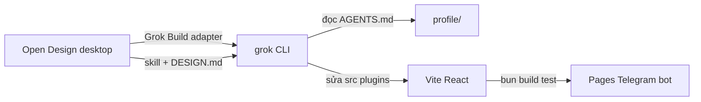

# Luồng Open Design + Grok (repo Profile)

**Trạng thái:** Thực hành đã áp dụng (tháng 7/2026)  
**Bản tiếng Anh:** [WORKFLOW.md](./WORKFLOW.md)  
**Nguồn upstream:** [Open Design Grok adapter](https://open-design.ai/agents/grok-design/)

## Stack này là gì

| Lớp | Công cụ | Vai trò trong `profile` |
|-----|---------|-------------------------|
| Workspace thiết kế | Open Design desktop | Design system, skill, template, `DESIGN.md`, preview local |
| Agent code | Grok Build CLI | Đọc repo, lập kế hoạch, sửa file, chạy shell, UI có hình ảnh |
| Ship / debug | Cursor + Grok (hoặc chỉ Grok) | Test, Convex, Telegram bot, ranh giới plugin |
| Production | GitHub Pages + Convex (tùy chọn) | Người dùng không cài Open Design |

Open Design **không** phải dependency npm. Grok **không** nằm trong `bun run build`.
Cả hai là **công cụ dev** trên máy bạn.



## Điều kiện tiên quyết

- Máy dev macOS, Windows, hoặc Linux
- Repo này đã clone local
- SuperGrok / X Premium+ **hoặc** [xAI API key](https://console.x.ai) cho headless
- Đã cài [Open Design desktop](https://open-design.ai/download/)

Tùy chọn: Cursor với agent Grok cho cùng repo (bổ sung, không loại trừ lẫn nhau).

## Bước 1: Cài Grok Build

```bash
curl -fsSL https://x.ai/cli/install.sh | bash
grok --version
```

Xác thực (chọn một):

```bash
# Tương tác (SuperGrok OAuth)
grok login

# Headless / CI / VPS
export XAI_API_KEY="xai-..."
```

Model mặc định cho repo (xem [MODEL-DEFAULT.vi.md](../grok-vps-github/MODEL-DEFAULT.vi.md)):

```toml
# ~/.grok/config.toml
[models]
default = "grok-composer-2.5-fast"
```

## Bước 2: Cài Open Design

1. Tải từ [open-design.ai/download](https://open-design.ai/download/)
2. Mở app desktop
3. **Settings → Agent → Grok Build**
4. Đăng nhập cùng tài khoản xAI hoặc trỏ tới `XAI_API_KEY`

Kiểm tra danh sách adapter: [open-design.ai/agents](https://open-design.ai/agents/) (Grok Build có trong danh sách).

## Bước 3: Mở repository này

Trong Open Design:

1. **Open folder** → `/path/to/profile` (root repo)
2. Xác nhận Grok đọc được `AGENTS.md` ở root (quy tắc project load mỗi lần chạy)
3. Tra cứu tài liệu, ưu tiên `qmd search ... -c profile-docs` (xem [QMD.vi.md](../../QMD.vi.md))

## Bước 4: Chọn design system và skill

Trong UI Open Design:

1. Duyệt [design systems](https://open-design.ai/plugins/systems/) (129+)
2. Chọn skill khớp artifact (landing, prototype, dashboard, slides)
3. Lưu hoặc export `DESIGN.md` trong thư mục feature khi đã chốt hướng thiết kế

**Riêng repo Profile:** căn với taste skill có sẵn trong `.agents/skills/` (ví dụ
`design-taste-frontend`, `minimalist-ui`) hoặc ghi override trong `DESIGN.md`.

## Bước 5: Chạy task thiết kế với Grok

Ví dụ prompt (đính kèm screenshot tham chiếu nếu có):

```text
Read AGENTS.md and docs/CONTEXT_RULES.md.
Task: redesign src/telegram-btc-alert/ AlertScreen and CSS only.
Keep hooks: useBtcAlert, useTelegramAuth, analyze-alert.ts unchanged.
Follow repo plugin rules if touching plugins/btc-chart/.
No em-dash in any UI string. Match bilingual docs policy for any new docs.
Show plan first, then implement. Run bun run build when done.
```

Điểm mạnh Grok cho thiết kế (theo tài liệu Open Design):

- **Plan mode:** xem lại hướng tiếp cận trước khi đổi file
- **Image input:** so sánh implementation với screenshot tham chiếu
- **AGENTS.md:** quy ước bền vững mỗi session

## Bước 6: Gộp vào harness repo

Sau khi Grok tạo file:

```bash
cd /path/to/profile
bun run build
bun test tests/unit
bun run lint
```

Trước commit:

1. Bump `package.json` version nếu có thay đổi user-facing (xem `AGENTS.md` ở root)
2. Cập nhật tài liệu song ngữ nếu đổi hành vi hoặc bước deploy
3. `bun run docs:index` nếu thêm tài liệu
4. Subject commit theo Conventional Commits, ≤ 100 ký tự

## Nên dùng Open Design + Grok ở đâu trong repo

| Bề mặt | Phù hợp? | Ghi chú |
|--------|----------|---------|
| `src/telegram-btc-alert/` | **Thử nghiệm đầu tiên tốt nhất** | Entry Vite độc lập, UI gọn |
| Portfolio / marketing HTML | **Có** | `index.html`, entry landing mới |
| UI `plugins/*/components/` | **Có, map cẩn thận** | Giữ tách `lib/`, `hooks/`, `plugin.tsx` |
| Logic trade `plugins/*/lib/` | **Không** | Dùng Cursor/Grok không qua luồng UI Open Design |
| Convex, Turso, Telegram `bot.mjs` | **Không** | Luồng agent thông thường |
| Move / Sui PTB / wallet | **Không** | Lane rủi ro cao, xem [TEST_MATRIX.vi.md](../../TEST_MATRIX.vi.md) |

### Nhắc kiến trúc plugin

Plugin Shadow DOM phải giữ:

```text
plugins/<name>/
  plugin.tsx          # entry mỏng
  components/ hooks/ lib/
  style.css           # scoped
```

Không dán nguyên app Open Design vào `plugin.tsx` mà không tách lớp.

## Open Design + Grok so với công cụ khác trong repo

| Công cụ | Trùng lặp | Khuyến nghị |
|---------|-----------|-------------|
| **Cursor Grok agent** | Cùng Grok, tích hợp IDE | Dùng sửa lỗi sau pass Open Design |
| **Stitch MCP** | Sinh UI | Một nguồn chính mỗi màn: Open Design **hoặc** Stitch |
| **`.agents/skills/design-taste-*`** | Quy tắc thẩm mỹ | Ghi hướng đã chọn vào `DESIGN.md` |
| **Grok VPS worker** | Headless issue→PR | Tự động backend, không preview thiết kế |

## Luồng gợi ý theo loại task

### A. Polish Telegram Mini App mới

1. Open Design + Grok → `src/telegram-btc-alert/`
2. `bun run build` → deploy theo [telegram/DEPLOY.vi.md](../../telegram/DEPLOY.vi.md)
3. Test trong bot Telegram (`bun run telegram:bot`)

### B. Section marketing mới

1. Template Open Design → HTML tĩnh hoặc React dưới `src/`
2. Thêm entry Vite trong `vite.config.ts` nếu có trang mới
3. Ghi trong `docs/runtime-entry-points.md` (+ `.vi.md` nếu có cặp)

### C. Redesign panel plugin (btc-chart, predict-club)

1. Open Design → mock + `DESIGN.md` trong `plugins/<name>/` hoặc `docs/`
2. Grok refactor chỉ `components/`
3. Chạy unit test plugin + `bun run doctor` cho React

## Xác thực và ranh giới dữ liệu

| Dữ liệu | Ở local? |
|---------|----------|
| File repo | Có, trên disk bạn |
| `DESIGN.md`, HTML sinh ra | Có, trong repo |
| Credential xAI | Máy bạn (BYOK); Open Design không proxy |
| Dữ liệu user production | Không liên quan Open Design |

Grok headless trên VPS (issue, cron), xem [grok-vps-github/TECHNICAL.vi.md](../grok-vps-github/TECHNICAL.vi.md).

## Xử lý sự cố

| Triệu chứng | Nguyên nhân có thể | Cách sửa |
|-------------|-------------------|----------|
| UI "AI slop" chung chung | Không có design system / tham chiếu | Chọn system Open Design + đính screenshot |
| Grok bỏ qua layout plugin | Prompt mơ hồ | Trỏ `AGENTS.md` + `docs/ARCHITECTURE.md` |
| Build fail sau pass OD | Import hoặc alias sai | Sửa `@btc-chart/*`, chạy `tsc -b` |
| Hai design system xung đột | Stitch + Open Design cùng màn | Chọn một nguồn chính |
| Open Design không thấy agent | Grok không trong PATH | `which grok`, đăng nhập lại `grok login` |

## Checklist: lần chạy thành công đầu tiên

| # | Bước | Xong |
|---|------|------|
| 1 | `grok login` hoặc đã set `XAI_API_KEY` | |
| 2 | Đã cài Open Design desktop, chọn adapter Grok | |
| 3 | Mở root repo trong Open Design | |
| 4 | Hoàn thành một task UI nhỏ (ví dụ CSS telegram alert) | |
| 5 | `bun run build` pass | |
| 6 | Commit thay đổi, bump version nếu cần | |

## Tham chiếu

- [Open Design quickstart](https://open-design.ai/quickstart/)
- [Grok Build for design](https://open-design.ai/agents/grok-design/)
- [open-design.ai FAQ](https://open-design.ai/) (local-first, BYOK, Apache-2.0)
- `AGENTS.md` ở root repo
- [docs/agents/open-design-grok/README.vi.md](./README.vi.md)