# BTC Chart Research Session (July 2026)

Deep research and implementation notes from the July 2026 btc-chart workstream:
SMC confluence, production deploy fixes, mobile UX, Open Interest (OI), and exchange
backend options (Convex vs Cloudflare Worker).

**Status:** Research captured as of v0.100.4 (`cf21250`).  
**Companion:** [RESEARCH-2026-07.vi.md](./RESEARCH-2026-07.vi.md)

---

## Table of Contents

1. [Session summary](#1-session-summary)
2. [Version timeline](#2-version-timeline)
3. [SMC confluence (Trade Setup)](#3-smc-confluence-trade-setup)
4. [Production deploy architecture](#4-production-deploy-architecture)
5. [Build toolchain (Rolldown / Vite 8)](#5-build-toolchain-rolldown--vite-8)
6. [Mobile UX audit](#6-mobile-ux-audit)
7. [Mobile numeric inputs (Zod)](#7-mobile-numeric-inputs-zod)
8. [Open Interest domain research](#8-open-interest-domain-research)
9. [OI delta % and sparkline (shipped)](#9-oi-delta--and-sparkline-shipped)
10. [Exchange CORS and proxy gap](#10-exchange-cors-and-proxy-gap)
11. [Backend options: Convex vs Cloudflare Worker](#11-backend-options-convex-vs-cloudflare-worker)
12. [Future backlog](#12-future-backlog)
13. [File index](#13-file-index)

---

## 1. Session summary

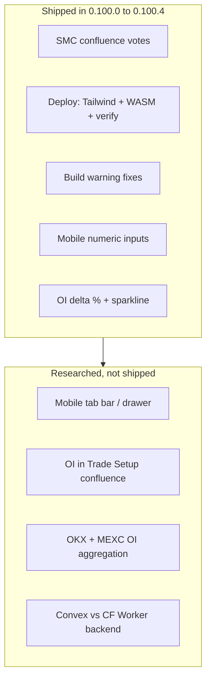

| Topic | Outcome |
|-------|---------|
| SMC BOS/CHoCH, OB touch, CHoCH after sweep | Wired into Trade Setup confluence (`collectSmcConfluenceVotes`) |
| GitHub Pages 404 (`tailwindcss`, WASM) | Tailwind compiled at build; WASM committed under `pkg/` |
| Rolldown warnings | `invalidAnnotation: false`; lazy split for readout panels |
| Mobile input erase/type | Zod + commit-on-blur `NumericFieldInput` |
| OI meaning and UX | ΔOI 1h/4h/24h chips + 24h sparkline (Binance USD trend) |
| OKX/MEXC in production | Gap: Vite proxy dev-only; needs Worker or Convex |

---

## 2. Version timeline

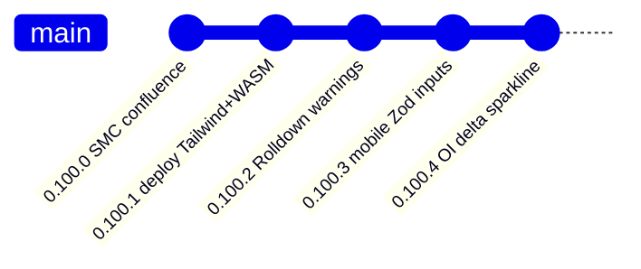

| Version | Commit (approx.) | Scope |
|---------|------------------|-------|
| 0.100.0 | `409cd03`, `0f72ae8`, `dc0c0a2` | SMC votes in trade-setup; ICT chips; dedupe ML banner |
| 0.100.1 | `0dac6a2`, `93dbd34` | Compile Tailwind in plugin CSS; commit WASM; deploy verify step |
| 0.100.2 | `7987349` | Rolldown `INVALID_ANNOTATION`; fix ineffective dynamic import |
| 0.100.3 | `64ce044` | `numeric-field.ts`, `useNumericField`, `NumericFieldInput` |
| 0.100.4 | `cf21250` | `open-interest.ts`, Binance OI hist, OIPanel sparkline |

---

## 3. SMC confluence (Trade Setup)

### 3.1 Problem

Trade Setup confluence already consumed ML, RSI, NWE, ADX, Boucher, Lien, ICT, and liquidity
signals. SMC overlay data (BOS, CHoCH, order blocks) was rendered on chart but did not vote
in the confluence engine.

### 3.2 Design

Pure logic in `plugins/btc-chart/lib/smc-signals.ts`. No React, no WASM imports in the
vote collector (DIP: domain reads `SMCResult` + `LiquidityResult` types from overlay layer).

```mermaid
flowchart LR
  WASM[compute_smc WASM] --> SMCResult[SMCResult]
  LIQ[liquidity.ts] --> LiqResult[LiquidityResult]
  Candles[Candle[]] --> Votes[collectSmcConfluenceVotes]
  SMCResult --> Votes
  LiqResult --> Votes
  Votes --> TS[trade-setup.ts confluence]
  TS --> Panel[TradeSetupPanel chips]
```

### 3.3 Vote rules (`SMC_LOOKBACK_BARS = 3`)

| Signal | Bull vote | Bear vote | Reason string |
|--------|-----------|-----------|---------------|
| Recent structure (last in lookback) | BOS/CHoCH bias bull | BOS/CHoCH bias bear | `SMC BOS Bull`, `SMC CHoCH Bear`, etc. |
| Order block touch on last candle | Bullish OB touch | Bearish OB touch | `SMC OB Bull touch`, `SMC OB Bear touch` |
| CHoCH after liquidity sweep | Bull CHoCH after SSL sweep | Bear CHoCH after BSL sweep | `SMC CHoCH after sweep Bull` |

**CHoCH after sweep** requires both `liquidity` sweeps and a CHoCH structure whose `endTime`
is after the sweep and within lookback.

### 3.4 Integration points

- `trade-setup.ts`: calls `collectSmcConfluenceVotes(data, extra.smc, extra.liquidity)` when
  SMC is available in extras.
- `plugin.tsx`: SMC overlay always computed for confluence (not only when visibility toggle on).
- `TradeSetupPanel`: displays SMC/ICT chips; ML conflict banner removed here (lives in
  `SignalPanel` only).

### 3.5 Tests

`tests/unit/btc-chart-smc-signals.test.ts` covers structure votes, OB touch, sweep+CHoCH.

---

## 4. Production deploy architecture

### 4.1 Hosting model

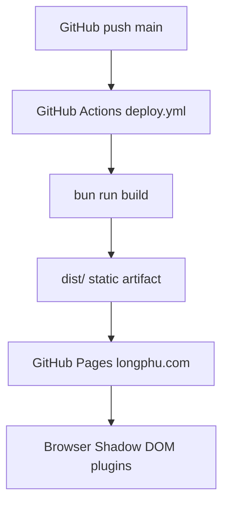

- **No Node server** at runtime. All plugins are static JS/CSS/WASM.
- Env at build time: `VITE_TURSO_DB_URL`, `VITE_TURSO_DB_TOKEN` for coin list.

### 4.2 Incidents fixed (0.100.1)

| Symptom | Root cause | Fix |
|---------|------------|-----|
| 404 `tailwindcss` on production | Raw `@import 'tailwindcss'` copied into `dist/plugins/btc-chart/style.css` | `copyPluginAssets` compiles Tailwind via `@tailwindcss/node` before copy |
| 404 `btc_chart_wasm.js` | `plugins/btc-chart/pkg/` gitignored, not deployed | Commit built WASM artifacts; verify in CI |
| SPA routes 404 | GitHub Pages needs fallback | `cp dist/index.html dist/404.html` |

### 4.3 CI verify step

After `bun run build`, workflow asserts:

- `dist/plugins/btc-chart/style.css` exists
- No raw `@import 'tailwindcss'` in compiled CSS
- `dist/plugins/btc-chart/pkg/btc_chart_wasm.js` and `.wasm` exist

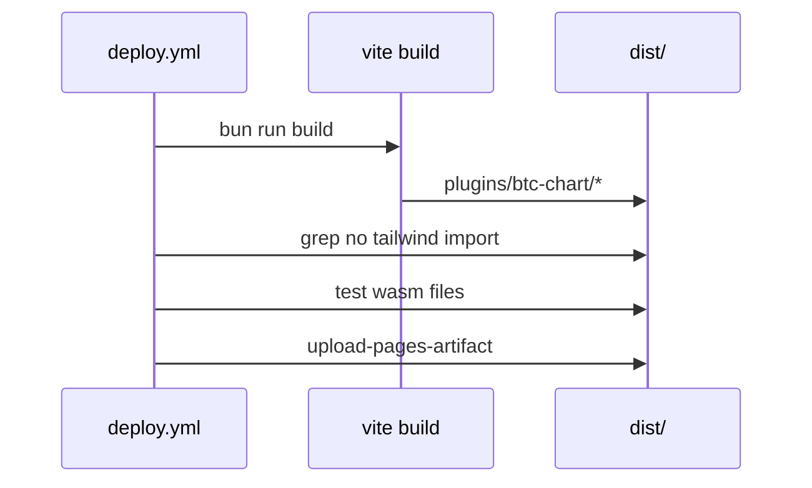

---

## 5. Build toolchain (Rolldown / Vite 8)

### 5.1 Warnings observed

| Warning | Meaning | Action |
|---------|---------|--------|
| `INVALID_ANNOTATION` | Rolldown strict on some annotations | `checks.invalidAnnotation: false` in `vite.config.ts` |
| `INEFFECTIVE_DYNAMIC_IMPORT` | `lazy()` target also statically imported | Split `BoxFlipPanel` / `MHBandPanel` to true lazy boundary |

Exit code remained **0** (warnings only, not build failure).

### 5.2 Lazy load pattern

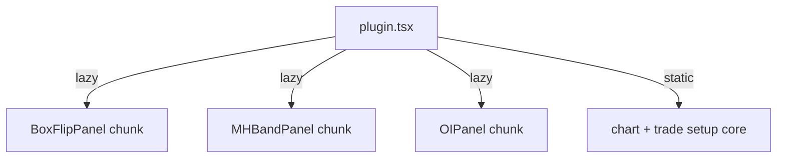

Readout panels that are rarely opened should stay behind `React.lazy` without a static import
of the same module path.

---

## 6. Mobile UX audit

Audit method: Playwright viewport ≤768px on `longphu.com` (production).

### 6.1 Findings

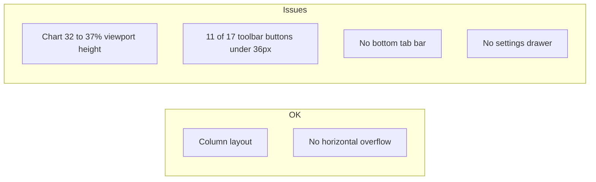

| Area | Result | Severity |
|------|--------|----------|
| Layout | Sidebar stacks below chart | OK |
| Horizontal scroll | None | OK |
| Chart height on phone | ~32 to 37% viewport | Medium |
| Touch targets | 11/17 controls &lt; 36px (WCAG 44px target) | Medium |
| Navigation | Long accordion list, no tab bar | Low (UX polish) |

**Not implemented in this session:** mobile tab bar, drawer, toolbar touch-size pass.

---

## 7. Mobile numeric inputs (Zod)

### 7.1 Problem

On iOS Safari, `type="number"` inputs with immediate `onChange` → parent state → re-render
fight the soft keyboard. Users could not reliably type or delete digits (Vốn, Leverage, NWE
multiplier).

### 7.2 Solution architecture

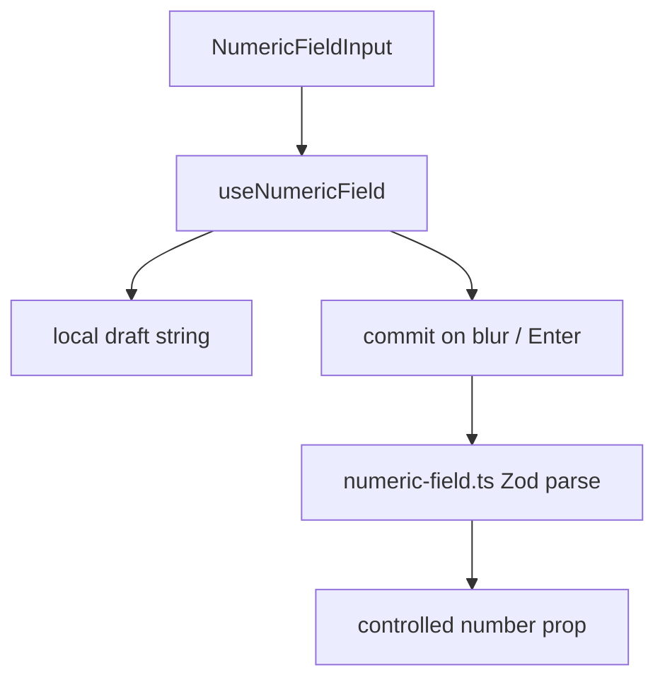

| File | Role |
|------|------|
| `lib/numeric-field.ts` | `parseBoundedInt`, `parseBoundedFloat`, `isNumericDraft` |
| `hooks/useNumericField.ts` | Draft state, blur commit, revert invalid |
| `components/NumericFieldInput.tsx` | `inputMode="decimal"`, `type="text"` |
| `style.css` | `font-size: 16px` (no iOS zoom), `min-height: 44px` |

Applied in: `TradeSetupPanel` (Vốn, Leverage), `NweSettingsSection`.

### 7.3 Why Zod

- Bounded coercion in one place (`z.coerce.number().min().max()`).
- `safeParse` avoids throw on partial drafts.
- Draft regex allows `12.` while typing.

Tests: `tests/unit/btc-chart-numeric-field.test.ts`.

---

## 8. Open Interest domain research

### 8.1 Definition

**Open Interest (OI)** is the total number of outstanding derivative contracts (futures/perps)
that have not been closed. It measures **positioning and leverage**, not volume.

| OI change | Price | Typical read |
|-----------|-------|--------------|
| OI up | Price up | New longs entering (trend fuel) |
| OI up | Price down | New shorts entering |
| OI down | Price up | Short covering (squeeze fuel) |
| OI down | Price down | Long liquidation |

### 8.2 OI / Market Cap ratio

`ratio = totalOiUsd / marketCapUsd`

| Ratio | Label (Vietnamese UI) |
|-------|------------------------|
| &gt; 1.5x | Cực kỳ rủi ro, dễ squeeze |
| &gt; 1.0x | Leverage cao |
| &gt; 0.5x | Leverage vừa phải |
| &gt; 0.2x | Bình thường |
| ≤ 0.2x | OI thấp, ít quan tâm derivatives |

Market cap from CoinGecko circulating supply × price (`fetchCirculatingSupply`, 24h
localStorage cache).

### 8.3 Exchange API surface (research)

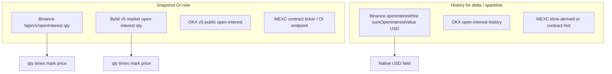

| Venue | Snapshot endpoint | History | USD native? |
|-------|-------------------|---------|-------------|
| Binance | `GET /fapi/v1/openInterest?symbol=` | `GET /futures/data/openInterestHist?period=1h&limit=25` | Hist: `sumOpenInterestValue` yes |
| Bybit | `GET /v5/market/open-interest?category=linear` | Same endpoint with `intervalTime` | Qty coin, needs price |
| OKX | `GET /api/v5/public/open-interest?instType=SWAP&instId=` | `GET /api/v5/public/open-interest-history?period=1H` | `oiCcy` field in USD |
| MEXC | Contract API (symbol-specific) | Limited public hist | Qty, needs price |

**Design choice (shipped):** snapshot aggregated Binance+Bybit; trend/delta from **Binance USD
history only** to avoid mixing qty and USD series.

---

## 9. OI delta % and sparkline (shipped)

### 9.1 Data flow

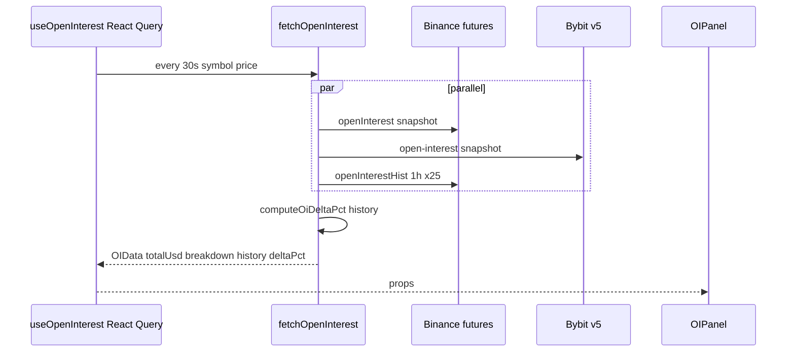

### 9.2 `OIData` shape

```ts
interface OIData {
  totalUsd: number
  breakdown: { exchange: string; usd: number }[]
  history: { time: number; totalUsd: number }[]  // Binance USD, ascending
  deltaPct: { h1: number | null; h4: number | null; h24: number | null }
}
```

### 9.3 Delta math (`computeOiDeltaPct`)

Given ascending history with last index `n`:

- **h1:** `(hist[n] - hist[n-1]) / hist[n-1] * 100`
- **h4:** compare to `hist[n-4]` when `n >= 4`
- **h24:** compare to `hist[0]` when `n >= 24` (25 hourly points)

### 9.4 UI (`OIPanel.tsx`)

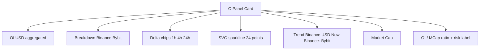

- Sparkline color: green if last ≥ first in series, else red.
- CSS: `.oi-delta-row`, `.oi-delta-chip`, `.oi-sparkline` in `style.css`.
- Fallback: no history → hide delta row and sparkline (show snapshot only).

### 9.5 Tests

`tests/unit/btc-chart-open-interest.test.ts` (4 tests).

### 9.6 Not in scope (yet)

- OI does **not** vote in Trade Setup confluence.
- OKX/MEXC not in breakdown.
- Multi-venue unified history for ΔOI.

---

## 10. Exchange CORS and proxy gap

### 10.1 Dev vs production

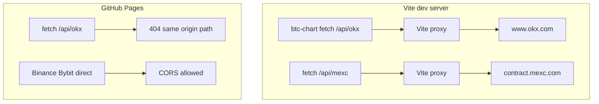

| Call site | Dev | Production |
|-----------|-----|------------|
| MEXC ticker/kline/funding | `/api/mexc/...` proxy | **Broken** unless external proxy URL |
| OKX ticker/kline | `/api/okx/...` proxy | **Broken** |
| OKX funding (some paths) | Direct `www.okx.com` | May work (inconsistent) |
| Binance/Bybit REST | Direct | Works |

Reference: `vite.config.ts` proxy block; `plugins/btc-chart/lib/api.ts` `fetchTicker`,
`fetchFunding`, klines.

### 10.2 Existing repo mitigations

| Asset | Path | Status |
|-------|------|--------|
| MEXC proxy worker | `workers/mexc-proxy/worker.js` | Exists, needs `wrangler deploy` |
| Polymarket proxy pattern | `workers/polymarket-proxy.js`, `__POLYMARKET_PROXY__` | Pattern for configurable prod URL |
| Turso coin list | Client read via `VITE_TURSO_*` | Works (public read token) |

---

## 11. Backend options: Convex vs Cloudflare Worker

See also: [../decisions/btc-chart-exchange-backend.md](../decisions/btc-chart-exchange-backend.md)

### 11.1 Requirement

Aggregate **OKX + MEXC** OI (and optionally fix all MEXC/OKX REST calls in production) without
browser CORS failures or per-user rate-limit storms.

### 11.2 Option A: Cloudflare Worker (thin proxy)

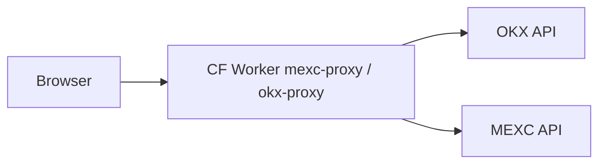

| Pros | Cons |
|------|------|
| Already in repo (`workers/mexc-proxy/worker.js`) | No built-in DB or cron |
| Minimal deploy (`wrangler deploy`) | Cache/history needs KV/D1 extra work |
| Low cold start, edge latency | One worker per domain or path routing logic |
| Free tier generous for read proxy | Aggregation logic runs on every client poll unless cached elsewhere |

**Best when:** Only need CORS bypass for existing client-side fetch paths.

### 11.3 Option B: Convex (HTTP Actions + Actions + DB)

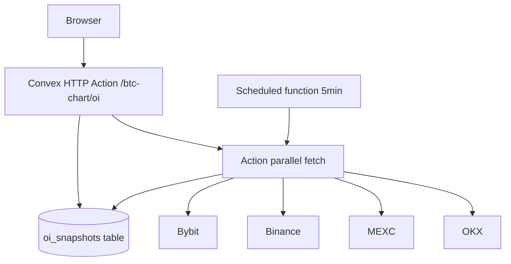

| Pros | Cons |
|------|------|
| `fetch()` server-side, no CORS | Second deployment target + `npx convex deploy` |
| Native scheduler for poll/cache | Heavier than pure proxy if only CORS needed |
| Convex DB for history, multi-venue ΔOI | HTTP Actions need explicit CORS headers |
| Single endpoint for frontend | Actions not Node; use nested `action` for Node if needed |
| Good for rate-limit sharing across users | Free tier function call limits |

**Best when:** OI history across 4 venues, scheduled snapshots, shared cache, future Trade
Setup confluence inputs.

### 11.4 Recommended frontend contract (either backend)

```ts
// env: VITE_BTC_CHART_API_URL
GET /btc-chart/oi?symbol=BTCUSDT
→ {
  totalUsd, breakdown: [{exchange, usd}],
  history: [{time, totalUsd}],
  deltaPct: {h1, h4, h24},
  sources: { snapshot: ['binance','bybit','okx','mexc'], trend: 'binance' }
}
```

### 11.5 Decision matrix

| Criterion | CF Worker | Convex |
|-----------|-----------|--------|
| Time to first OKX/MEXC OI in prod | **Fast** (extend mexc-proxy) | Medium (new project) |
| Multi-venue history + ΔOI | Manual (KV/D1) | **Native** |
| Aligns with static GitHub Pages | **Yes** | **Yes** (separate origin) |
| Operational complexity | **Low** | Medium |
| Fits hackathon scope | **Proxy only** | **Data platform** |

**Current recommendation:** CF Worker for immediate production fix; Convex when OI becomes a
first-class signal (confluence, alerts, multi-venue trend).

---

## 12. Future backlog

See [multi-exchange-data.md](./multi-exchange-data.md) for the full 4-venue data catalog,
cross-venue aggregates (funding, L/S, mark spread, whale, liquidations), phased plan, and
`MarketSnapshot` schema.

| Item | Priority | Notes |
|------|----------|-------|
| Deploy OKX proxy worker or unified `exchange-proxy` | High | Unblocks MEXC/OKX on longphu.com |
| Add OKX/MEXC to OI breakdown | Medium | Via backend aggregator |
| Funding 4/4 + spread + next funding time | Medium | Extend existing `fetchFunding` |
| Long/short consensus panel | Medium | Binance, Bybit, OKX |
| Mark median + cross-spread guard | Medium | Alt / MEXC-mapped symbols |
| OI votes in Trade Setup | Medium | e.g. OI rising + price rising |
| Mobile tab bar / drawer | Low | From audit |
| Toolbar 44px touch targets | Low | WCAG |
| OKX OI history in trend series | Low | After backend |
| Summarizer API console noise | Info | Not app bug (browser extension) |

---

## 13. File index

### Shipped code (0.100.0 to 0.100.4)

| File | Purpose |
|------|---------|
| `plugins/btc-chart/lib/smc-signals.ts` | SMC confluence votes |
| `plugins/btc-chart/lib/trade-setup.ts` | Confluence consumer |
| `plugins/btc-chart/lib/numeric-field.ts` | Zod bounded parsers |
| `plugins/btc-chart/hooks/useNumericField.ts` | Mobile input hook |
| `plugins/btc-chart/components/NumericFieldInput.tsx` | Mobile input UI |
| `plugins/btc-chart/lib/open-interest.ts` | OI delta + sparkline math |
| `plugins/btc-chart/lib/api.ts` | `fetchOpenInterest`, Binance hist |
| `plugins/btc-chart/components/OIPanel.tsx` | OI panel UI |
| `plugins/btc-chart/hooks/useOI.ts` | React Query 30s poll |
| `vite.config.ts` | Tailwind compile, proxy, Rolldown checks |
| `.github/workflows/deploy.yml` | Build verify WASM/CSS |
| `workers/mexc-proxy/worker.js` | MEXC CORS proxy (deploy separately) |

### Tests

| File | Covers |
|------|--------|
| `tests/unit/btc-chart-smc-signals.test.ts` | SMC votes |
| `tests/unit/btc-chart-numeric-field.test.ts` | Zod parsers |
| `tests/unit/btc-chart-open-interest.test.ts` | OI delta/sparkline |

### Related docs

- [TECHNICAL.md](./TECHNICAL.md): architecture baseline
- [trade-setup.md](./trade-setup.md): confluence engine
- [USER-GUIDE.md](./USER-GUIDE.md): end-user features
- [../decisions/btc-chart-exchange-backend.md](../decisions/btc-chart-exchange-backend.md): backend ADR