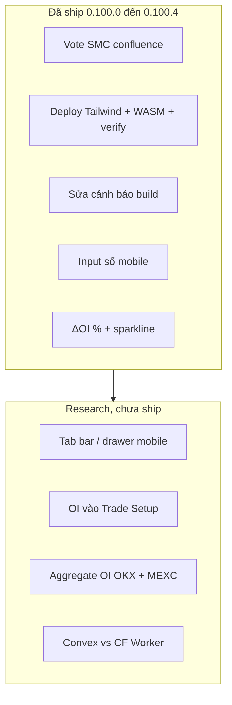
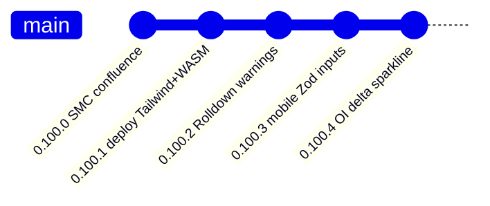
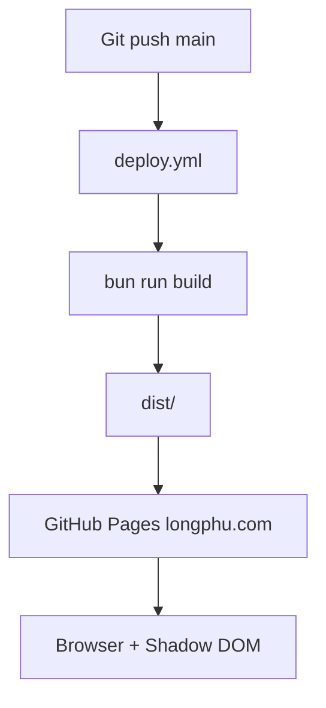
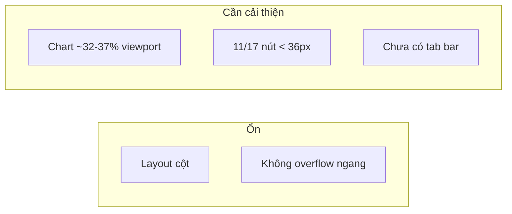
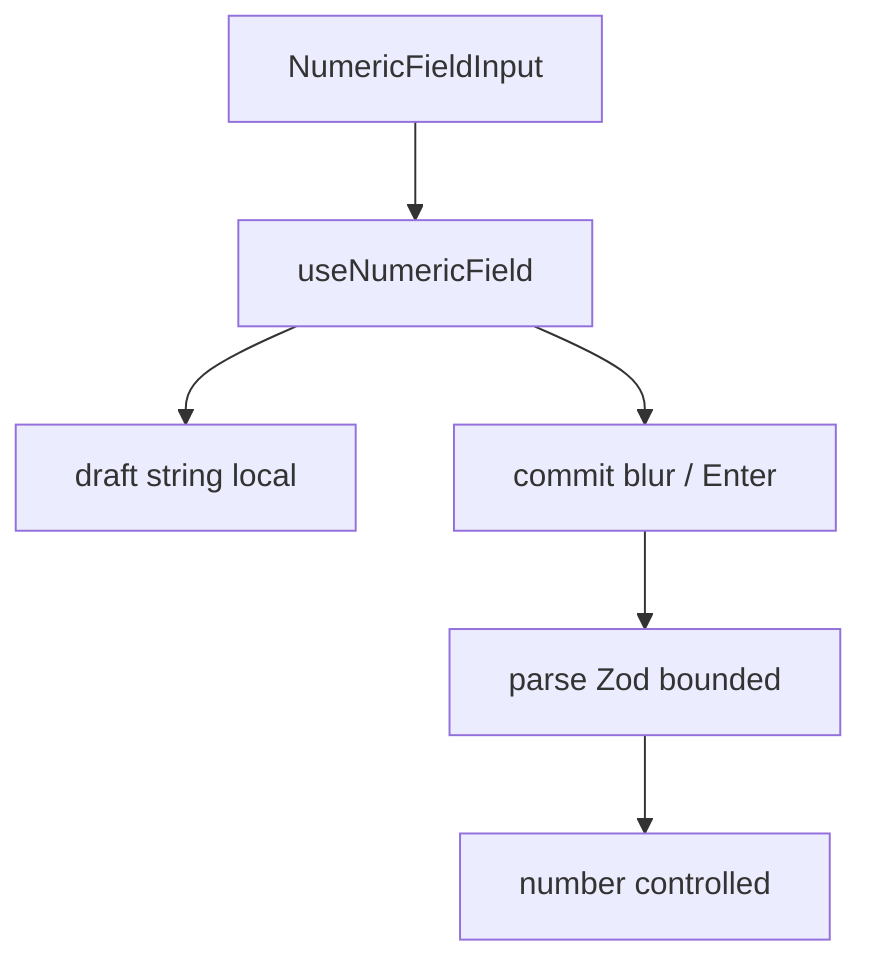
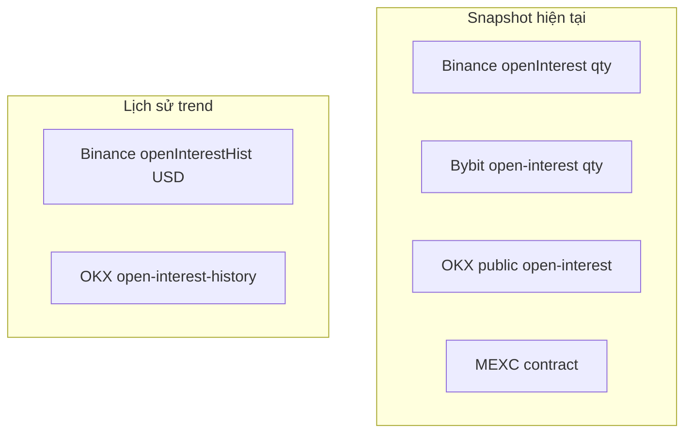
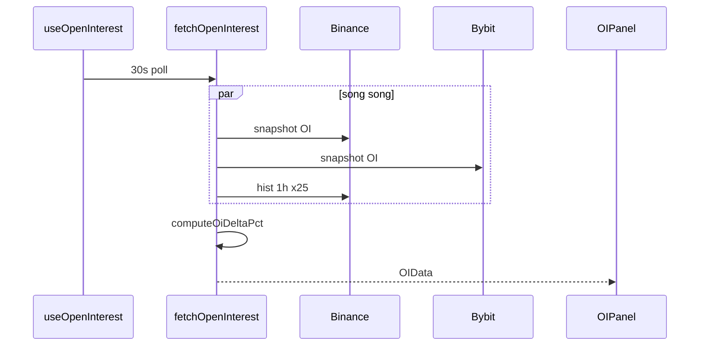
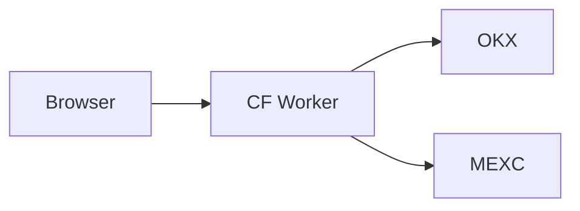
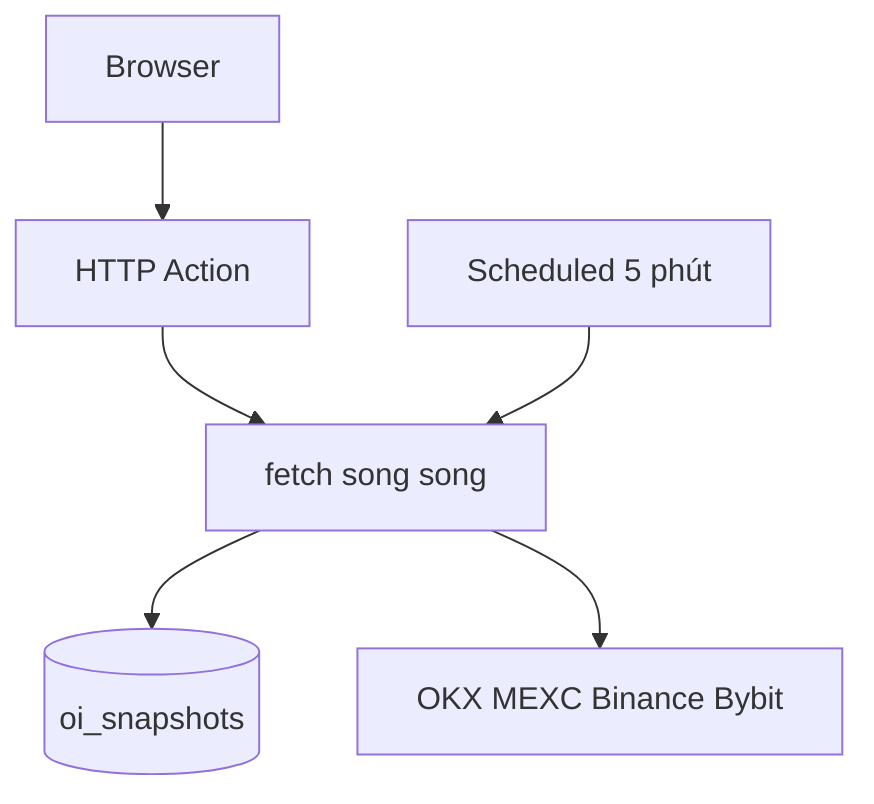

# BTC Chart: Research Session (Tháng 7/2026)

Ghi chép research và triển khai từ workstream btc-chart tháng 7/2026: SMC confluence,
sửa deploy production, mobile UX, Open Interest (OI), và lựa chọn backend cho OKX/MEXC
(Convex vs Cloudflare Worker).

**Trạng thái:** Ghi nhận tại v0.100.4 (`cf21250`).  
**Bản tiếng Anh:** [RESEARCH-2026-07.md](./RESEARCH-2026-07.md)

---

## Mục lục

1. [Tóm tắt session](#1-tóm-tắt-session)
2. [Timeline phiên bản](#2-timeline-phiên-bản)
3. [SMC confluence (Trade Setup)](#3-smc-confluence-trade-setup)
4. [Kiến trúc deploy production](#4-kiến-trúc-deploy-production)
5. [Build toolchain (Rolldown / Vite 8)](#5-build-toolchain-rolldown--vite-8)
6. [Audit mobile UX](#6-audit-mobile-ux)
7. [Input số trên mobile (Zod)](#7-input-số-trên-mobile-zod)
8. [Research domain Open Interest](#8-research-domain-open-interest)
9. [ΔOI % và sparkline (đã ship)](#9-δoi--và-sparkline-đã-ship)
10. [Khoảng trống CORS và proxy sàn](#10-khoảng-trống-cors-và-proxy-sàn)
11. [Backend: Convex vs Cloudflare Worker](#11-backend-convex-vs-cloudflare-worker)
12. [Backlog tương lai](#12-backlog-tương-lai)
13. [Chỉ mục file](#13-chỉ-mục-file)

---

## 1. Tóm tắt session



| Chủ đề | Kết quả |
|--------|---------|
| SMC BOS/CHoCH, chạm OB, CHoCH sau sweep | Gắn vào confluence Trade Setup |
| GitHub Pages 404 (`tailwindcss`, WASM) | Compile Tailwind lúc build; commit WASM `pkg/` |
| Cảnh báo Rolldown | `invalidAnnotation: false`; lazy split panel |
| Gõ/xóa số trên mobile | Zod + commit-on-blur |
| OI và UX | Chip ΔOI 1h/4h/24h + sparkline 24h (Binance USD) |
| OKX/MEXC trên production | Thiếu proxy: Vite proxy chỉ chạy dev |

---

## 2. Timeline phiên bản



| Phiên bản | Commit (gần đúng) | Phạm vi |
|-----------|-------------------|---------|
| 0.100.0 | `409cd03`, `0f72ae8` | SMC votes; chip ICT; bỏ trùng banner ML |
| 0.100.1 | `0dac6a2`, `93dbd34` | Tailwind plugin CSS; WASM; bước verify CI |
| 0.100.2 | `7987349` | Rolldown; dynamic import |
| 0.100.3 | `64ce044` | `numeric-field`, `NumericFieldInput` |
| 0.100.4 | `cf21250` | `open-interest.ts`, sparkline OIPanel |

---

## 3. SMC confluence (Trade Setup)

### 3.1 Vấn đề

SMC (BOS, CHoCH, order block) vẽ trên chart nhưng **không vote** trong engine confluence
của Trade Setup.

### 3.2 Thiết kế

Logic thuần: `plugins/btc-chart/lib/smc-signals.ts`.

```mermaid
flowchart LR
  WASM[compute_smc WASM] --> SMCResult[SMCResult]
  LIQ[liquidity.ts] --> LiqResult[LiquidityResult]
  Candles[Candle[]] --> Votes[collectSmcConfluenceVotes]
  SMCResult --> Votes
  LiqResult --> Votes
  Votes --> TS[trade-setup.ts]
  TS --> Panel[TradeSetupPanel]
```

### 3.3 Quy tắc vote (`SMC_LOOKBACK_BARS = 3`)

| Tín hiệu | Bull | Bear | Chuỗi reason |
|----------|------|------|--------------|
| Structure gần (BOS/CHoCH) | bias bull | bias bear | `SMC BOS Bull`, ... |
| Chạm order block nến cuối | OB bull | OB bear | `SMC OB Bull touch` |
| CHoCH sau liquidity sweep | CHoCH bull sau SSL | CHoCH bear sau BSL | `SMC CHoCH after sweep Bull` |

### 3.4 Điểm tích hợp

- `trade-setup.ts`: gọi `collectSmcConfluenceVotes` khi có `extra.smc`.
- `plugin.tsx`: SMC luôn tính cho confluence.
- `TradeSetupPanel`: chip SMC/ICT; banner conflict ML chỉ ở `SignalPanel`.

Test: `tests/unit/btc-chart-smc-signals.test.ts`.

---

## 4. Kiến trúc deploy production



### Sự cố đã sửa (0.100.1)

| Triệu chứng | Nguyên nhân | Cách sửa |
|-------------|-------------|----------|
| 404 `tailwindcss` | Copy raw `@import 'tailwindcss'` | Compile qua `@tailwindcss/node` |
| 404 WASM | `pkg/` bị gitignore | Commit artifact; verify CI |
| Route SPA 404 | Pages cần fallback | `404.html` từ `index.html` |

---

## 5. Build toolchain (Rolldown / Vite 8)

| Cảnh báo | Ý nghĩa | Xử lý |
|----------|---------|-------|
| `INVALID_ANNOTATION` | Rolldown strict | `checks.invalidAnnotation: false` |
| `INEFFECTIVE_DYNAMIC_IMPORT` | `lazy()` + static import trùng | Tách lazy `BoxFlipPanel`, `MHBandPanel` |

Build vẫn **exit 0** (chỉ warning).

---

## 6. Audit mobile UX

Playwright, viewport ≤768px, `longphu.com`.



Chưa implement: tab bar, drawer, tăng touch target lên 44px.

---

## 7. Input số trên mobile (Zod)

### Vấn đề

iOS Safari: `type="number"` + `onChange` đồng bộ parent state làm keyboard khó gõ/xóa.

### Giải pháp



- `font-size: 16px` (tránh zoom iOS)
- `min-height: 44px`
- `inputMode="decimal"`, `type="text"`

Áp dụng: Vốn, Leverage, NWE multiplier.

---

## 8. Research domain Open Interest

### Định nghĩa

**OI** = tổng hợp đồng phái sinh **chưa đóng**. Đo **đòn bẩy và positioning**, không phải volume.

| OI | Giá | Đọc nhanh |
|----|-----|-----------|
| Tăng | Tăng | Long mới vào |
| Tăng | Giảm | Short mới vào |
| Giảm | Tăng | Short cover (squeeze) |
| Giảm | Giảm | Long liquidation |

### Tỷ lệ OI / Market Cap

Lấy từ CoinGecko circulating supply × giá. Nhãn rủi ro tiếng Việt trong `OIPanel`.

### API theo sàn (research)



**Quyết định đã ship:** snapshot Binance+Bybit; trend/ΔOI chỉ **Binance USD** (tránh trộn
qty và USD).

---

## 9. ΔOI % và sparkline (đã ship)

### Luồng dữ liệu



### Công thức ΔOI

- **1h:** so với điểm `n-1`
- **4h:** so với `n-4` (cần ≥5 điểm)
- **24h:** so với `hist[0]` (cần 25 điểm 1h)

### UI

- 3 chip 1h / 4h / 24h (màu up/dn)
- SVG sparkline 24 điểm
- Ghi chú: *Trend: Binance USD (1h) · Now: Binance+Bybit*

File: `lib/open-interest.ts`, `OIPanel.tsx`, test `btc-chart-open-interest.test.ts`.

**Chưa có:** OI vote Trade Setup; OKX/MEXC trong breakdown.

---

## 10. Khoảng trống CORS và proxy sàn

```mermaid
flowchart TB
  subgraph dev [Vite dev]
    FE1[/api/okx] --> PROXY[proxy Vite]
    PROXY --> OKX[okx.com]
  end
  subgraph prod [GitHub Pages]
    FE2[/api/okx] --> FAIL[404]
    FE3[Binance Bybit trực tiếp] --> OK[OK]
  end
```

| Nguồn | Dev | Production |
|-------|-----|------------|
| MEXC/OKX ticker, kline | Proxy Vite | **Hỏng** nếu không có worker |
| Binance/Bybit | Trực tiếp | OK |

Có sẵn: `workers/mexc-proxy/worker.js` (cần deploy wrangler).

---

## 11. Backend: Convex vs Cloudflare Worker

Chi tiết ADR: [../decisions/btc-chart-exchange-backend.vi.md](../decisions/btc-chart-exchange-backend.vi.md)

### Worker (proxy mỏng)



- **Ưu:** Có sẵn trong repo, deploy nhanh, ít infra.
- **Nhược:** Cache/history phải tự làm (KV/D1).

### Convex (aggregation + DB)



- **Ưu:** Cron, cache, history đa sàn, một endpoint.
- **Nhược:** Deploy thứ hai, CORS headers, quota function.

### Khuyến nghị

| Mục tiêu | Chọn |
|----------|------|
| Sửa CORS OKX/MEXC nhanh | **Cloudflare Worker** |
| OI 4 sàn + history + confluence sau này | **Convex** |

---

## 12. Backlog tương lai

| Hạng mục | Ưu tiên |
|----------|---------|
| Deploy proxy OKX / worker thống nhất | Cao |
| OKX/MEXC vào breakdown OI | Trung bình |
| OI vote Trade Setup | Trung bình |
| Tab bar / drawer mobile | Thấp |
| Touch target 44px toolbar | Thấp |

---

## 13. Chỉ mục file

Xem bảng đầy đủ trong [RESEARCH-2026-07.md §13](./RESEARCH-2026-07.md#13-file-index).

Tài liệu liên quan:

- [TECHNICAL.vi.md](./TECHNICAL.vi.md)
- [trade-setup.vi.md](./trade-setup.vi.md)
- [decisions/btc-chart-exchange-backend.vi.md](../decisions/btc-chart-exchange-backend.vi.md)