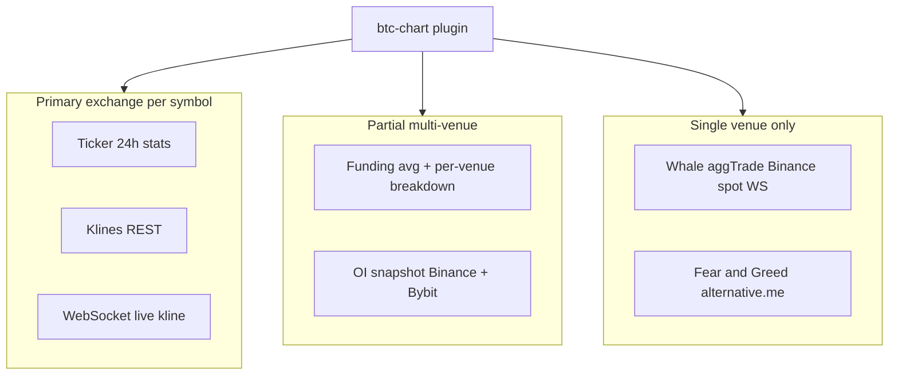
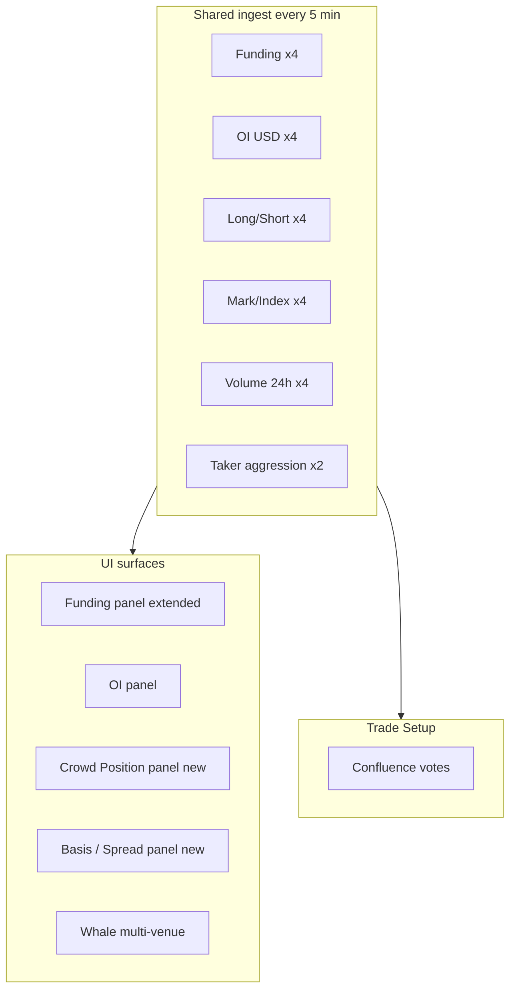
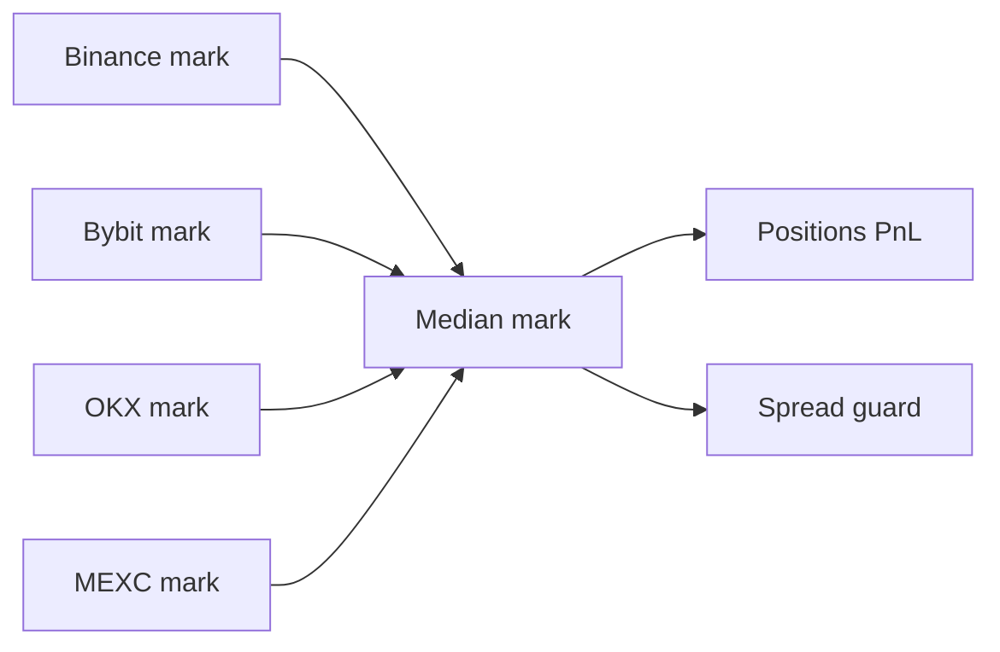
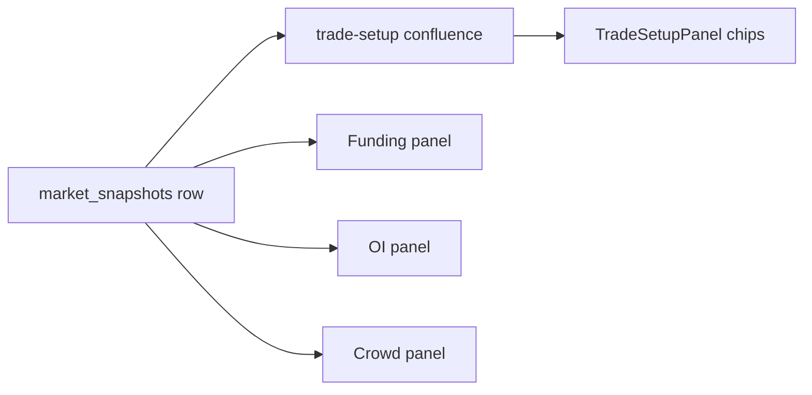
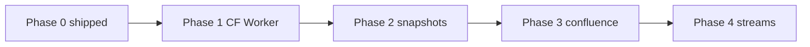

# BTC Chart: Multi-Exchange Data (4 Venues)

Research on what Binance, Bybit, MEXC, and OKX can provide beyond Open Interest,
how btc-chart uses them today, and a phased plan to aggregate data for panels and
Trade Setup confluence.

**Companion:** [multi-exchange-data.vi.md](./multi-exchange-data.vi.md)  
**Related:** [RESEARCH-2026-07.md](./RESEARCH-2026-07.md), [../decisions/btc-chart-exchange-backend.md](../decisions/btc-chart-exchange-backend.md)

---

## Table of Contents

1. [Scope](#1-scope)
2. [Current usage in btc-chart](#2-current-usage-in-btc-chart)
3. [Data catalog by venue](#3-data-catalog-by-venue)
4. [Cross-venue aggregates (beyond OI)](#4-cross-venue-aggregates-beyond-oi)
5. [Trade Setup confluence candidates](#5-trade-setup-confluence-candidates)
6. [Browser vs backend requirements](#6-browser-vs-backend-requirements)
7. [Convex free tier fit](#7-convex-free-tier-fit)
8. [Phased implementation plan](#8-phased-implementation-plan)
9. [Target snapshot schema](#9-target-snapshot-schema)
10. [File index](#10-file-index)

---

## 1. Scope

**Venues:** Binance (futures + spot fallback), Bybit (linear), MEXC (contract), OKX (SWAP).

**Goal:** Use public market data from all four exchanges where the symbol is listed,
not only the primary `exchange` field from Turso/`SymbolEntry`.

**Out of scope (this doc):** Authenticated trading, private account data, order placement.

---

## 2. Current usage in btc-chart



### 2.1 Implementation map

| Data | Source files | Poll / stream |
|------|--------------|---------------|
| Ticker | `lib/api.ts` `fetchTicker` | React Query ~5s |
| 24h stats | `statsFromTicker` | Derived from ticker |
| Klines | `lib/api.ts` `fetchKlines` | React Query |
| Live candles | `plugin.tsx` WebSocket per `info.exchange` | WS |
| Funding | `lib/api.ts` `fetchFunding` | React Query 30s |
| OI | `lib/api.ts` `fetchOpenInterest` | React Query 30s |
| Whale | `hooks/useWhaleTracker.ts` | Binance `aggTrade` WS |
| Market cap | `fetchCirculatingSupply` CoinGecko | 24h cache |

### 2.2 Per-venue wiring today

| Venue | Ticker / klines | WS | Funding in `fetchFunding` | OI |
|-------|-----------------|----|-----------------------------|-----|
| Binance | Futures first, spot fallback | `fstream` or spot | Yes | Yes |
| Bybit | When `exchange === 'bybit'` | `stream.bybit.com` | Yes | Yes |
| MEXC | When `exchange === 'mexc'` | `contract.mexc.com` | Yes if `mexcSymbol` | No |
| OKX | When `exchange === 'okx'` | `ws.okx.com` | Yes (direct URL) | No |

### 2.3 Production gap

MEXC and OKX REST paths use `/api/mexc` and `/api/okx` (Vite dev proxy only). On
GitHub Pages these calls fail unless a Cloudflare Worker or Convex HTTP layer is deployed.
See [../decisions/btc-chart-exchange-backend.md](../decisions/btc-chart-exchange-backend.md).

---

## 3. Data catalog by venue

Public derivatives data available without API keys (representative endpoints).

### 3.1 Binance Futures

| Metric | Endpoint (examples) | Normalize to |
|--------|---------------------|--------------|
| 24h ticker | `GET /fapi/v1/ticker/24hr` | `TickerData` |
| Klines | `GET /fapi/v1/klines` | `Candle[]` |
| Mark / index / funding | `GET /fapi/v1/premiumIndex` | mark, index, funding rate |
| Open interest | `GET /fapi/v1/openInterest` | qty (× price → USD) |
| OI history (USD) | `GET /futures/data/openInterestHist` | `sumOpenInterestValue` |
| Global L/S ratio | `GET /futures/data/globalLongShortAccountRatio` | ratio 0–1 |
| Top trader L/S | `GET /futures/data/topLongShortPositionRatio` | ratio 0–1 |
| Taker buy/sell | `GET /futures/data/takerlongshortRatio` | buy/sell ratio |
| Liquidations | WS `!forceOrder@arr` | side, qty, price |
| Large trades | WS `aggTrade` (spot stream used today) | whale detection |

**Browser:** Most REST works from client (CORS OK). WS works from browser.

### 3.2 Bybit v5 (linear)

| Metric | Endpoint (examples) | Normalize to |
|--------|---------------------|--------------|
| Tickers | `GET /v5/market/tickers` | `TickerData` |
| Klines | `GET /v5/market/kline` | `Candle[]` |
| Funding history | `GET /v5/market/funding/history` | latest rate |
| Open interest | `GET /v5/market/open-interest` | qty (× price → USD) |
| Account ratio | `GET /v5/market/account-ratio` | long/short accounts |
| Recent public trades | `GET /v5/market/recent-trade` | whale extension |

**Browser:** Public REST and WS work from client.

### 3.3 MEXC Contract

| Metric | Endpoint (examples) | Normalize to |
|--------|---------------------|--------------|
| Ticker (incl. funding) | `GET /api/v1/contract/ticker` | ticker + funding |
| Klines | `GET /api/v1/contract/kline/{symbol}` | `Candle[]` |
| Deals / trades | contract deal endpoints | flow / whale |
| Open interest | contract detail / ticker fields | venue-specific |

**Browser:** Requires **CORS proxy** in production (`workers/mexc-proxy/worker.js`).

### 3.4 OKX v5 (SWAP)

| Metric | Endpoint (examples) | Normalize to |
|--------|---------------------|--------------|
| Ticker | `GET /api/v5/market/ticker` | `TickerData` |
| Candles | `GET /api/v5/market/candles` | `Candle[]` |
| Funding | `GET /api/v5/public/funding-rate` | rate |
| Open interest | `GET /api/v5/public/open-interest` | `oiCcy` USD |
| OI history | `GET /api/v5/public/open-interest-history` | USD series |
| Mark price | `GET /api/v5/public/mark-price` | mark |
| Long/short ratio | `GET /api/v5/public/long-short-account-ratio` | ratio |
| Taker volume | `GET /api/v5/rubik/stat/taker-volume` | buy/sell split |
| Liquidations | WS liquidation channel | event stream |

**Browser:** Mixed. Some public REST works direct (funding). Ticker/klines need proxy in prod.

---

## 4. Cross-venue aggregates (beyond OI)



### 4.1 Group A: Positioning (highest value)

| Aggregate | Formula / rule | UI / signal use |
|-----------|----------------|-----------------|
| **Funding consensus** | Avg and per-venue breakdown; count venues above +0.05% or below 0 | Extend `FundingState`; chip "3/4 long heavy" |
| **Funding spread** | `max(rate) - min(rate)` across venues | Divergence = unstable crowd |
| **OI total USD** | Sum qty×price or native USD per venue | OI panel breakdown (planned) |
| **OI delta %** | Per-venue or Binance USD trend (shipped: Binance only) | ΔOI chips + sparkline |
| **Long/short consensus** | Median L/S; count venues with L/S > 0.7 | New Crowd panel; contrarian votes |
| **Taker buy/sell** | Binance + OKX taker ratios averaged | Scalping bias chip |

### 4.2 Group B: Price integrity

| Aggregate | Formula / rule | UI / signal use |
|-----------|----------------|-----------------|
| **Mark median** | Median of 4 mark prices | Better `markPrice` for positions |
| **Cross-venue spread** | `(max(mid) - min(mid)) / median` | Block entry if spread > threshold |
| **Basis / premium** | `(mark - index) / index` per venue | Futures overheating label |



### 4.3 Group C: Flow and liquidity

| Aggregate | Formula / rule | UI / signal use |
|-----------|----------------|-----------------|
| **24h quote volume rank** | Which venue has highest `quoteVol` | "Best liquidity: Bybit" hint |
| **Volume / OI ratio** | `sum(volume24h) / sum(oiUsd)` | Activity vs leverage |
| **Whale flow multi-venue** | Large trades from BN/BB/OKX/MEXC streams | Extend Whale panel |
| **Order book imbalance** | `(bidDepth - askDepth) / total` top N levels | Optional; rate-limit heavy |

### 4.4 Group D: Extreme events

| Aggregate | Formula / rule | UI / signal use |
|-----------|----------------|-----------------|
| **Liquidation burst 1h** | Sum notional liquidated by side | Squeeze in progress label |
| **OI flush** | OI Δ1h < -X% on ≥2 venues + price move | Capitulation vote |

### 4.5 Group E: Catalog meta (Turso)

| Aggregate | Use |
|-----------|-----|
| Symbol listed on venue | Validate Turso `coins` row |
| Primary vs fallback exchange | Auto-pick best liquidity venue |
| Funding interval | Display next funding per venue |

---

## 5. Trade Setup confluence candidates

Votes to add when multi-venue snapshots are available (`lib/trade-setup.ts`).

| Vote key | Condition (illustrative) | Bias |
|----------|--------------------------|------|
| `Funding crowded long` | ≥3 venues funding > +0.05% | Bear context (crowded longs) |
| `Funding crowded short` | ≥3 venues funding < 0 | Bull context |
| `OI build with trend` | OI Δ1h > 0 on ≥2 venues and price Δ1h same sign | Trend continuation |
| `L/S extreme long` | L/S > 0.70 on ≥2 venues | Contrarian bear |
| `L/S extreme short` | L/S < 0.30 on ≥2 venues | Contrarian bull |
| `Mark spread risk` | Cross-venue spread > 0.30% | Reduce confidence |
| `Liquidation flush longs` | Liquidation notional long > threshold in 1h + price up | Short squeeze context |
| `Taker buy aggression` | Taker buy ratio > 1.1 on ≥2 venues | Bull scalp vote |



---

## 6. Browser vs backend requirements

| Data type | Client-direct OK? | Needs proxy | Needs cron cache |
|-----------|-------------------|-------------|------------------|
| Binance futures REST/WS | Yes | No | Recommended for 4-venue poll |
| Bybit v5 REST/WS | Yes | No | Recommended |
| OKX/MEXC REST | Partial | **Yes (prod)** | Recommended |
| OKX/MEXC WS | Often OK | Sometimes | Optional |
| Aggregate 4 venues / 30s / user | No (rate limits) | N/A | **Required** |
| Liquidation WS multi-venue | Per-venue WS | Optional proxy | Client or server fan-in |

**Rule:** One scheduled ingest per symbol batch; clients read cache only.

---

## 7. Convex free tier fit

When using Convex (or any backend) for 4-venue snapshots:

| Resource | Free limit | Planned usage |
|----------|------------|---------------|
| Function calls | 1M/month | Cron ~3 calls × 8,640 + client reads |
| DB storage | 0.5 GB | Snapshots ~few MB |
| Action compute | 20 GB-hours/month | 4 fetches × 30 symbols × 5 min |

**Safe client poll:** 60s when reading Convex cache (not 30s with live venue fetch).

**Unsafe:** Each user triggers 4 exchange fetches every 30s.

See [RESEARCH-2026-07.md §11](./RESEARCH-2026-07.md#11-backend-options-convex-vs-cloudflare-worker).

---

## 8. Phased implementation plan



| Phase | Deliverable | Venues | Backend |
|-------|-------------|--------|---------|
| **0** (done) | OI Binance+Bybit, ΔOI Binance hist, funding partial | 2–4 partial | Client |
| **1** | `exchange-proxy` Worker; `VITE_*_PROXY_URL` | 4 REST fix | CF Worker free |
| **2a** | Funding 4/4 + spread + next funding time | 4 | Convex cron or Worker+KV |
| **2b** | OI 4/4 breakdown + unified history policy | 4 | Convex cron |
| **2c** | Mark median + cross-spread panel | 4 | Same snapshot |
| **3a** | Long/short consensus panel | 3–4 | Same snapshot |
| **3b** | Trade Setup votes (funding, OI, L/S, spread) | 4 | Read snapshot |
| **4** | Whale + liquidation multi-venue WS | 2–4 | Optional fan-in service |

### Priority order (recommended)

1. Phase 1 Worker (unblock OKX/MEXC on production).
2. Phase 2a Funding complete (low effort, already 80% done).
3. Phase 2c Mark/spread guard (important for alts and MEXC-mapped symbols).
4. Phase 2b OI 4 venues.
5. Phase 3a–3b Crowd panel + confluence votes.
6. Phase 4 streams (whale, liquidations).

---

## 9. Target snapshot schema

Proposed Convex table (or D1/KV JSON) for cron upsert:

```ts
interface MarketSnapshot {
  symbol: string           // BTCUSDT
  ts: number               // unix ms
  funding: {
    binance?: number       // percent, e.g. 0.01 = 0.01%
    bybit?: number
    okx?: number
    mexc?: number
    avg: number
    spread: number         // max - min
  }
  oiUsd: {
    binance?: number
    bybit?: number
    okx?: number
    mexc?: number
    total: number
  }
  oiDeltaPct?: { h1: number | null; h4: number | null; h24: number | null }
  longShort?: {
    binance?: number
    bybit?: number
    okx?: number
    median?: number
  }
  mark?: {
    binance?: number
    bybit?: number
    okx?: number
    mexc?: number
    median: number
    spreadPct: number
  }
  volume24hQuote?: {
    binance?: number
    bybit?: number
    okx?: number
    mexc?: number
  }
  takerBuyRatio?: {
    binance?: number
    okx?: number
  }
  meta: {
    venuesReporting: string[]
    trendSource: 'binance' | 'aggregated'
  }
}
```

**HTTP contract:**

```
GET {API_BASE}/btc-chart/market?symbol=BTCUSDT
→ latest MarketSnapshot + history[] for sparklines
```

---

## 10. File index

| Path | Role |
|------|------|
| `plugins/btc-chart/lib/api.ts` | Ticker, funding, klines, OI fetch |
| `plugins/btc-chart/lib/open-interest.ts` | OI delta and sparkline math |
| `plugins/btc-chart/hooks/useMarketData.ts` | React Query polling |
| `plugins/btc-chart/hooks/useWhaleTracker.ts` | Binance-only whale WS |
| `plugins/btc-chart/lib/trade-setup.ts` | Confluence engine (extension point) |
| `plugins/btc-chart/lib/symbols.ts` | Exchange maps (`mexcSymbol`, `okxInstId`) |
| `workers/mexc-proxy/worker.js` | MEXC CORS proxy (Phase 1) |
| `docs/decisions/btc-chart-exchange-backend.md` | Worker vs Convex ADR |