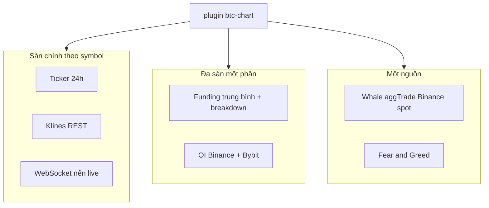
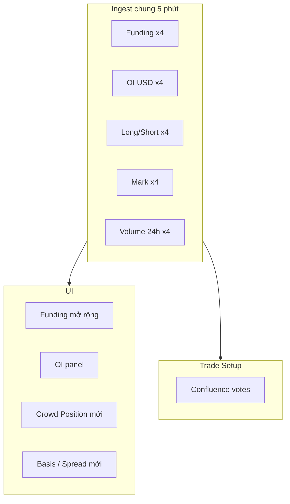
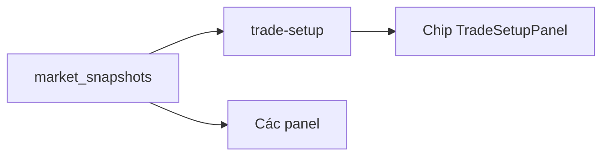
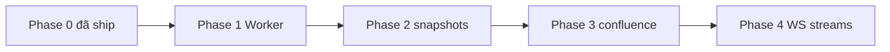

# BTC Chart: Dữ Liệu Đa Sàn (4 Venue)

Research về dữ liệu Binance, Bybit, MEXC, OKX **ngoài Open Interest**: btc-chart đang
dùng gì, có thể tận dụng gì, và lộ trình aggregate cho panel + Trade Setup confluence.

**Bản tiếng Anh:** [multi-exchange-data.md](./multi-exchange-data.md)  
**Liên quan:** [RESEARCH-2026-07.vi.md](./RESEARCH-2026-07.vi.md), [../decisions/btc-chart-exchange-backend.vi.md](../decisions/btc-chart-exchange-backend.vi.md)

---

## Mục lục

1. [Phạm vi](#1-phạm-vi)
2. [Đang dùng trong btc-chart](#2-đang-dùng-trong-btc-chart)
3. [Catalog dữ liệu theo sàn](#3-catalog-dữ-liệu-theo-sàn)
4. [Aggregate đa sàn (ngoài OI)](#4-aggregate-đa-sàn-ngoài-oi)
5. [Ứng viên vote Trade Setup](#5-ứng-viên-vote-trade-setup)
6. [Browser vs backend](#6-browser-vs-backend)
7. [Convex free tier](#7-convex-free-tier)
8. [Lộ trình triển khai](#8-lộ-trình-triển-khai)
9. [Schema snapshot mục tiêu](#9-schema-snapshot-mục-tiêu)
10. [Chỉ mục file](#10-chỉ-mục-file)

---

## 1. Phạm vi

**Sàn:** Binance (futures + spot fallback), Bybit linear, MEXC contract, OKX SWAP.

**Mục tiêu:** Dùng dữ liệu public từ cả 4 sàn khi symbol được list, không chỉ
`exchange` chính trong Turso/`SymbolEntry`.

**Ngoài phạm vi:** Trading có auth, dữ liệu tài khoản riêng, đặt lệnh.

---

## 2. Đang dùng trong btc-chart



### Bảng hiện trạng

| Dữ liệu | Binance | Bybit | MEXC | OKX |
|---------|---------|-------|------|-----|
| Ticker / klines / WS | Có | Có | Có* | Có* |
| Funding trong `fetchFunding` | Có | Có | Có† | Có |
| OI | Có | Có | Chưa | Chưa |
| Whale | Có | Chưa | Chưa | Chưa |

\* REST MEXC/OKX cần proxy trên production.  
† MEXC chỉ khi có `mexcSymbol` trong catalog.

### Khoảng trống production

`/api/mexc` và `/api/okx` chỉ có trên Vite dev. GitHub Pages cần Worker hoặc Convex.
Xem ADR backend.

---

## 3. Catalog dữ liệu theo sàn

### Binance Futures

| Metric | Ví dụ endpoint | Chuẩn hóa |
|--------|----------------|-----------|
| Ticker, klines | `fapi/v1/ticker/24hr`, `klines` | `TickerData`, `Candle[]` |
| Mark, index, funding | `premiumIndex` | mark, funding |
| OI + history USD | `openInterest`, `openInterestHist` | USD trend |
| Long/short global | `globalLongShortAccountRatio` | ratio |
| Top trader L/S | `topLongShortPositionRatio` | ratio |
| Taker buy/sell | `takerlongshortRatio` | aggression |
| Thanh lý | WS `!forceOrder@arr` | squeeze |
| Giao dịch lớn | WS `aggTrade` | whale |

### Bybit v5

| Metric | Ví dụ | Ghi chú |
|--------|-------|---------|
| Tickers, klines | `v5/market/*` | Browser OK |
| Funding, OI | `funding/history`, `open-interest` | qty × giá |
| Account ratio | `account-ratio` | L/S crowd |
| Public trades | `recent-trade` | mở rộng whale |

### MEXC Contract

| Metric | Ghi chú |
|--------|---------|
| Ticker (kèm funding) | Cần proxy prod |
| Klines | Cần proxy prod |
| OI | Trong contract API |

### OKX v5

| Metric | Ghi chú |
|--------|---------|
| Ticker, candles | Proxy prod cho REST |
| Funding, OI, OI history | Một số gọi direct được |
| Mark, L/S ratio, taker volume | Crowd positioning |
| Thanh lý | WS channel |

---

## 4. Aggregate đa sàn (ngoài OI)



### Nhóm A: Positioning (giá trị cao nhất)

| Aggregate | Cách tính | Dùng cho |
|-----------|-----------|----------|
| **Funding consensus** | Trung bình + đếm sàn long-heavy | Panel funding, chip 3/4 |
| **Funding spread** | max − min rate | Crowd không đồng nhất |
| **OI tổng USD** | Cộng 4 sàn | Breakdown OI |
| **ΔOI %** | Đã ship (Binance hist) | Mở rộng đa sàn sau |
| **L/S consensus** | Median + đếm cực đoan | Panel Crowd, contrarian |
| **Taker buy/sell** | Binance + OKX | Scalping bias |

### Nhóm B: Chất lượng giá

| Aggregate | Dùng cho |
|-----------|----------|
| **Mark median** | PnL positions chính xác hơn |
| **Cross-spread** | Chặn entry khi lệch sàn > ngưỡng |
| **Basis / premium** | Futures “quá nóng” |

### Nhóm C: Flow và thanh khoản

| Aggregate | Dùng cho |
|-----------|----------|
| **Volume 24h rank** | Sàn thanh khoản tốt nhất |
| **Volume / OI** | Hoạt động vs đòn bẩy |
| **Whale đa sàn** | Mở rộng Whale panel |
| **Order book imbalance** | Tùy chọn; rate limit cao |

### Nhóm D: Sự kiện cực đoan

| Aggregate | Dùng cho |
|-----------|----------|
| **Liquidation burst 1h** | Squeeze đang diễn ra |
| **OI flush** | Capitulation vote |

### Nhóm E: Meta catalog Turso

| Aggregate | Dùng cho |
|-----------|----------|
| Symbol có trên sàn | Validate coin |
| Sàn liquidity tốt nhất | Gợi ý primary exchange |

---

## 5. Ứng viên vote Trade Setup

| Vote | Điều kiện (gợi ý) | Hướng |
|------|-------------------|-------|
| `Funding crowded long` | ≥3 sàn funding > +0.05% | Bear context |
| `Funding crowded short` | ≥3 sàn funding < 0 | Bull context |
| `OI build with trend` | ΔOI 1h > 0 trên ≥2 sàn + giá cùng chiều | Theo trend |
| `L/S extreme long` | L/S > 70% trên ≥2 sàn | Contrarian bear |
| `Mark spread risk` | spread > 0.30% | Giảm confidence |
| `Liquidation flush longs` | LT long lớn + giá tăng | Short squeeze |
| `Taker buy aggression` | taker buy > 1.1 trên ≥2 sàn | Bull scalp |



---

## 6. Browser vs backend

| Loại | Client trực tiếp | Cần proxy | Cần cron cache |
|------|------------------|-----------|----------------|
| Binance / Bybit REST/WS | Có | Không | Nên có cho poll 4 sàn |
| OKX / MEXC REST | Một phần | **Có (prod)** | Nên có |
| Aggregate 4 sàn / user / 30s | Không | N/A | **Bắt buộc** |

**Quy tắc:** Cron ingest một lần; client chỉ đọc cache.

---

## 7. Convex free tier

| Tài nguyên | Free | Dùng dự kiến |
|------------|------|--------------|
| Function calls | 1M/tháng | Cron + đọc cache |
| DB | 0.5 GB | Snapshot vài MB |

**An toàn:** client poll **60s** khi đọc Convex.  
**Không an toàn:** mỗi user fetch 4 sàn mỗi 30s.

---

## 8. Lộ trình triển khai



| Phase | Giao hàng | Backend |
|-------|-----------|---------|
| **0** | OI 2 sàn, funding partial | Client |
| **1** | Proxy OKX/MEXC production | CF Worker |
| **2a** | Funding 4/4 + spread | Cron |
| **2b** | OI 4/4 | Cron |
| **2c** | Mark median + spread panel | Cron |
| **3** | L/S panel + vote Trade Setup | Đọc snapshot |
| **4** | Whale + liquidation đa sàn | WS fan-in |

**Thứ tự ưu tiên:** Worker → Funding đủ 4 → Mark/spread → OI 4 → Crowd + votes → streams.

---

## 9. Schema snapshot mục tiêu

```ts
interface MarketSnapshot {
  symbol: string
  ts: number
  funding: { binance?, bybit?, okx?, mexc?, avg, spread }
  oiUsd: { binance?, bybit?, okx?, mexc?, total }
  oiDeltaPct?: { h1, h4, h24 }
  longShort?: { binance?, bybit?, okx?, median? }
  mark?: { binance?, bybit?, okx?, mexc?, median, spreadPct }
  volume24hQuote?: { ... }
  takerBuyRatio?: { binance?, okx? }
  meta: { venuesReporting, trendSource }
}
```

**API:**

```
GET {API_BASE}/btc-chart/market?symbol=BTCUSDT
```

---

## 10. Chỉ mục file

| File | Vai trò |
|------|---------|
| `plugins/btc-chart/lib/api.ts` | Fetch ticker, funding, klines, OI |
| `plugins/btc-chart/lib/open-interest.ts` | ΔOI, sparkline |
| `plugins/btc-chart/lib/trade-setup.ts` | Confluence (điểm mở rộng) |
| `workers/mexc-proxy/worker.js` | Proxy MEXC phase 1 |
| `docs/decisions/btc-chart-exchange-backend.vi.md` | ADR Worker vs Convex |

Chi tiết endpoint và bảng đầy đủ: [multi-exchange-data.md](./multi-exchange-data.md).