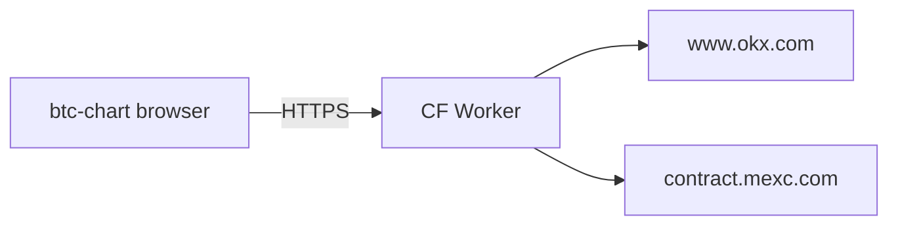
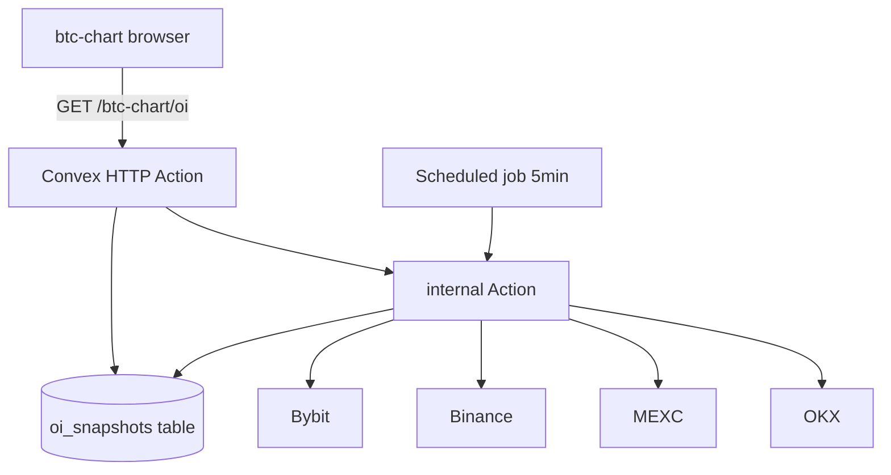
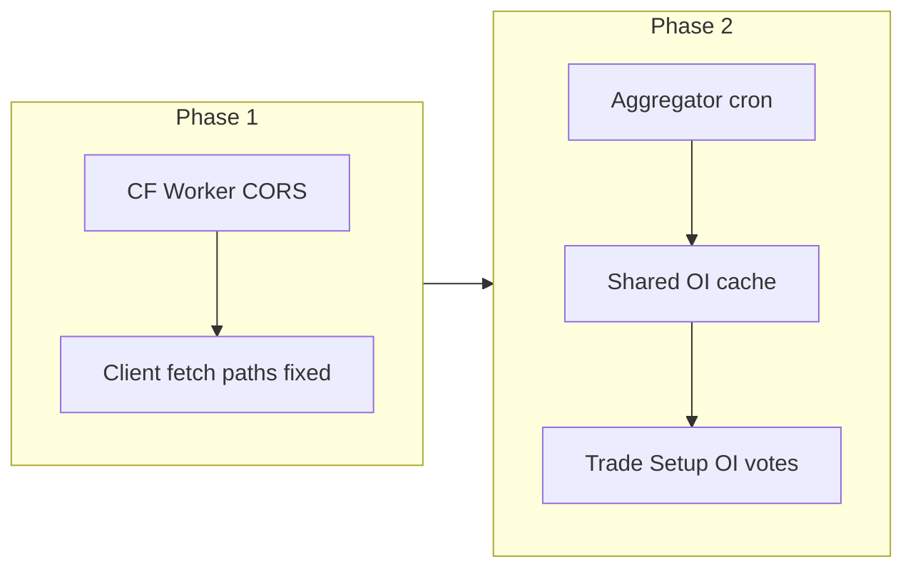

# ADR: BTC Chart Exchange Backend for OKX and MEXC

**Status:** Proposed (July 2026)  
**Context:** [btc-chart/RESEARCH-2026-07.md](../btc-chart/RESEARCH-2026-07.md)  
**Companion:** [btc-chart-exchange-backend.vi.md](./btc-chart-exchange-backend.vi.md)

## Problem

The btc-chart plugin runs as static assets on GitHub Pages (`longphu.com`). Development uses
Vite proxies (`/api/okx`, `/api/mexc`) that do not exist in production. Browser calls to
MEXC and OKX REST endpoints fail with CORS or 404 on the same-origin proxy path.

Binance and Bybit public REST APIs work from the browser today. Open Interest currently
aggregates Binance + Bybit only. Adding OKX and MEXC OI (and fixing ticker/klines for those
venues in production) requires a server-side or edge fetch layer.

## Decision drivers

1. **CORS bypass** for MEXC and OKX from static hosting.
2. **Rate limits:** OI polling every 30s per user does not scale; prefer shared cache.
3. **Data quality:** Multi-venue OI history needs consistent USD series for ΔOI and sparklines.
4. **Repo fit:** Minimize new infrastructure for a hackathon static site.
5. **Future:** OI may feed Trade Setup confluence and alerts.

## Options considered

### Option 1: Cloudflare Worker (thin CORS proxy)

Extend `workers/mexc-proxy/worker.js` or add `workers/okx-proxy/worker.js`.



**Pros**

- Already present in repo; matches Polymarket proxy pattern.
- Single-file deploy via Wrangler.
- Low latency at edge; no database required for pass-through.

**Cons**

- No built-in cron: client still polls unless KV/D1 cache added manually.
- Aggregation across four venues happens in browser or requires custom worker logic.
- History storage for ΔOI multi-venue needs extra design (KV TTL, D1 schema).

### Option 2: Convex (HTTP Actions + scheduled Actions + DB)



**Pros**

- Server-side `fetch()` without CORS.
- Scheduler reduces exchange API load (one poll per interval globally).
- Convex tables store hourly snapshots for sparkline and ΔOI across venues.
- One stable contract for frontend: `VITE_BTC_CHART_API_URL`.

**Cons**

- New deployment pipeline (`npx convex deploy`, `CONVEX_DEPLOY_KEY` in CI).
- HTTP Actions require explicit CORS for `https://longphu.com`.
- Heavier than a proxy if the only need is CORS.
- Function call quotas on free tier.

### Option 3: Do nothing (Binance + Bybit only)

Keep current client-side OI. Accept broken MEXC/OKX REST on production for non-proxy paths.

**Rejected** for products targeting multi-exchange symbols from Turso catalog.

## Proposed decision

**Phase 1 (immediate):** Deploy Cloudflare Worker proxy for OKX and wire production base URL
(similar to `__POLYMARKET_PROXY__` or env `VITE_MEXC_PROXY_URL` / `VITE_OKX_PROXY_URL`).

**Phase 2 (when OI becomes a signal):** Introduce Convex (or Worker + D1) aggregator endpoint
that returns normalized `OIData` with four-venue breakdown and unified history policy.



## API contract (target)

```
GET {API_BASE}/btc-chart/oi?symbol=BTCUSDT

Response 200:
{
  "totalUsd": number,
  "breakdown": [{ "exchange": string, "usd": number }],
  "history": [{ "time": number, "totalUsd": number }],
  "deltaPct": { "h1": number|null, "h4": number|null, "h24": number|null },
  "meta": {
    "snapshotSources": ["binance", "bybit", "okx", "mexc"],
    "trendSource": "aggregated|binance|..."
  }
}
```

## Convex implementation sketch (Phase 2)

| Convex module | Responsibility |
|---------------|----------------|
| `convex/oi/fetch.ts` | Action: parallel venue fetch, normalize USD |
| `convex/oi/snapshots.ts` | Mutation: upsert hourly row |
| `convex/oi/crons.ts` | Cron: top symbols every 5 min |
| `convex/http.ts` | `GET /btc-chart/oi`, CORS + OPTIONS |

Frontend change: `fetchOpenInterest` checks `VITE_BTC_CHART_API_URL`; falls back to current
client-side Binance+Bybit path when unset.

## Worker implementation sketch (Phase 1)

```js
// workers/exchange-proxy/worker.js
// Routes: /okx/* -> www.okx.com, /mexc/* -> contract.mexc.com
// Headers: Access-Control-Allow-Origin: https://longphu.com
```

Update `api.ts` to use `import.meta.env.VITE_OKX_PROXY_URL` instead of `/api/okx` in
production builds.

## Consequences

- **Positive:** Production parity with dev for MEXC/OKX; path to richer OI UX.
- **Negative:** Extra secret/env management; second deploy target if Convex chosen.
- **Neutral:** GitHub Pages remains static; backend is optional env-configured origin.

## Validation

| Check | Phase 1 | Phase 2 |
|-------|---------|---------|
| MEXC ticker on longphu.com | Manual + Playwright | Same |
| OKX klines on longphu.com | Manual + Playwright | Same |
| OI breakdown shows 4 venues | N/A | Unit test aggregator |
| ΔOI matches manual calc | N/A | `btc-chart-open-interest.test.ts` extended |
| CORS preflight | curl OPTIONS | curl OPTIONS |

## References

- `vite.config.ts` dev proxy
- `workers/mexc-proxy/worker.js`
- `plugins/btc-chart/lib/api.ts`
- [Convex HTTP Actions](https://docs.convex.dev/functions/http-actions)