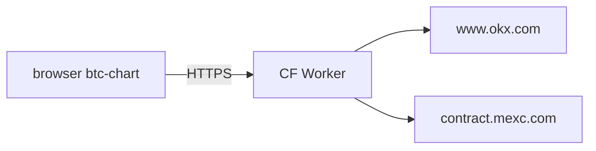
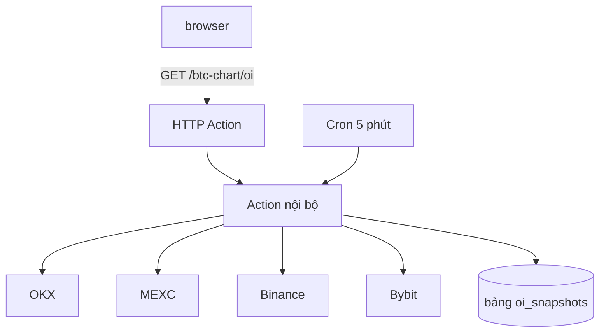
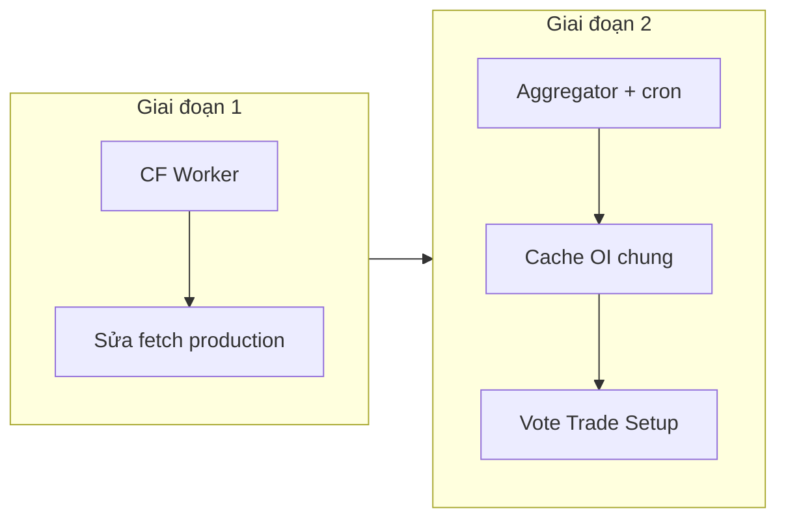

# ADR: Backend sàn cho BTC Chart (OKX và MEXC)

**Trạng thái:** Đề xuất (Tháng 7/2026)  
**Ngữ cảnh:** [btc-chart/RESEARCH-2026-07.vi.md](../btc-chart/RESEARCH-2026-07.vi.md)  
**Bản tiếng Anh:** [btc-chart-exchange-backend.md](./btc-chart-exchange-backend.md)

## Vấn đề

Plugin btc-chart chạy static trên GitHub Pages (`longphu.com`). Môi trường dev có Vite proxy
(`/api/okx`, `/api/mexc`) nhưng **không tồn tại trên production**. Gọi REST OKX/MEXC từ
browser bị CORS hoặc 404.

Binance và Bybit gọi trực tiếp được. OI hiện chỉ gộp Binance + Bybit. Muốn thêm OKX/MEXC
(và sửa ticker/klines cho các symbol đó trên production) cần lớp fetch phía server/edge.

## Tiêu chí quyết định

1. Bypass CORS từ static hosting.
2. Giảm rate limit: tránh mỗi user poll OI 30s riêng.
3. Chuỗi USD nhất quán cho ΔOI và sparkline đa sàn.
4. Phù hợp repo hackathon (ít infra mới).
5. Tương lai: OI có thể vote Trade Setup.

## Các phương án

### Phương án 1: Cloudflare Worker (proxy CORS mỏng)

Mở rộng `workers/mexc-proxy/worker.js` hoặc thêm worker OKX.



**Ưu:** Có sẵn repo; deploy Wrangler; latency edge thấp.  
**Nhược:** Không cron sẵn; cache/history phải tự thiết kế (KV/D1).

### Phương án 2: Convex (HTTP Actions + cron + DB)



**Ưu:** `fetch()` server-side; scheduler chia sẻ poll; lưu history; một URL API ổn định.  
**Nhược:** Pipeline deploy mới; CORS headers; nặng hơn nếu chỉ cần proxy.

### Phương án 3: Giữ nguyên (chỉ Binance + Bybit)

**Loại** nếu catalog Turso có nhiều symbol MEXC/OKX.

## Quyết định đề xuất

**Giai đoạn 1 (ngay):** Deploy Cloudflare Worker cho OKX; cấu hình URL production (tương tự
`__POLYMARKET_PROXY__` hoặc `VITE_OKX_PROXY_URL`).

**Giai đoạn 2 (khi OI thành tín hiệu):** Aggregator (Convex hoặc Worker+D1) trả `OIData`
chuẩn hóa 4 sàn.



## Hợp đồng API mục tiêu

```
GET {API_BASE}/btc-chart/oi?symbol=BTCUSDT
```

Trả `totalUsd`, `breakdown`, `history`, `deltaPct`, `meta.snapshotSources`.

## Phác thảo Convex (giai đoạn 2)

| Module | Nhiệm vụ |
|--------|----------|
| `convex/oi/fetch.ts` | Action fetch song song, chuẩn hóa USD |
| `convex/oi/snapshots.ts` | Mutation lưu snapshot theo giờ |
| `convex/oi/crons.ts` | Cron symbol phổ biến |
| `convex/http.ts` | Route GET + CORS OPTIONS |

Frontend: `fetchOpenInterest` ưu tiên `VITE_BTC_CHART_API_URL`, fallback client hiện tại.

## Phác thảo Worker (giai đoạn 1)

Route `/okx/*` và `/mexc/*`, header `Access-Control-Allow-Origin: https://longphu.com`.

## Hệ quả

- **Tích cực:** Production ngang dev cho MEXC/OKX; lộ trình OI đầy đủ.
- **Tiêu cực:** Thêm biến môi trường; có thể thêm deploy Convex.
- **Trung tính:** GitHub Pages vẫn static.

## Kiểm chứng

| Kiểm tra | Giai đoạn 1 | Giai đoạn 2 |
|----------|-------------|-------------|
| MEXC ticker trên longphu.com | Playwright | Giữ |
| OKX klines production | Playwright | Giữ |
| Breakdown 4 sàn | N/A | Unit test aggregator |
| CORS OPTIONS | curl | curl |

## Tham chiếu

- `vite.config.ts`, `workers/mexc-proxy/worker.js`, `plugins/btc-chart/lib/api.ts`
- [Convex HTTP Actions](https://docs.convex.dev/functions/http-actions)