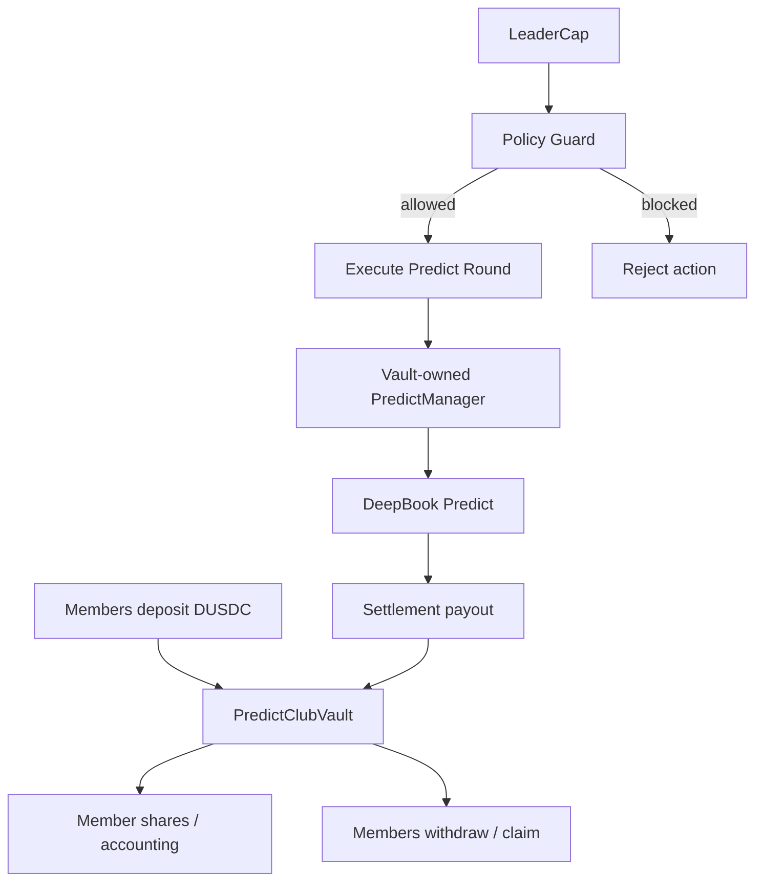

# Predict Club Architecture Decision

## Decision

Predict Club will start as a hybrid, non-custodial community coordination layer
and defer pooled DUSDC custody to a future policy-guarded group vault.

## Context

The user wants a community where a leader validates prediction opportunities,
members contribute around a shared decision, indicators support the thesis, and
loan or liquidity packages can help evaluate capital use. This touches wallet
signing, user funds, DeepBook Predict, possible pooled capital, and leader
authorization.

DeepBook Predict currently uses user PredictManager accounts and requires
careful transaction sequencing. The existing bot architecture docs already
state that assistants should not hold user keys or control personal managers
without user signatures.

## Options Considered

- Self-sign only: leader publishes signals and every member signs their own
  PredictManager trades.
- Shared vault immediately: members deposit DUSDC into a group contract and the
  leader executes from pooled capital.
- Hybrid: V1 uses self-sign coordination; V2 adds a group vault with explicit
  policy and limits.

## Chosen Direction

Choose Hybrid.

V1 will prove the community workflow, indicator consensus, leader confirmation,
member pledges, trade-plan preview, and settlement tracking without taking
custody of member funds. V2 can add pooled capital once the vault contract,
policy limits, accounting, and withdrawal rules are designed and validated.

## V2 Group Vault Model

## Policy Requirements

Any V2 vault must enforce:

- max position size
- max daily turnover
- allowed oracle assets
- minimum and maximum expiry windows
- max drawdown or max loss per round
- oracle health requirement
- pause switch
- member accounting and withdrawal rules
- leader capability that cannot withdraw arbitrary funds

## Consequences

- Positive: V1 is safer, faster to validate, and aligns with user-signed wallet
  boundaries.
- Positive: V2 has a clear policy checklist before custody is introduced.
- Negative: V1 does not provide true pooled execution.
- Negative: Some member actions require individual wallet signing.
- Follow-up: Create a separate Move story before implementing
  `PredictClubVault`.

## References

- `docs/product/predict-club.md`
- `docs/stories/plans/13-predict-club-community.md`
- `docs/stories/plans/09-predict-manager-bot-architecture.md`
- `docs/deepbook/onchain-finance/deepbook-predict.md`
