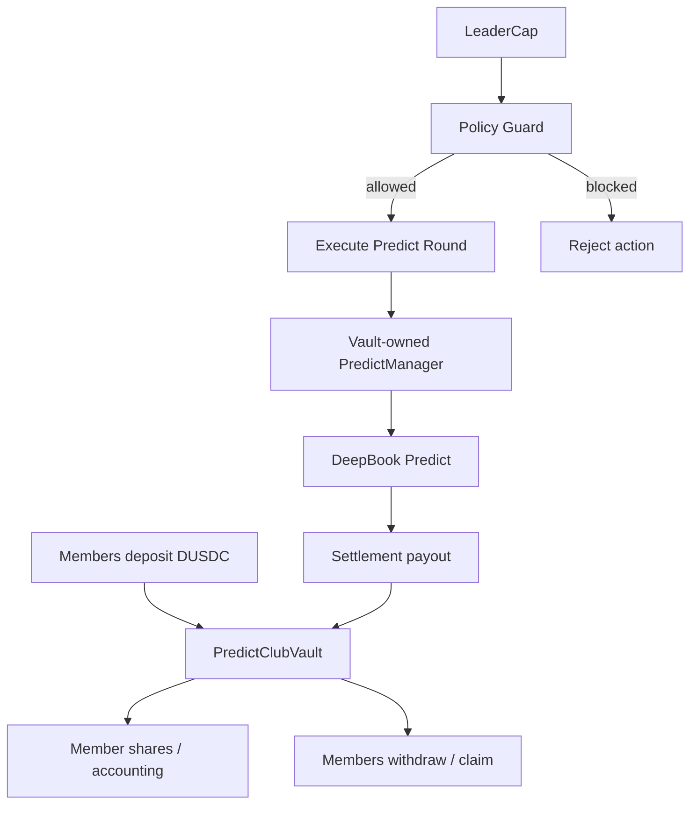

# Quyết Định Kiến Trúc Predict Club

## Quyết Định

Predict Club sẽ khởi đầu như một lớp điều phối cộng đồng lai, không custody,
và dời việc custody DUSDC gộp sang một group vault có policy guard trong tương
lai.

## Bối Cảnh

Người dùng muốn một cộng đồng nơi leader xác thực cơ hội dự đoán, member đóng
góp quanh một quyết định chung, indicator hỗ trợ cho luận điểm, và các gói vay
hoặc thanh khoản giúp đánh giá việc sử dụng vốn. Điều này chạm tới wallet
signing, tiền của người dùng, DeepBook Predict, khả năng dùng vốn gộp và quyền
của leader.

DeepBook Predict hiện dùng các tài khoản PredictManager của người dùng và yêu
cầu chuỗi giao dịch phải được sắp xếp cẩn thận. Tài liệu bot architecture hiện
có cũng đã nêu rõ rằng assistant không được giữ khóa của người dùng hoặc kiểm
soát personal manager nếu không có chữ ký của chính người dùng.

## Các Lựa Chọn Đã Cân Nhắc

- Chỉ tự ký: leader công bố tín hiệu và mỗi member tự ký các giao dịch PredictManager của mình.
- Dùng shared vault ngay: member nạp DUSDC vào group contract và leader thực thi từ vốn gộp.
- Hybrid: V1 dùng cơ chế điều phối tự ký; V2 thêm group vault với policy và giới hạn rõ ràng.

## Hướng Được Chọn

Chọn mô hình Hybrid.

V1 sẽ chứng minh workflow cộng đồng, đồng thuận indicator, việc leader xác nhận,
member cam kết, trade-plan preview và settlement tracking mà không custody tiền
của member. V2 có thể thêm vốn gộp sau khi vault contract, policy limits,
accounting và withdrawal rules đã được thiết kế và xác minh.

## Mô Hình Group Vault Ở V2

## Yêu Cầu Về Policy

Mọi vault ở V2 phải ép buộc:

- kích thước vị thế tối đa
- vòng quay hàng ngày tối đa
- tập oracle asset được phép
- cửa sổ expiry tối thiểu và tối đa
- drawdown tối đa hoặc mức lỗ tối đa cho mỗi round
- yêu cầu về oracle health
- pause switch
- accounting cho member và withdrawal rules
- leader capability không thể rút tiền tùy ý

## Hệ Quả

- Tích cực: V1 an toàn hơn, xác minh nhanh hơn và phù hợp với boundary ví do người dùng tự ký.
- Tích cực: V2 có checklist policy rõ ràng trước khi đưa custody vào.
- Tiêu cực: V1 không cung cấp pooled execution thực sự.
- Tiêu cực: Một số hành động của member vẫn cần ký bằng ví cá nhân.
- Việc tiếp theo: tạo một Move story riêng trước khi triển khai `PredictClubVault`.

## Tài Liệu Tham Chiếu

- `docs/product/predict-club.md`
- `docs/stories/plans/13-predict-club-community.md`
- `docs/stories/plans/09-predict-manager-bot-architecture.md`
- `docs/deepbook/onchain-finance/deepbook-predict.md`
