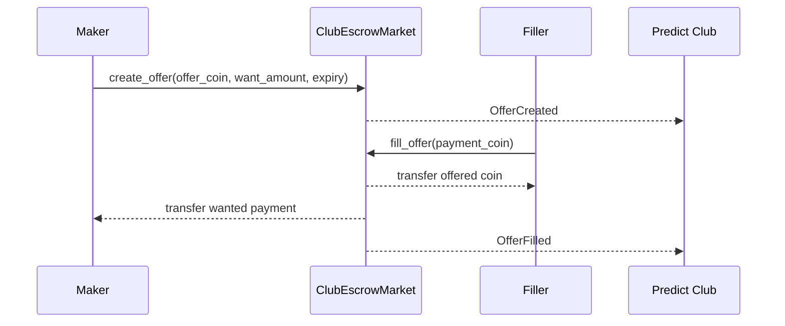
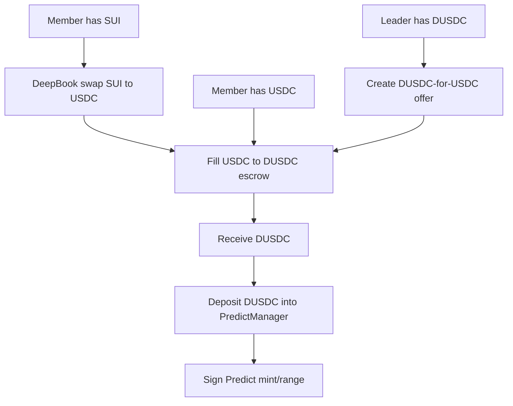

# Predict Club Funding Escrow Decision

## Decision

Predict Club will use a P2P escrow exchange model for USDC to DUSDC funding
instead of pretending that USDC can be used directly in DeepBook Predict.

## Context

Members may have SUI or USDC but not DUSDC. DeepBook Predict currently requires
DUSDC for minting binary and range positions. A leader or another member may be
willing to provide DUSDC in exchange for USDC so the participant can join a
round.

Sui's escrow swap example provides a useful pattern: an offered object or coin
is locked in an escrow object, and the counterparty fills it atomically with the
wanted asset.

## Options Considered

- Leader reserve only: leader holds DUSDC and manually sends DUSDC after
  receiving USDC.
- Protocol swap: use a real USDC/DUSDC pool if one exists and is liquid.
- P2P escrow exchange: leader/member creates an offer that atomically exchanges
  USDC and DUSDC.

## Chosen Direction

Use P2P escrow exchange as the default product model, with leader reserve as a
special case of the same offer flow.

This keeps the exchange explicit, atomic, cancellable, and auditable. It also
works for either direction:

- leader sells DUSDC for member USDC
- member posts USDC request and leader fills with DUSDC

## Escrow Model



## Move Shape

```move
public struct ClubEscrowMarket has key {
  id: UID,
  club_id: ID,
  admin: address,
  paused: bool,
}

public struct EscrowOffer<phantom OfferT, phantom WantT> has key, store {
  id: UID,
  maker: address,
  recipient: Option<address>,
  round_id: Option<ID>,
  offer_amount: u64,
  want_amount: u64,
  expires_at_ms: u64,
  offer_coin: Coin<OfferT>,
}
```

Functions:

- `create_offer<OfferT, WantT>`
- `fill_offer<OfferT, WantT>`
- `cancel_offer<OfferT, WantT>`
- `pause_market`
- `resume_market`

Rules:

- Maker can cancel their own offer.
- Expired offers cannot be filled.
- Recipient-restricted offers can only be filled by that recipient.
- Market pause blocks new offers and fills.
- MVP uses exact fill, not partial fill.
- Overpayment should split exact `want_amount` and return change.
- UI labels this as `P2P escrow exchange`, not a protocol swap.

## Time-Locked Escrow Slice

Before implementing generic USDC/DUSDC exchange, the Move package can include a
small SUI time-locked escrow slice for testing `TxContext`, epoch timing, and
approval capabilities.

The time-locked slice should be split into:

- `errors.move`
- `events.move`
- `types.move`
- `escrow.move`
- `approvals.move`
- `receipts.move`
- `views.move`

It should store real `Balance<SUI>` in `EscrowFunds`, not just a numeric
balance. `ctx.fresh_object_address()` may be used for a stable escrow reference
address, but real object IDs still come from `object::new(ctx)`.

## Generic Extension Table

| Area | Time-Locked SUI Escrow | Generic USDC/DUSDC Escrow |
| --- | --- | --- |
| Purpose | Hold SUI until time/approval conditions pass | Exchange one coin type for another |
| Core type | `Escrow`, `EscrowFunds` | `EscrowOffer<OfferT, WantT>` |
| Asset held | `Balance<SUI>` | `Coin<OfferT>` |
| Counter asset | None | `Coin<WantT>` from filler |
| Main flow | create -> deposit -> approve/wait -> release | create offer -> fill/cancel |
| Time logic | `locked_until_epoch` | `expires_at_epoch` |
| Approval | Optional `ApproverCap` | Optional recipient restriction / market pause |
| Beneficiary | Fixed beneficiary | Filler receives offer; maker receives payment |
| Cancellation | Depositor before late window | Maker while offer is open |
| Receipt | `ReleaseReceipt` | `OfferFilledReceipt` and events |
| Predict Club use | Payment lock or commitment | USDC/DUSDC funding exchange |

## Funding Flow



## Consequences

- Positive: funding exchange is atomic and visible.
- Positive: leader/member can both create offers.
- Positive: escrow can support club-specific or round-specific offers.
- Negative: no partial fills in MVP may reduce liquidity.
- Negative: escrow does not solve external bridge or network mismatch.
- Follow-up: add Move story for `contracts/predict-club` once the UI funding
  router is ready.

## References

- Sui escrow swap example: https://docs.sui.io/develop/publish-upgrade-packages/versioning#example-escrow-swap
- `docs/product/predict-club-escrow-contract.md`
- `docs/product/predict-club-funding.md`
- `docs/product/predict-club.md`
