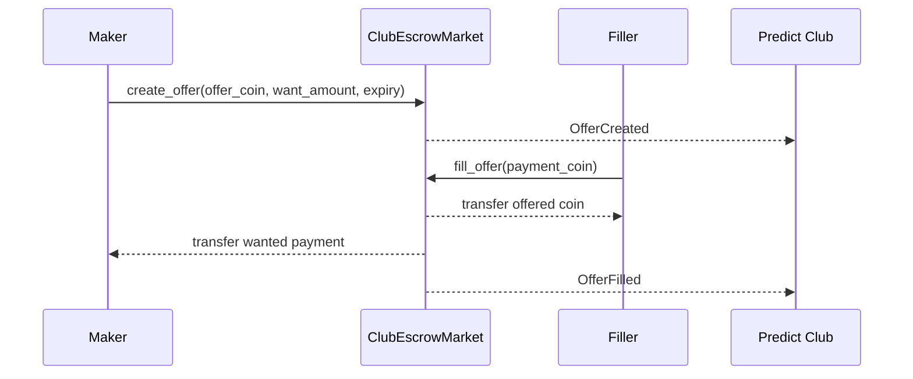

# Quyết Định Về Escrow Nạp Vốn Predict Club

## Quyết Định

Predict Club sẽ dùng mô hình P2P escrow exchange cho việc nạp vốn từ USDC sang
DUSDC thay vì giả định rằng USDC có thể dùng trực tiếp trong DeepBook Predict.

## Bối Cảnh

Member có thể có SUI hoặc USDC nhưng không có DUSDC. DeepBook Predict hiện yêu
cầu DUSDC để mint các vị thế binary và range. Leader hoặc một member khác có
thể sẵn sàng cung cấp DUSDC để đổi lấy USDC nhằm giúp người tham gia vào round.

Ví dụ escrow swap của Sui cung cấp một pattern hữu ích: object hoặc coin được
chào bán bị khóa trong một escrow object, và counterparty điền lệnh đó bằng tài
sản mong muốn theo cách nguyên tử.

## Các Lựa Chọn Đã Cân Nhắc

- Chỉ dùng leader reserve: leader giữ DUSDC và gửi DUSDC thủ công sau khi nhận USDC.
- Protocol swap: dùng một pool USDC/DUSDC thật nếu nó tồn tại và có thanh khoản.
- P2P escrow exchange: leader/member tạo một offer trao đổi USDC và DUSDC theo cách nguyên tử.

## Hướng Được Chọn

Dùng P2P escrow exchange làm mô hình sản phẩm mặc định, với leader reserve chỉ
là một trường hợp đặc biệt của cùng một luồng offer.

Điều này giữ cho việc trao đổi là tường minh, nguyên tử, có thể hủy và có thể
kiểm toán. Nó cũng hoạt động cho cả hai chiều:

- leader bán DUSDC để lấy USDC từ member
- member đăng yêu cầu USDC và leader điền bằng DUSDC

## Mô Hình Escrow

## Hệ Quả

- Tích cực: việc trao đổi nạp vốn là nguyên tử và minh bạch.
- Tích cực: cả leader lẫn member đều có thể tạo offer.
- Tích cực: escrow có thể hỗ trợ offer theo club hoặc theo round.
- Tiêu cực: việc không có partial fill ở MVP có thể làm giảm thanh khoản.
- Tiêu cực: escrow không giải quyết bridge bên ngoài hay network mismatch.
- Việc tiếp theo: thêm Move story cho `contracts/predict-club` khi UI funding router đã sẵn sàng.

## Tài Liệu Tham Chiếu

- Sui escrow swap example: https://docs.sui.io/develop/publish-upgrade-packages/versioning#example-escrow-swap
- `docs/product/predict-club-escrow-contract.md`
- `docs/product/predict-club-funding.md`
- `docs/product/predict-club.md`
