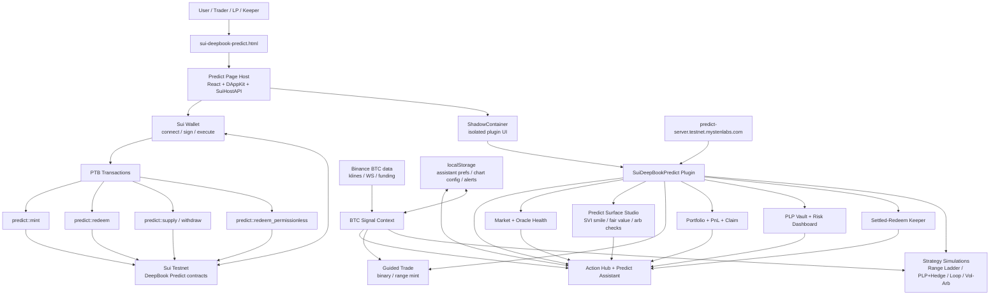
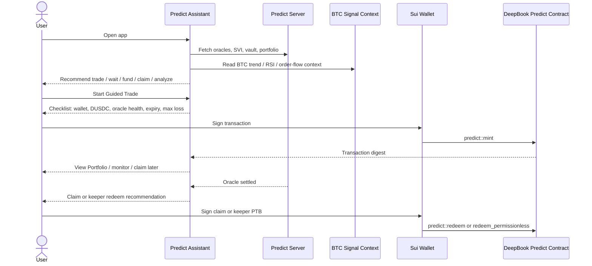

# DeepBook Predict User Assist Plan

## Summary

Build a user-assistance layer for `sui-deepbook-predict.html` that combines the existing DeepBook Predict dashboard with BTC market context from BTC Chart Pro.

The product goal is to help first-time users and hackathon judges answer:

- Can I trade now?
- Should I wait or analyze first?
- Do I need DUSDC?
- Which direction is aligned with current BTC context?
- What is my max loss?
- What should I do after settlement?
- Where are my existing Predict positions on the price chart?

This plan keeps **Predict Surface Studio / Analytics & Developer Tooling** as the primary Idea Bank direction, with supporting modules from PLP risk, keeper services, strategy simulations, and guided consumer UX.

## Idea Bank Positioning

Primary idea:

- **#9 Predict Surface Studio** — live SVI surface, oracle health, fair value, and market legibility.

Combined supporting ideas:

- **#10 PLP Risk Dashboard** — vault utilization, what-if stress, LP safety.
- **#8 Settled-Redeem Keeper Network** — settled-position scanning and permissionless redeem.
- **#7 Vol-Arb Bot / Signal Monitor** — compare Predict SVI context with external market context and feeder lag.
- **#1 Range Ladder Vault** and **#2 PLP + Hedge Vault** — strategy simulations unless implemented as real vault contracts.
- **Alt-flavor consumer frontend** — Action Hub and Guided Trade replace a raw pro-only tab experience for new users.

Do not pitch this as a guaranteed trading bot. BTC signals are **decision support**, not a promise of profitable prediction.

## Architecture Model



## Key Changes

- Add a `Predict Assistant` section above or beside the current Action Hub.
- Recommend one action at a time:
  - `Ready to Trade`
  - `Wait`
  - `Analyze First`
  - `Claim Position`
  - `Fund DUSDC`
- Explain recommendations using:
  - wallet connection
  - DUSDC availability
  - oracle freshness
  - expiry time
  - open or settled positions
  - PLP/vault risk
  - BTC market context
  - max-loss visibility
- Add `BTC Signal Context` into Predict:
  - MA50/MA200 trend regime
  - RSI overbought/oversold state
  - NWE band touch
  - order-flow spike
  - volume-profile position against POC/VAH/VAL
- Output only probabilistic labels:
  - `Bullish`
  - `Bearish`
  - `Neutral`
  - `No Trade`
- Upgrade Guided Trade:
  - Show signal alignment beside `BTC Up` and `BTC Down`.
  - Warn when oracle is stale, expiry is too close, user has no DUSDC, or direction conflicts with context.
  - Add a pre-sign checklist: wallet connected, DUSDC available, oracle healthy, expiry safe, max loss accepted.
- Add participation support after trade:
  - Portfolio recommendation when position exists.
  - Claim/settlement reminder when an oracle is settled.
  - Keeper prompt for permissionless redeem opportunities.
- Add chart-first position selection:
  - Click a price on the selected oracle chart to fill a binary strike and infer `UP` or `DOWN`.
  - Drag a price band to fill range lower/upper strikes.
  - Overlay minted binary and range positions so users can see current exposure visually.
- Add persistence and export:
  - Store assistant preferences in localStorage, modeled after BTC chart config.
  - Export a short participation summary/snapshot for demos or sharing.

## Public Interfaces / Types

Internal UI/data types only:

```ts
type PredictAssistAction =
  | 'connect-wallet'
  | 'fund-dusdc'
  | 'start-guided-trade'
  | 'analyze-market'
  | 'view-portfolio'
  | 'claim-position'
  | 'wait'

type BtcSignalBias = 'bullish' | 'bearish' | 'neutral' | 'no-trade'
type AssistSeverity = 'info' | 'warning' | 'blocked'

interface PredictAssistState {
  recommendedAction: PredictAssistAction
  severity: AssistSeverity
  reasons: string[]
  btcSignal: BtcSignalBias
  checklist: {
    walletConnected: boolean
    hasDusdc: boolean
    oracleHealthy: boolean
    expirySafe: boolean
    maxLossAccepted: boolean
  }
}
```

No Predict server, Sui transaction, or Move interface changes are required for this layer.

## User Flow



## Test Plan

- Wallet disconnected: assistant recommends `connect-wallet`.
- Wallet connected with no DUSDC: assistant recommends `fund-dusdc`.
- Healthy oracle and DUSDC available: assistant recommends `start-guided-trade`.
- Stale oracle: assistant blocks trade and routes to `Analyze Market`.
- Expiry too close: assistant warns or blocks based on configured safe-time threshold.
- BTC bullish signal: `BTC Up` is marked aligned, `BTC Down` shows caution.
- BTC bearish signal: `BTC Down` is marked aligned, `BTC Up` shows caution.
- Neutral/no-trade signal: assistant suggests range, PLP, or market analysis instead of directional trade.
- Settled position exists: assistant recommends claim/portfolio before opening a new trade.
- Existing Market, Trade, Portfolio, Vault, Keeper, and advanced tabs still render.
- `rtk bun run build` passes.

## Related Docs

- `docs/deepbook/predict/PLAN.md`
- `docs/deepbook/predict/PLAN_MOD.md`
- `docs/deepbook/btc/README.md`
- `docs/deepbook/btc/features.md`
- `docs/deepbook/btc/alerts.md`
- `docs/deepbook/btc/volume-profile.md`
- `docs/deepbook/btc/order-flow-overlay.md`
- `docs/deepbook/onchain-finance/deepbook-predict.md`
- `plugins/sui-deepbook-predict/docs/ARCHITECTURE.md`
- `docs/plans/10-interactive-predict-position-chart.md`

## Assumptions

- The primary user is a first-time Predict trader or hackathon judge.
- The implementation extends the current Action Hub and Guided Trade instead of replacing the Predict plugin.
- BTC signals are advisory context only.
- Vault/strategy modules remain simulations unless backed by real contracts.
