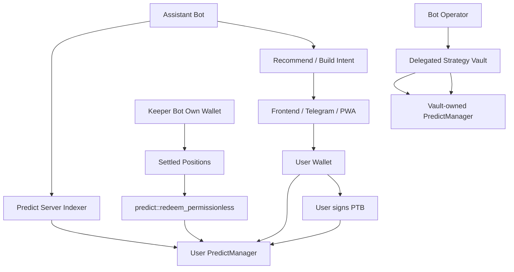
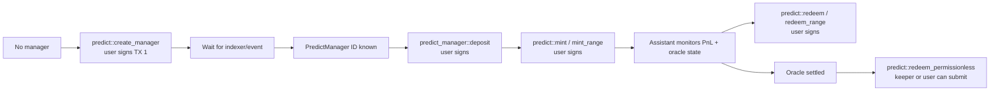
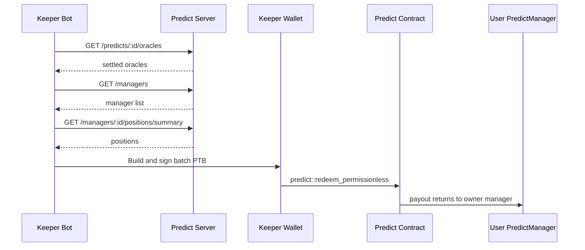

# Predict Manager Bot Architecture Plan

## Summary

Design bot support for user `PredictManager` accounts without taking unsafe custody or bypassing wallet consent.

DeepBook Predict uses a shared `PredictManager` per user to hold deposited quote balances and track binary/range positions. A bot can monitor and assist that manager, but it should not have direct authority to mint, redeem live positions, withdraw, or move user funds unless the user signs the transaction or the user has deposited into a separate strategy vault.

This plan separates four bot roles:

- `AssistantBot` — read-only monitor and recommender.
- `ExecutionAssistant` — builds PTBs for the user to review and sign.
- `KeeperBot` — calls settled `predict::redeem_permissionless` where allowed.
- `StrategyVaultBot` — future automated strategy over a vault-owned manager, not a personal user manager.

## Core Rule

Do not design a bot that holds a user private key or has unrestricted control over the user's personal `PredictManager`.

For personal manager flows, the bot may prepare an action, but the wallet owner signs sensitive execution.

For automated strategies, use a separate strategy vault or delegated-manager contract with explicit limits.

## Permission Model



## Bot Roles

### 1. AssistantBot

Read-only bot. It can monitor managers and recommend what the user should do next.

Allowed:

- Discover user managers through `GET /managers`, filtered by `owner`.
- Read `GET /managers/:id/summary`.
- Read `GET /managers/:id/positions/summary`.
- Read `GET /managers/:id/pnl?range=ALL`.
- Read oracle state, SVI, vault state, and settled-oracle status.
- Notify user about stale oracle, DUSDC shortage, claimable positions, high vault risk, or strategy opportunities.

Not allowed:

- Submit mint/redeem/withdraw actions for the user's manager without user signature.
- Store the user's private key.

### 2. ExecutionAssistant

Non-custodial execution helper. It builds PTBs and presents a preview, but the user signs every sensitive action.

Allowed after user review/signature:

- `predict::create_manager`
- `predict_manager::deposit<DUSDC>`
- `predict::mint`
- `predict::mint_range`
- `predict::redeem`
- `predict::redeem_range`
- `predict::supply`
- `predict::withdraw`

Important flow constraint:

- `predict::create_manager` returns an ID, but the actual `PredictManager` is a shared object.
- The app cannot create and use the manager in the same PTB.
- Use two transactions:
  - TX 1: `predict::create_manager`
  - Wait for indexer or event.
  - TX 2: use `tx.object(managerId)` in deposit/mint/redeem calls.

### 3. KeeperBot

Permissionless settlement bot. It can run with its own wallet and scan all managers for positions on settled oracles.

Allowed:

- Fetch all managers.
- Fetch positions for settled oracles.
- Build a batch PTB calling `predict::redeem_permissionless`.
- Submit with the keeper's wallet.

Constraint:

- Payout goes to the position owner's `PredictManager`, not the keeper.
- Any keeper tip or fee requires an additional explicit mechanism.

### 4. StrategyVaultBot

Future automated strategy. It should not control the user's personal `PredictManager`.

Recommended model:

- User deposits DUSDC into a strategy vault contract.
- Vault creates or owns its own `PredictManager`.
- User receives a share token or accounting balance.
- Bot/operator calls strategy functions bounded by vault policy.

Required limits:

- max position size
- max daily turnover
- allowed oracle assets
- allowed expiry windows
- max loss / drawdown guard
- vault pause switch
- withdrawal queue or cooldown
- transparent strategy reporting

## Manager Lifecycle



## Public Interfaces / Types

Conceptual types for implementation planning:

```ts
type BotRole =
  | 'assistant'
  | 'execution-assistant'
  | 'keeper'
  | 'strategy-vault'

type ManagerAction =
  | 'create-manager'
  | 'deposit-dusdc'
  | 'mint-binary'
  | 'mint-range'
  | 'redeem'
  | 'redeem-range'
  | 'redeem-permissionless'
  | 'supply-plp'
  | 'withdraw-plp'

type ActionPermission =
  | 'read-only'
  | 'requires-user-signature'
  | 'permissionless'
  | 'vault-policy-controlled'

interface ManagerActionPlan {
  action: ManagerAction
  permission: ActionPermission
  managerId?: string
  oracleId?: string
  userAddress?: string
  riskChecks: string[]
}
```

## Execution Matrix

| Action | Bot can prepare | Bot can self-submit | Required authority |
|---|---:|---:|---|
| Discover managers | Yes | Yes | Public indexer read |
| Read positions/PnL | Yes | Yes | Public indexer read |
| Create user manager | Yes | No | User wallet signature |
| Deposit DUSDC into user manager | Yes | No | User wallet signature |
| Mint binary/range for user manager | Yes | No | User wallet signature |
| Redeem live position | Yes | No | User wallet signature |
| Withdraw PLP/DUSDC | Yes | No | User wallet signature |
| Redeem settled position permissionlessly | Yes | Yes | Permissionless protocol function |
| Automated strategy trading | Yes | Only via vault | Vault policy authority |

## Keeper Flow



## Test / Acceptance Scenarios

- User has no manager:
  - assistant recommends creating one.
  - execution flow creates manager in TX 1, waits for indexer, then uses manager in TX 2.
- User has manager but no DUSDC:
  - assistant recommends deposit/fund DUSDC.
  - bot builds deposit PTB, user signs.
- User has active oracle and DUSDC:
  - assistant builds mint preview and PTB.
  - user must sign before execution.
- User has settled positions:
  - assistant recommends claim.
  - keeper can call `redeem_permissionless` without owner signature, with payout returning to the owner's manager.
- Bot scans all managers:
  - only settled redeem actions are self-executable.
  - non-settled mint/redeem/withdraw actions are blocked unless user signs.
- Vault automation:
  - bot trades only through a vault-owned manager after user deposits into the vault.
  - strategy limits are explicit: max size, allowed assets/oracles, max loss, and pause switch.

## Related Docs

- `docs/deepbook/onchain-finance/deepbook-predict.md`
- `docs/deepbook/mint-position-guide.md`
- `plugins/sui-deepbook-predict/TODO.md`
- `plugins/sui-deepbook-predict/components/KeeperTab.tsx`
- `plugins/sui-deepbook-predict/components/PortfolioTab.tsx`
- `plugins/sui-deepbook-predict/components/GuidedTrade.tsx`
- `plugins/sui-deepbook-predict/docs/ARCHITECTURE.md`

## Assumptions

- Current DeepBook Predict integration target is Sui testnet.
- The public Predict server is `https://predict-server.testnet.mystenlabs.com`.
- Personal `PredictManager` automation is non-custodial by default.
- Fully automated trading belongs in a separate strategy vault or delegated manager design.
