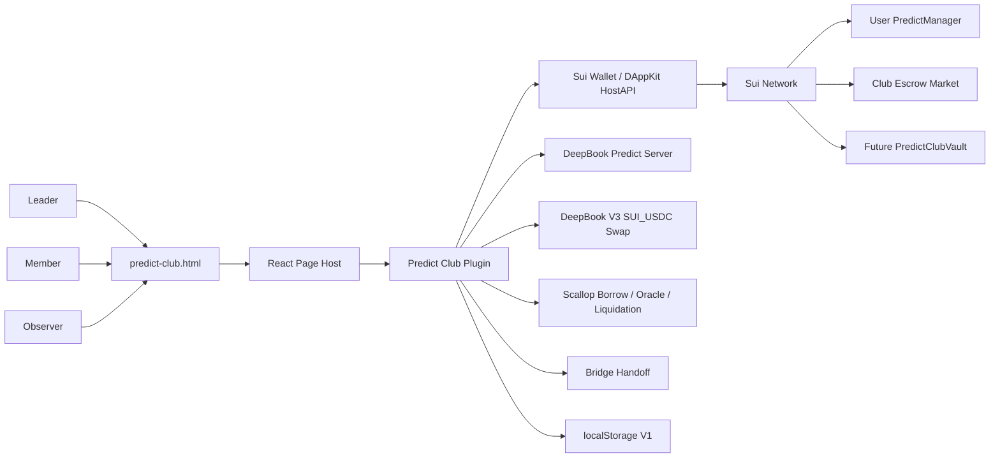
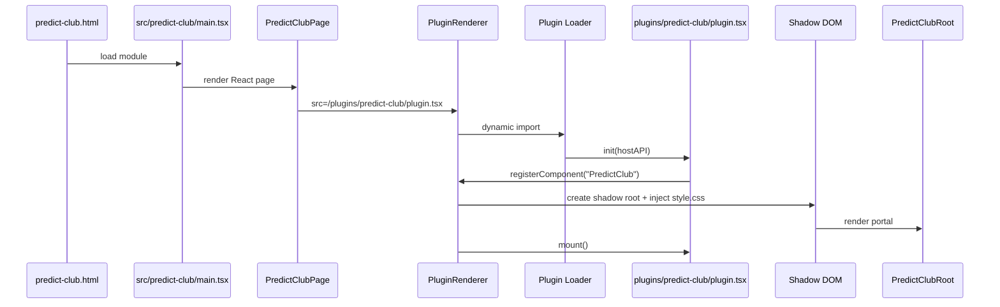
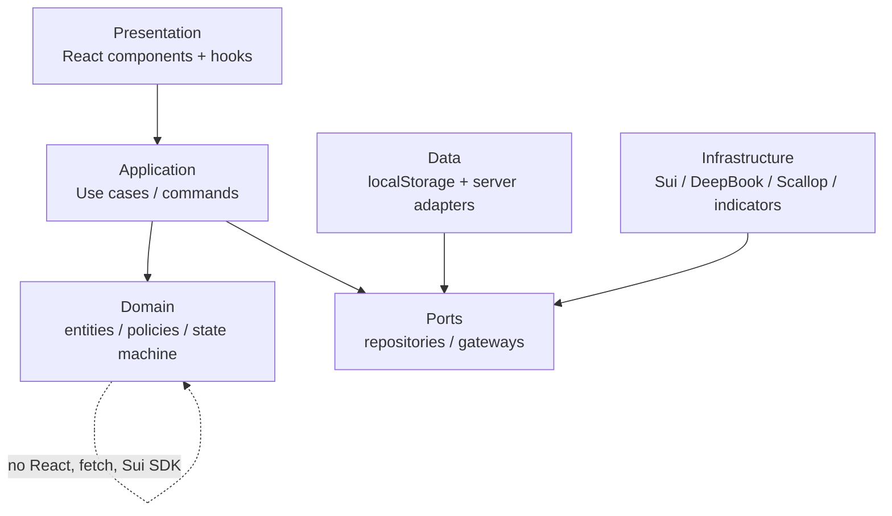
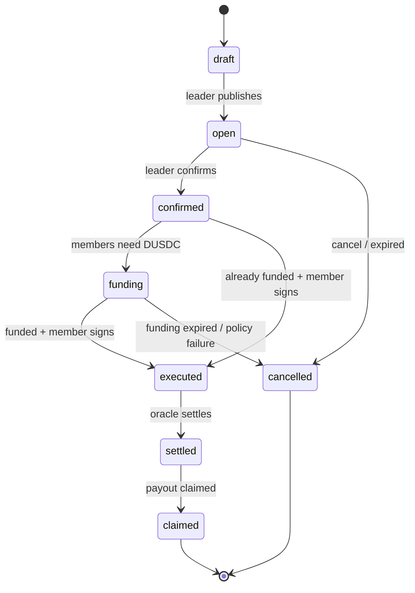
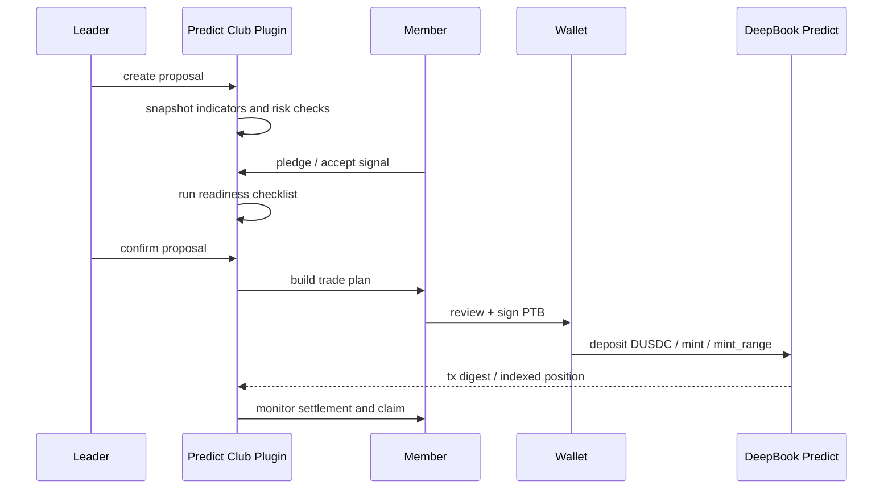
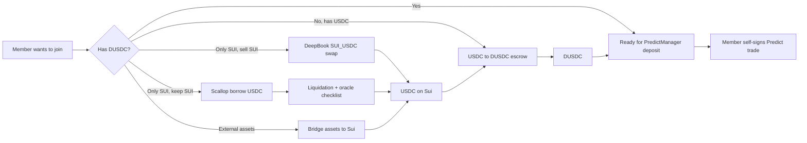
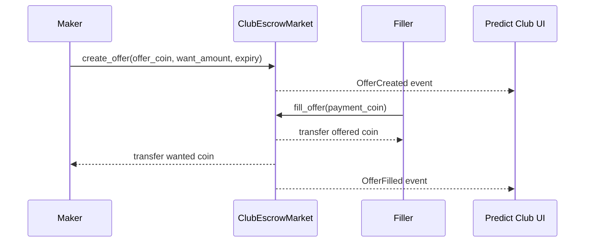
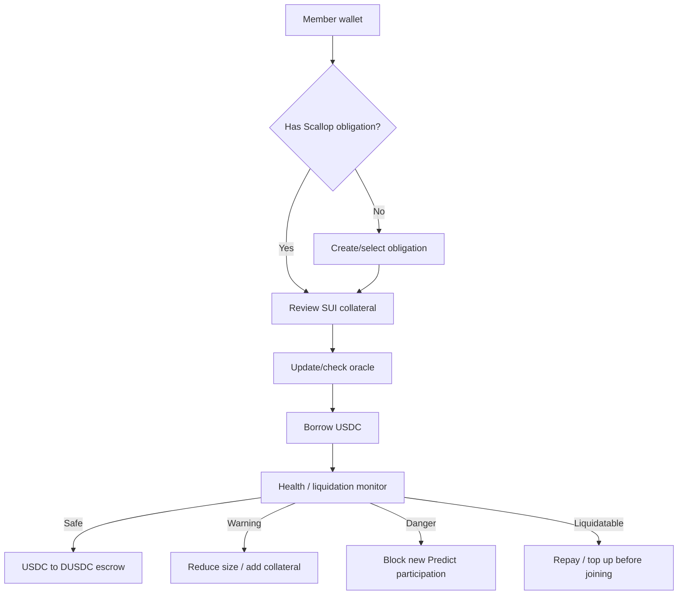
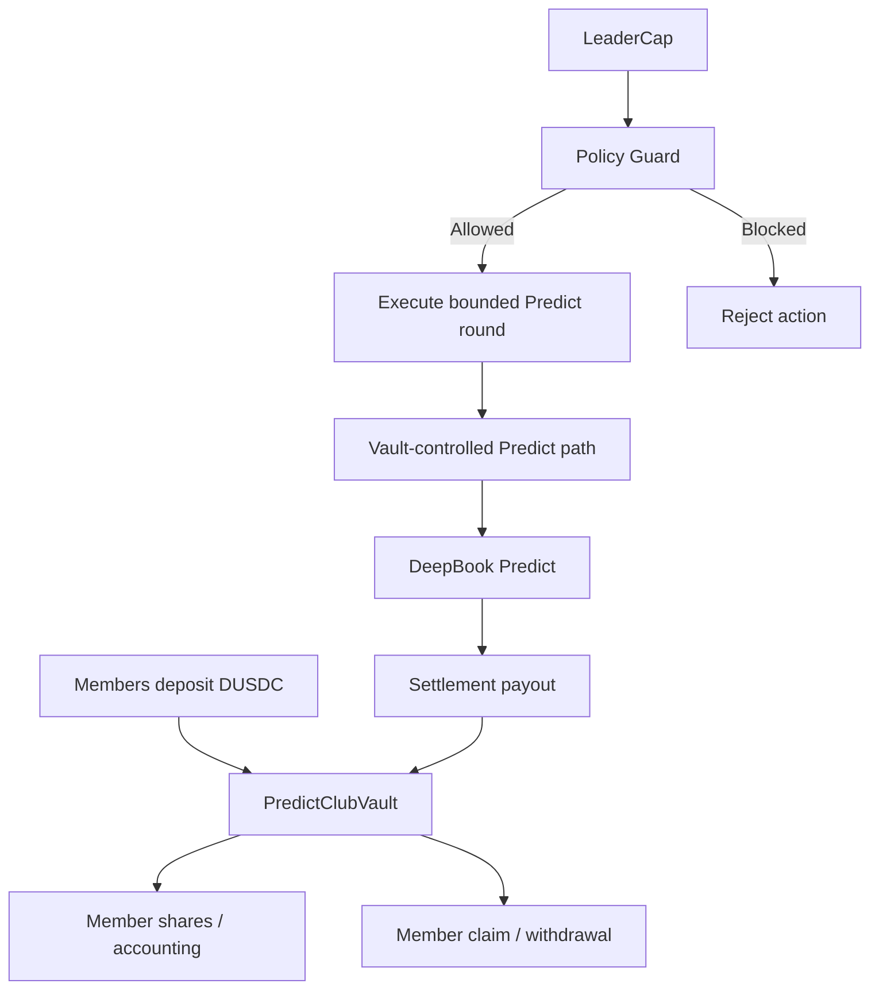
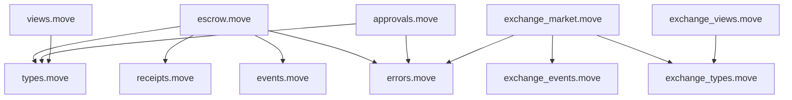

# Predict Club Architecture Diagrams

## Summary

This document collects the architecture diagrams and planned file structure for
`predict-club.html`, `plugins/predict-club`, and the future
`contracts/predict-club` package.

Predict Club is a high-risk feature because it touches wallet signing,
authorization, funding routes, escrow exchange, Scallop borrowing risk,
DeepBook Predict, and future pooled-capital custody.

## System Context



## Page and Plugin Runtime



## Clean Architecture Boundaries



Rules:

- Domain is pure and dependency-free.
- Application depends on interfaces, not concrete fetch/Sui clients.
- Presentation never contains protocol rules.
- Infrastructure owns wallet, Sui SDK, DeepBook, Scallop, and external provider
  details.

## Round Lifecycle



## Member Self-Sign Trade Flow



## Funding Router



## Escrow Exchange



Use cases:

- Leader offers DUSDC and wants USDC.
- Member offers USDC and wants DUSDC.
- Recipient-restricted offers support one specific member.
- Round-linked offers support funding for one active prediction round.

## Scallop Borrow Risk Flow



## Future Group Vault



V2 vault work is explicitly separate from V1. It requires a Move story,
contract tests, and wallet-flow review before implementation.

## Escrow Contract Module Architecture



The Move package should be split into small files. Do not place the
time-locked escrow and generic USDC/DUSDC exchange logic in one large module.

## Planned File Structure

### Page Host

```text
predict-club.html
src/predict-club/
  main.tsx
  PredictClubPage.tsx
  predict-club.css
```

Purpose:

- `predict-club.html`: standalone entry point.
- `main.tsx`: React root bootstrap.
- `PredictClubPage.tsx`: page shell, wallet provider, and plugin renderer.
- `predict-club.css`: host page layout only; plugin UI remains scoped in
  Shadow DOM.

### Plugin

```text
plugins/predict-club/
  plugin.tsx
  style.css
  domain/
    entities.ts
    valueObjects.ts
    policies.ts
    events.ts
    stateMachine.ts
  application/
    createProposal.ts
    pledgeToRound.ts
    confirmProposal.ts
    recommendFundingRoute.ts
    createEscrowOffer.ts
    fillEscrowOffer.ts
    buildMemberTradePlan.ts
    settleRound.ts
  data/
    predictClubRepository.ts
    predictRepositoryAdapter.ts
    localClubStore.ts
    escrowRepository.ts
  infrastructure/
    suiPredictGateway.ts
    deepbookSwapGateway.ts
    scallopGateway.ts
    indicatorSignalGateway.ts
    bridgeGateway.ts
  presentation/
    PredictClubRoot.tsx
    hooks/
      useClubState.ts
      useFundingRoutes.ts
      useRoundActions.ts
    components/
      DecisionStrip.tsx
      PredictionRoom.tsx
      IndicatorConsensus.tsx
      MemberCommitments.tsx
      RiskChecklist.tsx
      LeaderCommandPanel.tsx
      FundingRouter.tsx
      EscrowExchange.tsx
      ScallopRiskPanel.tsx
      LoanPlanner.tsx
      RoundHistory.tsx
      ClaimQueue.tsx
```

### Future Move Package

```text
contracts/predict-club/
  Move.toml
  sources/
    errors.move
    events.move
    types.move
    escrow.move
    approvals.move
    receipts.move
    views.move
    exchange_types.move
    exchange_market.move
    exchange_views.move
    exchange_events.move
    club_vault.move
  tests/
    escrow_tests.move
    approval_tests.move
    cancellation_tests.move
    exchange_offer_tests.move
    exchange_cancel_tests.move
    exchange_recipient_tests.move
    club_vault_tests.move
```

Purpose:

- `escrow.move`: SUI time-locked escrow using epoch-based release.
- `exchange_market.move`: P2P generic `EscrowOffer<OfferT, WantT>` market for
  USDC/DUSDC funding.
- `club_vault.move`: future DUSDC pooled-capital vault; not part of V1.
- tests verify offer fill/cancel/expiry/recipient restrictions and future vault
  policy checks.

## Type Contracts

```ts
type RoundStatus =
  | 'draft'
  | 'open'
  | 'confirmed'
  | 'funding'
  | 'executed'
  | 'settled'
  | 'claimed'
  | 'cancelled'

type FundingRoute =
  | 'ready-with-dusdc'
  | 'deepbook-sui-to-usdc'
  | 'scallop-borrow-usdc'
  | 'bridge-assets-to-sui'
  | 'club-escrow-usdc-to-dusdc'

type ScallopRiskState = 'safe' | 'warning' | 'danger' | 'liquidatable' | 'unknown'

interface EscrowOfferView {
  id: string
  maker: string
  recipient?: string
  roundId?: string
  offerCoinType: string
  wantCoinType: string
  offerAmount: string
  wantAmount: string
  expiresAtMs: number
  status: 'open' | 'filled' | 'cancelled' | 'expired'
}
```

## Validation Map

| Area | Proof |
| --- | --- |
| Docs / diagrams | Mermaid renders and links resolve in Obsidian-compatible markdown. |
| Page host | `rtk bun run build`; browser smoke on `predict-club.html`. |
| Plugin runtime | Plugin loads inside Shadow DOM and registers `PredictClub`. |
| Funding router | SUI-only, USDC-only, DUSDC-ready, and external-asset states route correctly. |
| Scallop borrow | Borrow route shows oracle and liquidation warnings before signing. |
| Escrow | Create, fill, cancel, expiry, recipient restriction, and overpayment scenarios. |
| Predict flow | Member self-signs; no bot or leader holds private keys. |

## Related Docs

- `docs/product/predict-club.md`
- `docs/product/predict-club-escrow-contract.md`
- `docs/product/predict-club-funding.md`
- `docs/stories/plans/13-predict-club-community.md`
- `docs/decisions/predict-club-architecture.md`
- `docs/decisions/predict-club-funding-escrow.md`
