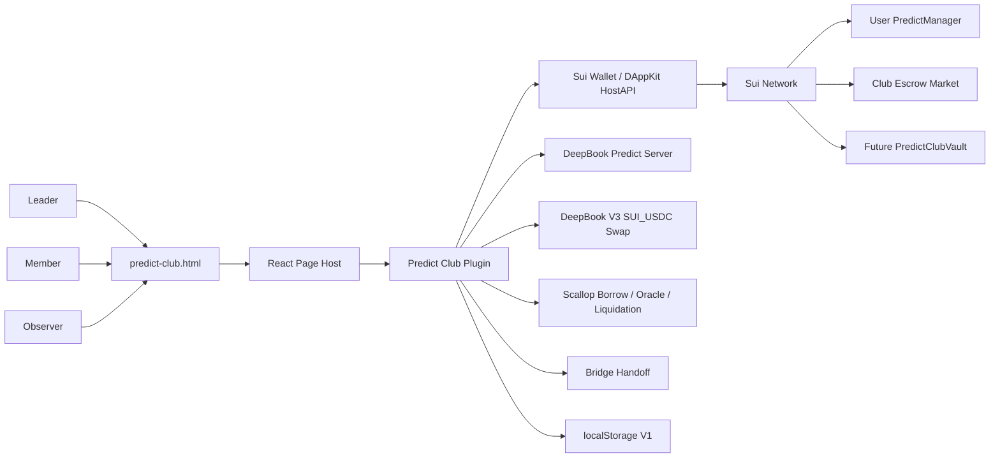
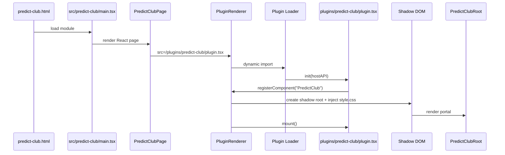
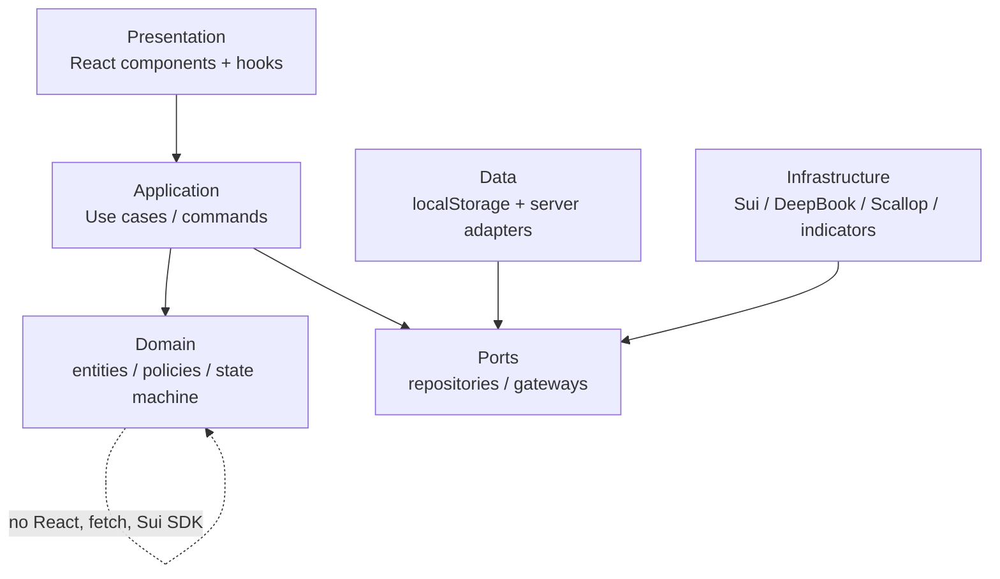
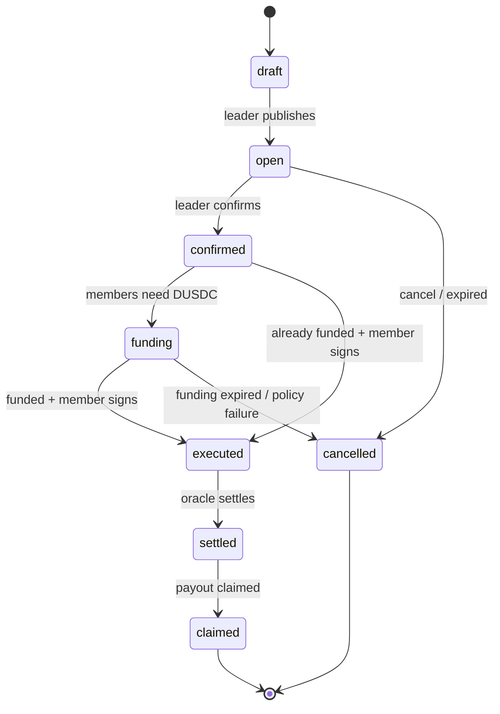
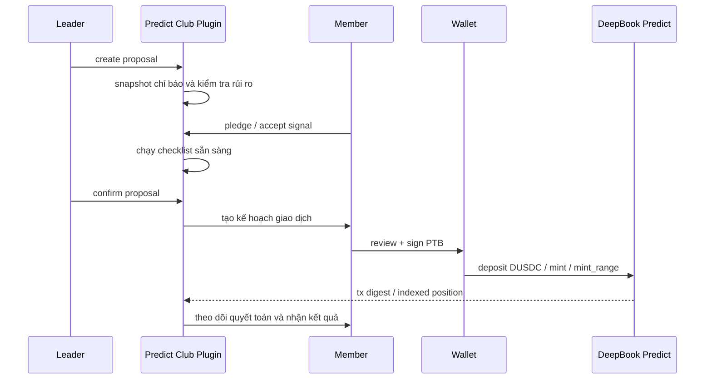
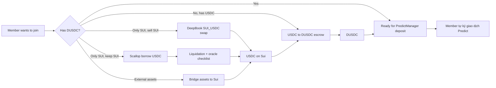
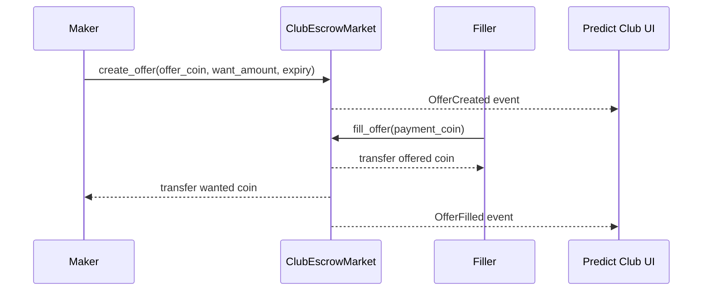
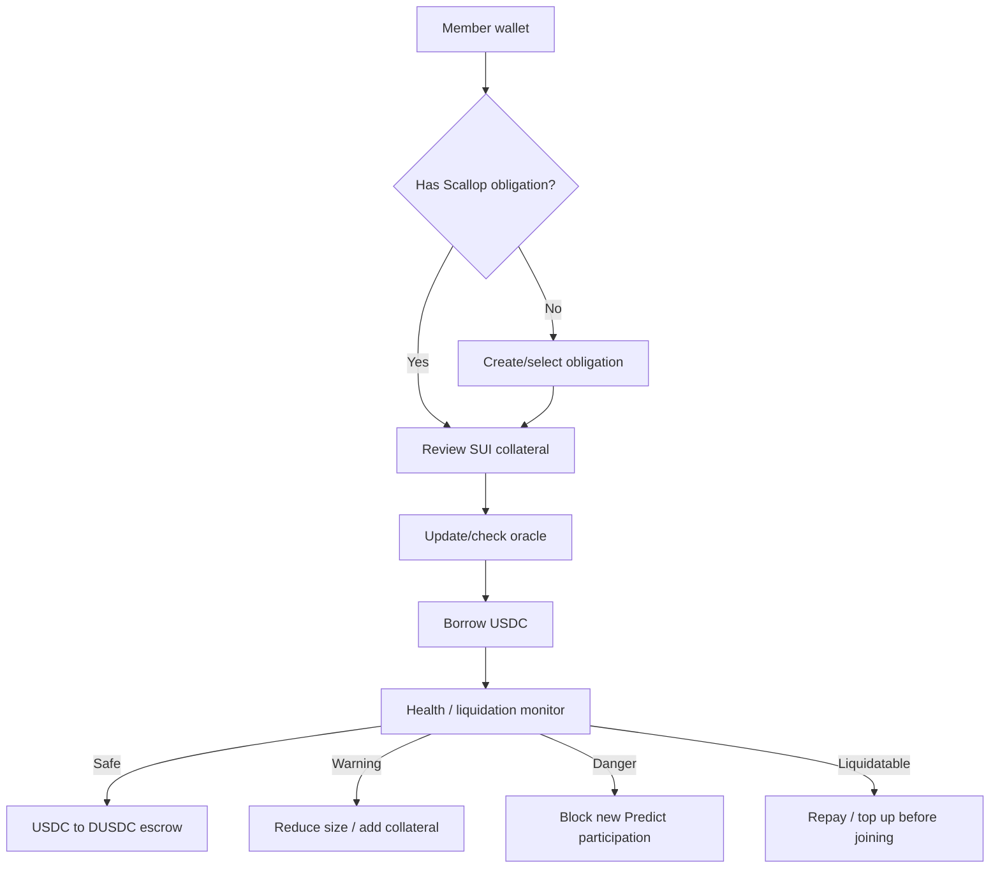
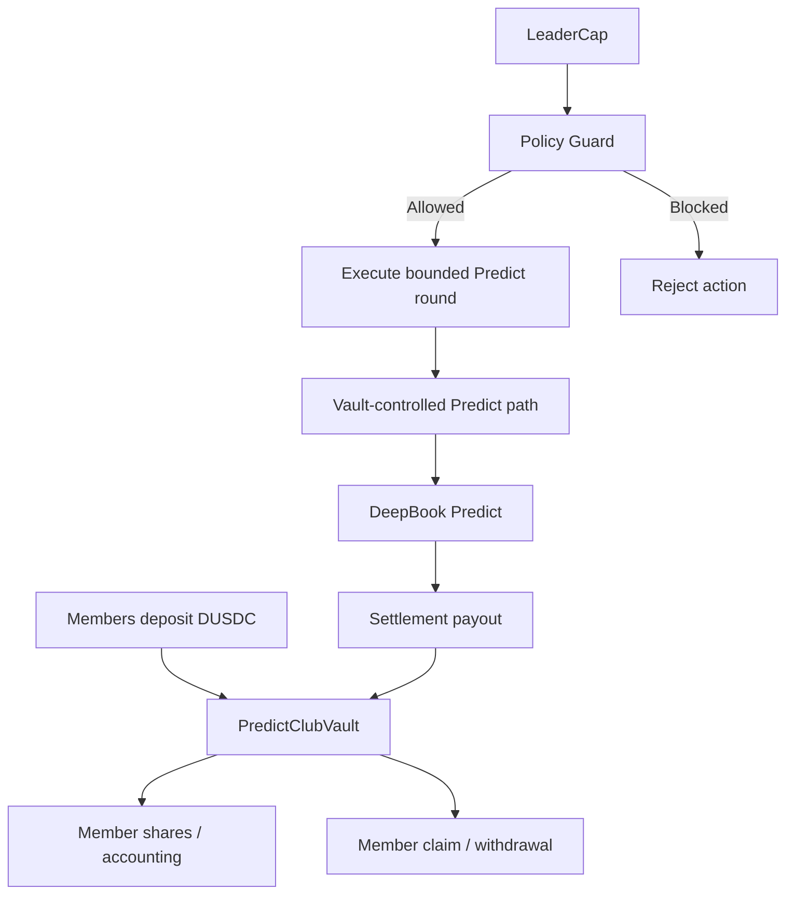
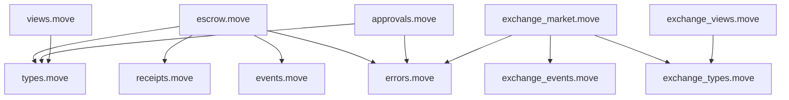

# Sơ Đồ Kiến Trúc Predict Club

## Tóm Tắt

Tài liệu này tập hợp các sơ đồ kiến trúc và cấu trúc file dự kiến cho
`predict-club.html`, `plugins/predict-club` và package `contracts/predict-club`
trong tương lai.

Predict Club là một tính năng rủi ro cao vì nó chạm tới ký ví,
authorization, tuyến nạp vốn, escrow exchange, rủi ro vay Scallop, DeepBook
Predict và custody vốn gộp trong tương lai.

## Ngữ Cảnh Hệ Thống



## Runtime Của Trang Và Plugin



## Boundary Clean Architecture



Quy tắc:

- Domain phải thuần và không phụ thuộc vào dependency.
- Application phụ thuộc vào interface, không phụ thuộc vào fetch/Sui client cụ thể.
- Presentation không bao giờ chứa quy tắc protocol.
- Infrastructure sở hữu chi tiết về ví, Sui SDK, DeepBook, Scallop và các
  external provider.

## Vòng Đời Round



## Luồng Thành Viên Tự Ký Giao Dịch



## Funding Router



## Escrow Exchange



Các use case:

- Leader chào bán DUSDC và muốn nhận USDC.
- Member chào bán USDC và muốn nhận DUSDC.
- Offer giới hạn người nhận để hỗ trợ một thành viên cụ thể.
- Offer gắn với round hỗ trợ việc nạp vốn cho một prediction round đang hoạt động.

## Luồng Rủi Ro Vay Scallop



## Group Vault Tương Lai



Công việc vault ở V2 tách biệt rõ khỏi V1. Nó yêu cầu một story về Move, test
contract và rà soát luồng ví trước khi triển khai.

## Kiến Trúc Module Của Escrow Contract



Move package nên được tách thành các file nhỏ. Không gộp logic escrow khóa thời
gian và logic trao đổi USDC/DUSDC tổng quát vào một module lớn.

## Cấu Trúc File Dự Kiến

### Page Host

```text
predict-club.html
src/predict-club/
  main.tsx
  PredictClubPage.tsx
  predict-club.css
```

Mục đích:

- `predict-club.html`: entry point độc lập.
- `main.tsx`: bootstrap React root.
- `PredictClubPage.tsx`: page shell, wallet provider và plugin renderer.
- `predict-club.css`: chỉ layout cho host page; UI của plugin vẫn được cô lập
  trong Shadow DOM.
