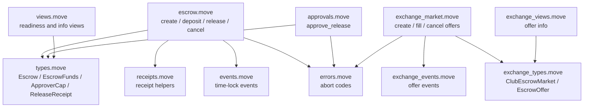
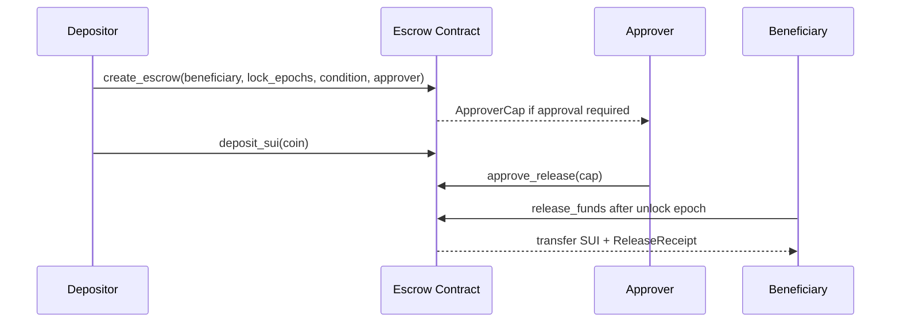
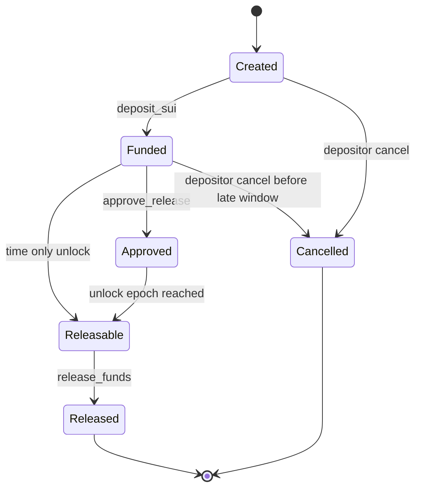
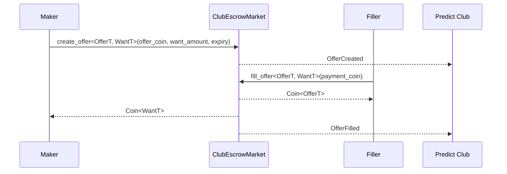

# Predict Club Escrow Contract Plan

## Summary

This document translates the time-locked escrow discussion into a planned
`contracts/predict-club` Move package.

The first contract slice is a time-locked SUI escrow using epoch-based release
constraints. The extension is a generic `EscrowOffer<OfferT, WantT>` exchange
for USDC/DUSDC club funding.

## Contract Package Layout

```text
contracts/predict-club/
  Move.toml
  sources/
    errors.move
    events.move
    types.move
    escrow.move
    approvals.move
    receipts.move
    views.move
    exchange_types.move
    exchange_market.move
    exchange_views.move
    exchange_events.move
  tests/
    escrow_tests.move
    approval_tests.move
    cancellation_tests.move
    exchange_offer_tests.move
    exchange_cancel_tests.move
    exchange_recipient_tests.move
```

## Move Module Architecture



## Time-Locked Escrow Flow



## Time-Locked Escrow State Machine



## Time-Locked Escrow Types

```move
public struct Escrow has key {
    id: UID,
    escrow_address: address,
    depositor: address,
    beneficiary: address,
    amount: u64,
    locked_until_epoch: u64,
    created_at_epoch: u64,
    created_at_timestamp: u64,
    release_conditions: u8,
    approver: address,
    approved: bool,
    released: bool,
}

public struct EscrowFunds has key {
    id: UID,
    escrow_id: address,
    balance: Balance<SUI>,
}

public struct ApproverCap has key, store {
    id: UID,
    escrow_id: address,
}

public struct ReleaseReceipt has key, store {
    id: UID,
    escrow_id: address,
    released_to: address,
    amount: u64,
    released_at_epoch: u64,
    released_at_timestamp: u64,
}
```

## Time-Locked Escrow Functions

```move
public fun create_escrow(
    beneficiary: address,
    lock_duration_epochs: u64,
    release_conditions: u8,
    approver: address,
    ctx: &mut TxContext,
)
```

```move
public fun deposit_sui(
    escrow: &mut Escrow,
    funds: &mut EscrowFunds,
    coin: Coin<SUI>,
    ctx: &mut TxContext,
)
```

```move
public fun approve_release(
    approver_cap: &ApproverCap,
    escrow: &mut Escrow,
    ctx: &TxContext,
)
```

```move
public fun release_funds(
    escrow: &mut Escrow,
    funds: &mut EscrowFunds,
    ctx: &mut TxContext,
)
```

```move
public fun cancel_escrow(
    escrow: &mut Escrow,
    funds: &mut EscrowFunds,
    ctx: &mut TxContext,
)
```

Rules:

- Use `ctx.fresh_object_address()` for the escrow reference address.
- Use `object::new(ctx)` for real object IDs.
- Store real funds as `Balance<SUI>` in `EscrowFunds`; do not store only `u64`.
- Release requires `ctx.epoch() >= locked_until_epoch`.
- Approval-required escrows require `approved == true`.
- Cancellation is depositor-only and must happen before the final epoch window.

## Generic USDC/DUSDC Escrow Extension

The extension uses `EscrowOffer<OfferT, WantT>` for P2P funding exchange.

| Area | Time-Locked SUI Escrow | Generic USDC/DUSDC Escrow |
| --- | --- | --- |
| Purpose | Hold SUI until time/approval conditions pass | Exchange one coin type for another |
| Core type | `Escrow`, `EscrowFunds` | `EscrowOffer<OfferT, WantT>` |
| Asset held | `Balance<SUI>` | `Coin<OfferT>` |
| Counter asset | None | `Coin<WantT>` from filler |
| Main flow | create -> deposit -> approve/wait -> release | create offer -> fill/cancel |
| Time logic | `locked_until_epoch` | `expires_at_epoch` |
| Approval | Optional `ApproverCap` | Optional recipient restriction / market pause |
| Beneficiary | Fixed beneficiary | Filler receives offer; maker receives payment |
| Cancellation | Depositor before late window | Maker while offer is open |
| Receipt | `ReleaseReceipt` | `OfferFilledReceipt` and events |
| Predict Club use | Payment lock or commitment | USDC/DUSDC funding exchange |

## Generic Escrow Exchange Flow



## Generic Escrow Types

```move
public struct ClubEscrowMarket has key {
    id: UID,
    club_id: ID,
    admin: address,
    paused: bool,
}

public struct EscrowOffer<phantom OfferT, phantom WantT> has key, store {
    id: UID,
    maker: address,
    recipient: Option<address>,
    round_id: Option<ID>,
    offer_amount: u64,
    want_amount: u64,
    expires_at_epoch: u64,
    offer_coin: Coin<OfferT>,
}

public struct OfferFilledReceipt has key, store {
    id: UID,
    offer_id: ID,
    maker: address,
    filler: address,
    offer_amount: u64,
    want_amount: u64,
    filled_at_epoch: u64,
}
```

## Generic Escrow Functions

```move
public fun create_market(
    club_id: ID,
    ctx: &mut TxContext,
): ClubEscrowMarket
```

```move
public fun create_offer<OfferT, WantT>(
    market: &mut ClubEscrowMarket,
    offer_coin: Coin<OfferT>,
    want_amount: u64,
    recipient: Option<address>,
    round_id: Option<ID>,
    expires_in_epochs: u64,
    ctx: &mut TxContext,
): EscrowOffer<OfferT, WantT>
```

```move
public fun fill_offer<OfferT, WantT>(
    market: &mut ClubEscrowMarket,
    offer: EscrowOffer<OfferT, WantT>,
    payment: Coin<WantT>,
    ctx: &mut TxContext,
)
```

```move
public fun cancel_offer<OfferT, WantT>(
    market: &mut ClubEscrowMarket,
    offer: EscrowOffer<OfferT, WantT>,
    ctx: &mut TxContext,
): Coin<OfferT>
```

Rules:

- `offer_coin.value() > 0`.
- `want_amount > 0`.
- `expires_in_epochs > 0`.
- `fill_offer` aborts if current epoch is greater than expiry.
- Recipient-restricted offers can only be filled by the recipient.
- No partial fill in MVP.
- Underpayment aborts.
- Overpayment splits exact `want_amount` and returns change to filler.
- Market pause blocks create and fill.

## Funding Examples

| Maker | OfferT | Wants | Filler | Use case |
| --- | --- | --- | --- | --- |
| Leader | DUSDC | USDC | Member | Member pays USDC and receives DUSDC to join Predict |
| Member | USDC | DUSDC | Leader | Member requests DUSDC; leader fills request |
| Member A | USDC | DUSDC | Member B | Peer-to-peer funding inside club |
| Leader | DUSDC | SUI | Member | Emergency route if member has SUI and no USDC |
| Member | SUI | DUSDC | Leader | Direct SUI to DUSDC request if leader accepts rate |

## Test Plan

Time-locked escrow:

- create escrow sets depositor, beneficiary, approver, condition, created epoch,
  and unlock epoch correctly.
- deposit accepts only depositor and updates balance.
- approval accepts only the approver with `ApproverCap`.
- early release aborts.
- approval-required release aborts if unapproved.
- cancel returns funds to depositor before the late window.
- release transfers funds and receipt to beneficiary.

Generic escrow:

- leader creates DUSDC-for-USDC offer.
- member fills DUSDC-for-USDC offer.
- member creates USDC-for-DUSDC request.
- leader fills request.
- wrong filler is rejected for recipient-restricted offer.
- non-maker cancel aborts.
- maker cancel returns offered coin.
- expired offer cannot be filled.
- underpayment aborts.
- overpayment returns change.
- paused market blocks create/fill.

## Related Docs

- `docs/product/predict-club-architecture.md`
- `docs/product/predict-club-funding.md`
- `docs/decisions/predict-club-funding-escrow.md`
- Sui escrow swap example: https://docs.sui.io/develop/publish-upgrade-packages/versioning#example-escrow-swap
