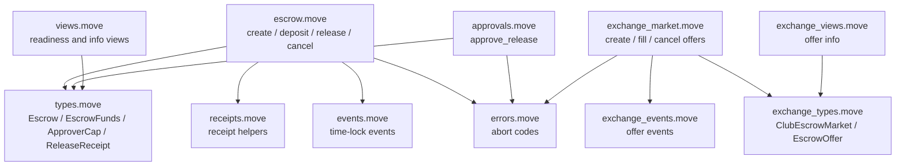
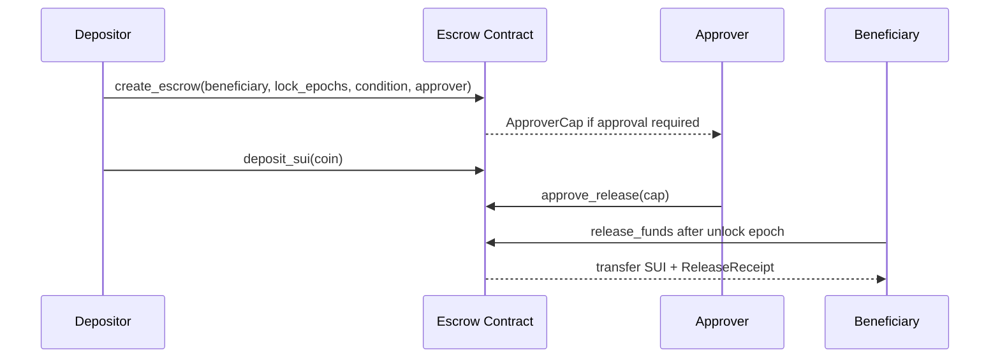
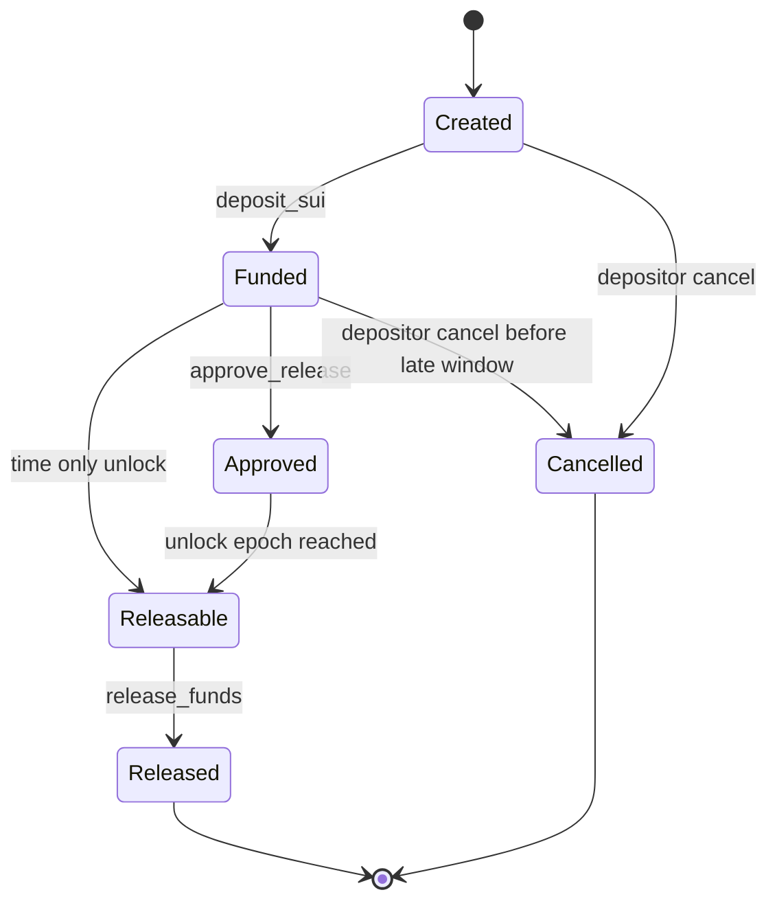
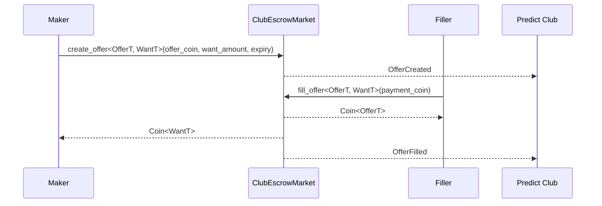

# Kế Hoạch Escrow Contract Predict Club

## Tóm Tắt

Tài liệu này chuyển phần thảo luận về escrow khóa thời gian thành một Move
package `contracts/predict-club` đã được lên kế hoạch.

Lát cắt contract đầu tiên là escrow SUI khóa thời gian với ràng buộc mở khóa
theo epoch. Phần mở rộng là một sàn giao dịch tổng quát
`EscrowOffer<OfferT, WantT>` cho việc nạp vốn club bằng USDC/DUSDC.

## Bố Cục Contract Package

```text
contracts/predict-club/
  Move.toml
  sources/
    errors.move
    events.move
    types.move
    escrow.move
    approvals.move
    receipts.move
    views.move
    exchange_types.move
    exchange_market.move
    exchange_views.move
    exchange_events.move
  tests/
    escrow_tests.move
    approval_tests.move
    cancellation_tests.move
    exchange_offer_tests.move
    exchange_cancel_tests.move
    exchange_recipient_tests.move
```

## Kiến Trúc Module Move



## Luồng Escrow Khóa Thời Gian



## Máy Trạng Thái Của Escrow Khóa Thời Gian



## Kiểu Dữ Liệu Của Escrow Khóa Thời Gian

```move
public struct Escrow has key {
    id: UID,
    escrow_address: address,
    depositor: address,
    beneficiary: address,
    amount: u64,
    locked_until_epoch: u64,
    created_at_epoch: u64,
    created_at_timestamp: u64,
    release_conditions: u8,
    approver: address,
    approved: bool,
    released: bool,
}

public struct EscrowFunds has key {
    id: UID,
    escrow_id: address,
    balance: Balance<SUI>,
}

public struct ApproverCap has key, store {
    id: UID,
    escrow_id: address,
}

public struct ReleaseReceipt has key, store {
    id: UID,
    escrow_id: address,
    released_to: address,
    amount: u64,
    released_at_epoch: u64,
    released_at_timestamp: u64,
}
```

## Các Hàm Của Escrow Khóa Thời Gian

```move
public fun create_escrow(
    beneficiary: address,
    lock_duration_epochs: u64,
    release_conditions: u8,
    approver: address,
    ctx: &mut TxContext,
)
```

```move
public fun deposit_sui(
    escrow: &mut Escrow,
    funds: &mut EscrowFunds,
    coin: Coin<SUI>,
    ctx: &mut TxContext,
)
```

```move
public fun approve_release(
    approver_cap: &ApproverCap,
    escrow: &mut Escrow,
    ctx: &TxContext,
)
```

```move
public fun release_funds(
    escrow: &mut Escrow,
    funds: &mut EscrowFunds,
    ctx: &mut TxContext,
)
```

```move
public fun cancel_escrow(
    escrow: &mut Escrow,
    funds: &mut EscrowFunds,
    ctx: &mut TxContext,
)
```

Quy tắc:

- Dùng `ctx.fresh_object_address()` cho địa chỉ tham chiếu của escrow.
- Dùng `object::new(ctx)` cho object ID thực.
- Lưu tiền thật dưới dạng `Balance<SUI>` trong `EscrowFunds`; không chỉ lưu `u64`.
- Việc release yêu cầu `ctx.epoch() >= locked_until_epoch`.
- Escrow yêu cầu phê duyệt phải có `approved == true`.
- Hủy chỉ cho depositor và phải diễn ra trước cửa sổ epoch cuối cùng.

## Phần Mở Rộng Escrow USDC/DUSDC Tổng Quát

Phần mở rộng dùng `EscrowOffer<OfferT, WantT>` cho việc trao đổi nạp vốn P2P.

| Vùng | Escrow SUI khóa thời gian | Escrow USDC/DUSDC tổng quát |
| --- | --- | --- |
| Mục đích | Giữ SUI tới khi qua điều kiện thời gian/phê duyệt | Đổi một loại coin sang loại coin khác |
| Kiểu cốt lõi | `Escrow`, `EscrowFunds` | `EscrowOffer<OfferT, WantT>` |
| Tài sản nắm giữ | `Balance<SUI>` | `Coin<OfferT>` |
| Tài sản đối ứng | Không có | `Coin<WantT>` từ filler |
| Luồng chính | create -> deposit -> approve/wait -> release | create offer -> fill/cancel |
| Logic thời gian | `locked_until_epoch` | `expires_at_epoch` |
| Phê duyệt | `ApproverCap` tùy chọn | Giới hạn người nhận hoặc market pause tùy chọn |
| Người nhận | Beneficiary cố định | Filler nhận offer; maker nhận payment |
| Hủy | Depositor trước cửa sổ muộn | Maker khi offer còn mở |
| Biên nhận | `ReleaseReceipt` | `OfferFilledReceipt` và event |
| Use case của Predict Club | Khóa thanh toán hoặc cam kết | Trao đổi nạp vốn USDC/DUSDC |

## Luồng Trao Đổi Escrow Tổng Quát



## Kiểu Dữ Liệu Escrow Tổng Quát

```move
public struct ClubEscrowMarket has key {
    id: UID,
    club_id: ID,
    admin: address,
    paused: bool,
}

public struct EscrowOffer<phantom OfferT, phantom WantT> has key, store {
    id: UID,
    maker: address,
    recipient: Option<address>,
    round_id: Option<ID>,
    offer_amount: u64,
    want_amount: u64,
    expires_at_epoch: u64,
    offer_coin: Coin<OfferT>,
}

public struct OfferFilledReceipt has key, store {
    id: UID,
    offer_id: ID,
    maker: address,
    filler: address,
    offer_amount: u64,
    want_amount: u64,
    filled_at_epoch: u64,
}
```
