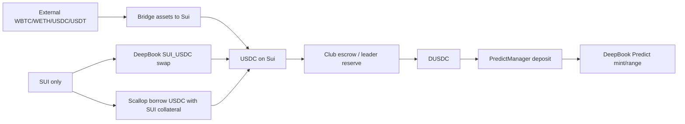

# Predict Club Funding Router

## Summary

Predict Club needs a funding path for members who want to join a DeepBook
Predict round but do not already hold DUSDC.

The router must not imply that USDC or SUI can be used directly for DeepBook
Predict. Predict trading still requires DUSDC as the quote asset in the current
testnet integration. SUI and USDC are intermediate funding assets.

## Funding Routes

| User state | Recommended route | Notes |
| --- | --- | --- |
| Has DUSDC | Join Predict directly | Deposit DUSDC into PredictManager, then mint. |
| Has USDC | Use club escrow or leader reserve | Exchange USDC for DUSDC through a P2P offer. |
| Has only SUI and wants simple funding | DeepBook swap SUI to USDC, then escrow USDC to DUSDC | Keep SUI for gas. |
| Has only SUI and wants to keep SUI exposure | Scallop borrow USDC against SUI, then escrow USDC to DUSDC | Requires liquidation-risk warning. |
| Has external assets | Bridge assets to Sui first | Use documented bridge handoff; do not custody bridge assets in Predict Club. |

## Route Graph



## DeepBook SUI to USDC

The repo already has a DeepBook swap plugin that uses `@mysten/deepbook-v3`.
For the `SUI_USDC` pool:

- SUI is the base asset.
- USDC is the quote asset.
- SUI to USDC uses the `swapExactBaseForQuote` direction.
- The UI must reserve enough SUI for gas and should not allow a full-balance
  SUI swap.

This route is a funding conversion only. The member still needs USDC to DUSDC
exchange before Predict participation.

## Scallop Borrowing Route

Scallop can be used as a borrowing path when the user has SUI collateral and
wants USDC without selling SUI.

Product behavior:

- Present the route as `Borrow USDC with SUI`.
- Require a liquidation warning before wallet signing.
- Show obligation, collateral, debt, risk state, and oracle status when
  available.
- Keep Scallop borrow separated from the Predict mint transaction until the
  integration is proven.

Implementation constraints from Scallop docs:

- Borrowing depends on an obligation / obligation key model.
- Borrow and liquidation transactions require oracle price update handling.
- Liquidation can occur when an obligation becomes unhealthy.
- Oracle status and liquidation risk must be visible before the member joins a
  Predict round with borrowed funds.

## Bridge Assets to Sui

For users with assets outside Sui, Predict Club should provide a bridge handoff,
not a custody bridge.

Supported product copy:

- Bridge WBTC, WETH, USDC, or USDT to Sui through the documented Scallop /
  Wormhole Connect path.
- Return to Predict Club after assets arrive on Sui.
- Continue through USDC to DUSDC exchange if the bridged asset is USDC.

Do not route mainnet assets into testnet DUSDC. Network mismatch must block the
flow.

## Liquidation Monitor

For any Scallop borrowing path, Predict Club should add a liquidation monitor:

- `safe`: enough margin to proceed.
- `warning`: show reduce size / add collateral prompt.
- `danger`: block new Predict round participation by default.
- `liquidatable`: show repay/top-up guidance and stop new trades.
- `unknown`: require manual review.

Recommended actions:

- add SUI collateral
- repay USDC debt
- reduce Predict participation size
- avoid joining a new round while health is unknown or dangerous

## Oracle Panel

The Scallop integration should show oracle state because borrow and liquidation
paths depend on oracle freshness.

The UI should include:

- provider label
- last update time when available
- stale or missing update warning
- requirement that borrow/liquidation PTBs include oracle update logic

## Funding Types

```ts
type FundingRoute =
  | 'ready-with-dusdc'
  | 'deepbook-sui-to-usdc'
  | 'scallop-borrow-usdc'
  | 'bridge-assets-to-sui'
  | 'club-escrow-usdc-to-dusdc'

type ScallopRiskState = 'safe' | 'warning' | 'danger' | 'liquidatable' | 'unknown'

interface FundingRecommendation {
  route: FundingRoute
  label: string
  requiresWalletSignature: boolean
  riskState?: ScallopRiskState
  nextAsset: 'SUI' | 'USDC' | 'DUSDC'
  warnings: string[]
}
```

## Related Docs

- `docs/product/predict-club.md`
- `docs/decisions/predict-club-funding-escrow.md`
- `docs/stories/plans/13-predict-club-community.md`
- `plugins/sui-swap/plugin.tsx`
- `docs/deepbook/onchain-finance/deepbook-predict.md`
