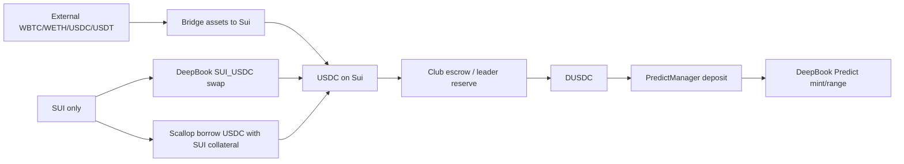

# Funding Router Predict Club

## Tóm Tắt

Predict Club cần một tuyến nạp vốn cho các thành viên muốn tham gia một round của
DeepBook Predict nhưng chưa nắm giữ DUSDC.

Tài liệu này không được ngụ ý rằng USDC hoặc SUI có thể dùng trực tiếp cho DeepBook
Predict. Trong tích hợp testnet hiện tại, giao dịch Predict vẫn yêu cầu DUSDC
làm quote asset. SUI và USDC chỉ là tài sản trung gian để nạp vốn.

## Các Tuyến Nạp Vốn

| Trạng thái người dùng | Tuyến khuyến nghị | Ghi chú |
| --- | --- | --- |
| Có DUSDC | Tham gia Predict trực tiếp | Nạp DUSDC vào PredictManager, rồi mint. |
| Có USDC | Dùng club escrow hoặc leader reserve | Đổi USDC sang DUSDC thông qua offer P2P. |
| Chỉ có SUI và muốn nạp vốn đơn giản | Đổi SUI sang USDC qua DeepBook, rồi đổi USDC sang DUSDC qua escrow | Giữ lại SUI cho gas. |
| Chỉ có SUI và muốn giữ exposure với SUI | Vay USDC qua Scallop bằng thế chấp SUI, rồi đổi USDC sang DUSDC qua escrow | Cần cảnh báo rủi ro liquidation. |
| Có tài sản bên ngoài | Bridge tài sản sang Sui trước | Dùng bridge handoff đã được ghi lại; Predict Club không custody tài sản bridge. |

## Trạng Thái UI Hiện Tại

Tính đến 2026-06-06, funding modal được triển khai như một gate kiểm tra mức
sẵn sàng của member:

- Direct DUSDC là route duy nhất có thể dẫn tới local pledge trong UI hiện tại.
- SUI sang USDC, Scallop borrow, bridge và escrow đang được hiển thị như preview
  hoặc local offer flow.
- Modal hiển thị trạng thái ví, club member, PredictManager và số dư trước khi
  hiển thị hành động tiếp theo.
- Nếu ví chưa kết nối, hành động chính là `Connect Wallet`.
- Nếu ví đã kết nối nhưng chưa có PredictManager, hành động chính là `Create Manager`.
- Nếu đã có PredictManager và đủ DUSDC, hành động chính là `Pledge DUSDC`.
- Nếu thiếu DUSDC, hành động chính bị disable dưới nhãn `Need DUSDC` cho tới khi
  tích hợp route nạp vốn thật.

Cách này giữ UI trung thực: funding routes có thể giải thích và preview, nhưng
execution vẫn yêu cầu DUSDC và PredictManager thuộc sở hữu của người dùng.

## Đồ Thị Tuyến



## DeepBook Đổi SUI Sang USDC

Repo đã có sẵn plugin swap DeepBook dùng `@mysten/deepbook-v3`. Với pool
`SUI_USDC`:

- SUI là base asset.
- USDC là quote asset.
- Đổi SUI sang USDC dùng hướng `swapExactBaseForQuote`.
- UI phải giữ lại đủ SUI cho gas và không được cho phép đổi toàn bộ số dư SUI.

Đây chỉ là tuyến chuyển đổi để nạp vốn. Thành viên vẫn cần đổi USDC sang DUSDC
trước khi tham gia Predict.

## Tuyến Vay Qua Scallop

Scallop có thể được dùng làm đường vay khi người dùng có tài sản thế chấp là
SUI và muốn có USDC mà không phải bán SUI.

Hành vi sản phẩm:

- Hiển thị tuyến dưới nhãn `Borrow USDC with SUI`.
- Bắt buộc cảnh báo thanh lý trước khi ký ví.
- Hiển thị obligation, collateral, debt, trạng thái rủi ro và trạng thái oracle
  nếu có.
- Giữ giao dịch vay Scallop tách khỏi giao dịch mint Predict cho tới khi tích
  hợp đã được chứng minh.

Ràng buộc triển khai theo tài liệu Scallop:

- Việc vay phụ thuộc vào mô hình obligation / obligation key.
- Giao dịch vay và liquidation yêu cầu xử lý cập nhật giá oracle.
- Liquidation có thể xảy ra khi obligation trở nên không lành mạnh.
- Tình trạng oracle và rủi ro thanh lý phải hiển thị trước khi thành viên tham
  gia một round Predict bằng nguồn vốn đi vay.

## Bridge Tài Sản Sang Sui

Với người dùng có tài sản ngoài Sui, Predict Club nên cung cấp bridge handoff,
không phải custody bridge.

Copy sản phẩm được hỗ trợ:

- Bridge WBTC, WETH, USDC hoặc USDT sang Sui qua luồng Scallop / Wormhole
  Connect đã được ghi lại.
- Quay lại Predict Club sau khi tài sản đã tới Sui.
- Tiếp tục qua bước đổi USDC sang DUSDC nếu tài sản được bridge là USDC.

Không được điều hướng tài sản mainnet vào DUSDC của testnet. Flow phải chặn khi
network không khớp.

## Liquidation Monitor

Với mọi đường vay qua Scallop, Predict Club nên thêm một liquidation monitor:

- `safe`: còn đủ biên an toàn để tiếp tục.
- `warning`: hiển thị gợi ý giảm kích thước / thêm tài sản thế chấp.
- `danger`: mặc định chặn tham gia round Predict mới.
- `liquidatable`: hiển thị hướng dẫn repay/top-up và dừng giao dịch mới.
- `unknown`: yêu cầu rà soát thủ công.

Hành động khuyến nghị:

- thêm collateral SUI
- repay nợ USDC
- giảm kích thước tham gia Predict
- tránh tham gia round mới khi health chưa rõ hoặc đang nguy hiểm

## Oracle Panel

Tích hợp Scallop nên hiển thị trạng thái oracle vì các luồng vay và liquidation
phụ thuộc vào độ mới của oracle.

UI nên bao gồm:

- nhãn provider
- thời gian cập nhật gần nhất nếu có
- cảnh báo stale hoặc thiếu cập nhật
- yêu cầu rằng PTB vay/thanh lý phải bao gồm logic cập nhật oracle

## Funding Types

```ts
type FundingRoute =
  | 'ready-with-dusdc'
  | 'deepbook-sui-to-usdc'
  | 'scallop-borrow-usdc'
  | 'bridge-assets-to-sui'
  | 'club-escrow-usdc-to-dusdc'

type ScallopRiskState = 'safe' | 'warning' | 'danger' | 'liquidatable' | 'unknown'

interface FundingRecommendation {
  route: FundingRoute
  label: string
  requiresWalletSignature: boolean
  riskState?: ScallopRiskState
  nextAsset: 'SUI' | 'USDC' | 'DUSDC'
  warnings: string[]
}
```

## Tài Liệu Liên Quan

- `docs/product/predict-club.md`
- `docs/decisions/predict-club-funding-escrow.md`
- `docs/stories/plans/13-predict-club-community.md`
- `docs/stories/plans/13-predict-club-community.md#implementation-log---2026-06-06`
- `plugins/sui-swap/plugin.tsx`
- `docs/deepbook/onchain-finance/deepbook-predict.md`
