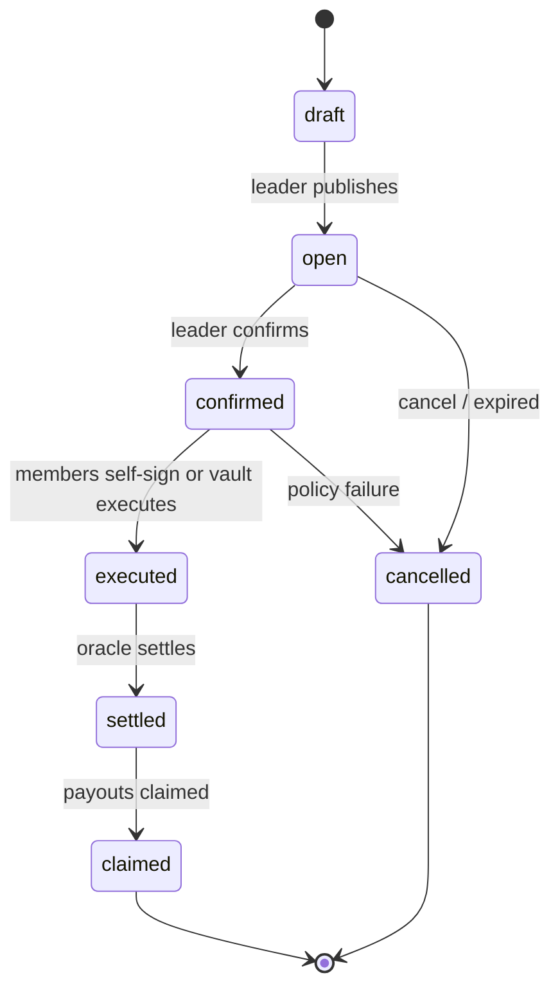
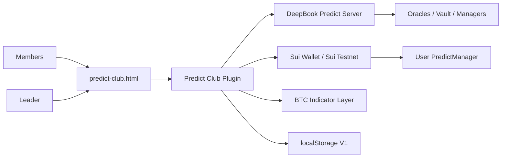

# Predict Club Product Contract

## Summary

Predict Club is a community layer for DeepBook Predict. It lets a leader create
prediction rounds, lets members pledge or accept the round, and helps each
member execute a user-signed Predict trade with clear indicator and risk
context.

The product uses a hybrid custody roadmap:

- V1: members self-sign trades through their own PredictManager.
- V2: a policy-guarded group vault may hold pooled DUSDC and execute bounded
  strategy actions.

DeepBook Margin and other loan/liquidity paths are simulation-only in the MVP.
Funding support for members without DUSDC is handled by the Predict Club
Funding Router and P2P escrow exchange.

## Users and Roles

| Role | Responsibility |
| --- | --- |
| Leader | Creates proposals, records the trade thesis, confirms the selected round, and manages the group workflow. |
| Member | Joins a club, pledges intent, accepts a signal, signs personal trades, monitors settlement, and claims positions. |
| Keeper | Scans settled positions and can help redeem when the protocol function is permissionless. |
| Observer | Reviews round history, indicators, leader performance, and club risk without participating. |

## Product Rules

- Do not let a bot hold a user's private key.
- V1 member execution must be user-signed.
- A proposal must snapshot indicator evidence before confirmation.
- A confirmed round must show oracle health, expiry, max loss, and DUSDC
  readiness before trade execution.
- Stale oracle, unsafe expiry, missing DUSDC, or `no-trade` indicator consensus
  must block or warn before execution.
- Any pooled-capital execution belongs to the V2 vault design and must be
  bounded by explicit policy.

## Round Lifecycle



## System Context



## Main User Flow

1. Leader creates a proposal with oracle, expiry, direction, strike or range,
   intended size, and trade thesis.
2. The app snapshots indicator consensus from BTC signals and DeepBook Predict
   market state.
3. Members review the proposal, pledge DUSDC intent, and accept or watch.
4. Leader confirms the proposal once the checklist is acceptable.
5. Each participating member reviews a generated trade plan and signs with
   their own wallet.
6. The club monitors positions, settlement state, and claimable outcomes.
7. Settled rounds are archived with PnL, participation, and thesis evidence.

## Funding Flow

Members who do not hold DUSDC use `Fund to Join`:

1. If the member has SUI, the app can recommend DeepBook `SUI_USDC` swap to get
   USDC while preserving SUI for gas.
2. If the member wants to keep SUI exposure, the app can route to a Scallop
   borrowing landing page to borrow USDC against SUI collateral.
3. If the member has external assets, the app can hand off to documented bridge
   flows for assets such as WBTC, WETH, USDC, or USDT to Sui.
4. Once the member has USDC on Sui, they fill a club escrow offer or leader
   reserve quote to receive DUSDC.
5. The member deposits DUSDC into their PredictManager and self-signs the
   Predict trade.

## Interface Contract

```ts
type RoundStatus =
  | 'draft'
  | 'open'
  | 'confirmed'
  | 'executed'
  | 'settled'
  | 'claimed'
  | 'cancelled'

type MemberRoundState = 'watching' | 'pledged' | 'accepted' | 'executed' | 'claimed'
type SignalBias = 'bullish' | 'bearish' | 'neutral' | 'no-trade'
type PredictDirection = 'up' | 'down' | 'range'

interface CommunityPrediction {
  clubId: string
  roundId: string
  leaderAddress: string
  oracleId: string
  expiry: number
  direction: PredictDirection
  strike?: number
  lowerStrike?: number
  upperStrike?: number
  proposedAmount: string
  status: RoundStatus
  signalBias: SignalBias
  indicatorReasons: string[]
  riskChecks: string[]
}
```

## UI Contract

The first screen is an operational cockpit, not a marketing page:

- Top bar: club selector, network, wallet, DUSDC balance.
- Decision strip: one active round, one primary next action.
- Desktop workspace:
  - left: club and member commitments
  - center: prediction room and indicator consensus
  - right: risk checklist, leader commands, loan simulation
- Mobile workspace:
  - tabs: Room, Risk, Members, History
  - sticky bottom action for the next primary step

## Related Docs

- `docs/stories/plans/13-predict-club-community.md`
- `docs/product/predict-club-architecture.md`
- `docs/product/predict-club-funding.md`
- `docs/decisions/predict-club-architecture.md`
- `docs/decisions/predict-club-funding-escrow.md`
- `docs/deepbook/onchain-finance/deepbook-predict.md`
- `docs/stories/plans/09-predict-manager-bot-architecture.md`
- `docs/stories/plans/08-deepbook-predict-user-assist.md`
