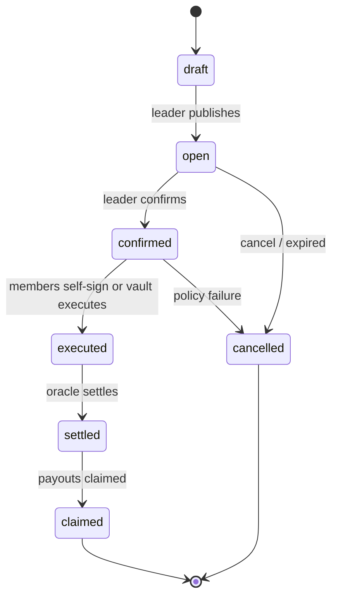
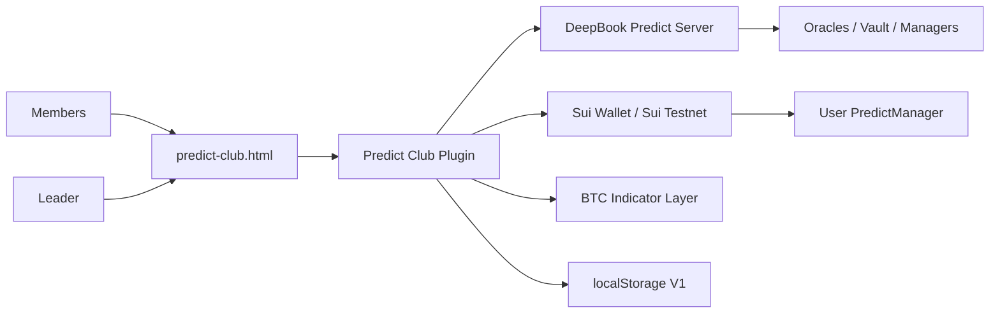

# Product Contract Predict Club

## Tóm Tắt

Predict Club là lớp cộng đồng cho DeepBook Predict. Nó cho phép leader tạo các
vòng dự đoán, cho phép thành viên cam kết hoặc chấp nhận một vòng, và hỗ trợ
mỗi thành viên thực thi một giao dịch Predict do chính người dùng ký với ngữ
cảnh chỉ báo và rủi ro rõ ràng.

Sản phẩm sử dụng lộ trình custody lai:

- V1: thành viên tự ký giao dịch qua PredictManager của riêng mình.
- V2: một group vault có policy guard có thể nắm giữ DUSDC gộp và thực thi các
  hành động chiến lược trong giới hạn.

DeepBook Margin và các đường vay/thanh khoản khác chỉ ở mức mô phỏng trong
MVP. Hỗ trợ nạp vốn cho thành viên chưa có DUSDC được xử lý bởi bộ định tuyến
nạp vốn Predict Club và sàn trao đổi escrow P2P.

## Người Dùng Và Vai Trò

| Vai trò | Trách nhiệm |
| --- | --- |
| Leader | Tạo proposal, ghi lại luận điểm giao dịch, xác nhận round đã chọn và quản lý quy trình của nhóm. |
| Member | Tham gia club, cam kết ý định, chấp nhận tín hiệu, ký giao dịch cá nhân, theo dõi quyết toán và nhận vị thế. |
| Keeper | Quét các vị thế đã settled và có thể hỗ trợ redeem khi hàm của protocol là permissionless. |
| Observer | Xem lịch sử round, chỉ báo, hiệu suất leader và rủi ro của club mà không tham gia. |

## Quy Tắc Sản Phẩm

- Không để bot giữ private key của người dùng.
- Thực thi của thành viên ở V1 phải do người dùng tự ký.
- Proposal phải chụp snapshot bằng chứng chỉ báo trước khi xác nhận.
- Một round đã xác nhận phải hiển thị tình trạng oracle, expiry, max loss và mức
  sẵn sàng DUSDC trước khi thực thi giao dịch.
- Oracle cũ, expiry không an toàn, thiếu DUSDC hoặc đồng thuận chỉ báo
  `no-trade` phải chặn hoặc cảnh báo trước khi thực thi.
- Mọi thực thi dùng vốn gộp thuộc thiết kế vault V2 và phải bị ràng buộc bởi
  policy rõ ràng.

## Vòng Đời Round



## Ngữ Cảnh Hệ Thống



## Luồng Người Dùng Chính

1. Leader tạo proposal với oracle, expiry, direction, strike hoặc range, kích
   thước dự định và luận điểm giao dịch.
2. Ứng dụng chụp snapshot đồng thuận chỉ báo từ tín hiệu BTC và trạng thái
   thị trường DeepBook Predict.
3. Thành viên xem proposal, cam kết ý định DUSDC, rồi chấp nhận hoặc theo dõi.
4. Leader xác nhận proposal khi checklist đã chấp nhận được.
5. Mỗi thành viên tham gia xem kế hoạch giao dịch được tạo sẵn và ký bằng ví của chính họ.
6. Club theo dõi vị thế, trạng thái quyết toán và kết quả có thể nhận.
7. Các round đã được quyết toán được lưu trữ cùng PnL, mức tham gia và bằng chứng luận điểm.

## Luồng Nạp Vốn

Thành viên chưa nắm giữ DUSDC sẽ dùng `Fund to Join`:

1. Nếu thành viên có SUI, ứng dụng có thể gợi ý DeepBook đổi `SUI_USDC` để lấy
   USDC trong khi vẫn giữ lại SUI cho gas.
2. Nếu thành viên muốn giữ mức tiếp xúc với SUI, ứng dụng có thể điều hướng tới trang
   vay Scallop để vay USDC bằng tài sản thế chấp là SUI.
3. Nếu thành viên có tài sản bên ngoài, ứng dụng có thể chuyển tiếp sang các luồng
   bridge đã được ghi lại cho các tài sản như WBTC, WETH, USDC hoặc USDT sang Sui.
4. Khi thành viên đã có USDC trên Sui, họ điền vào một club escrow offer hoặc
   leader reserve quote để nhận DUSDC.
5. Thành viên nạp DUSDC vào PredictManager của mình và tự ký giao dịch Predict.

## Interface Contract

```ts
type RoundStatus =
  | 'draft'
  | 'open'
  | 'confirmed'
  | 'executed'
  | 'settled'
  | 'claimed'
  | 'cancelled'

type MemberRoundState = 'watching' | 'pledged' | 'accepted' | 'executed' | 'claimed'
type SignalBias = 'bullish' | 'bearish' | 'neutral' | 'no-trade'
type PredictDirection = 'up' | 'down' | 'range'

interface CommunityPrediction {
  clubId: string
  roundId: string
  leaderAddress: string
  oracleId: string
  expiry: number
  direction: PredictDirection
  strike?: number
  lowerStrike?: number
  upperStrike?: number
  proposedAmount: string
  status: RoundStatus
  signalBias: SignalBias
  indicatorReasons: string[]
  riskChecks: string[]
}
```

## UI Contract

Màn hình đầu tiên là một bảng điều khiển vận hành, không phải landing page kiểu
marketing:

- Thanh trên cùng: bộ chọn club, network, ví, số dư DUSDC.
- Dải quyết định: một round đang hoạt động, một hành động tiếp theo chính.
- Không gian desktop:
  - trái: club và cam kết của thành viên
  - giữa: phòng dự đoán và đồng thuận chỉ báo
  - phải: checklist rủi ro, lệnh của leader, mô phỏng khoản vay
- Không gian mobile:
  - tab: Room, Risk, Members, History
  - hành động chính tiếp theo ở thanh đáy dạng sticky

## Tài Liệu Liên Quan

- `docs/stories/plans/13-predict-club-community.md`
- `docs/product/predict-club-architecture.md`
- `docs/product/predict-club-funding.md`
- `docs/decisions/predict-club-architecture.md`
- `docs/decisions/predict-club-funding-escrow.md`
- `docs/deepbook/onchain-finance/deepbook-predict.md`
- `docs/stories/plans/09-predict-manager-bot-architecture.md`
- `docs/stories/plans/08-deepbook-predict-user-assist.md`
