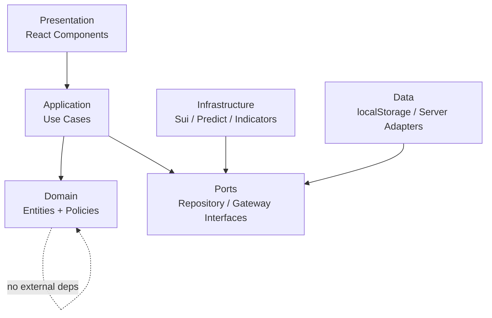
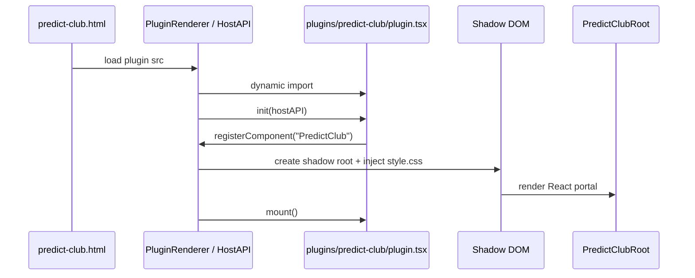
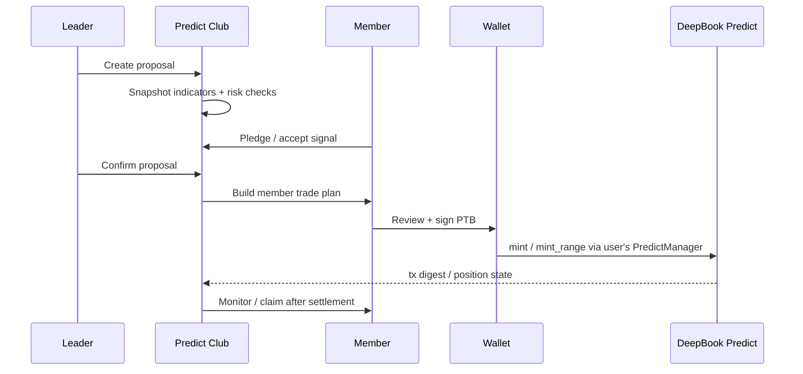
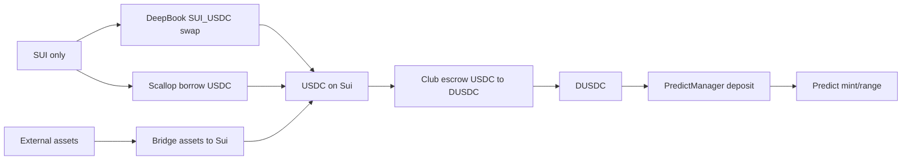
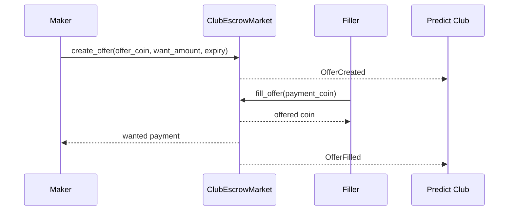

# Predict Club Community Plan

## Goal

Create `predict-club.html` and a `predict-club` plugin that help a community
coordinate DeepBook Predict rounds with indicators, leader confirmation, member
pledges, self-signed execution, and settlement tracking.

## Scope

In:

- Harness docs and story contract for Predict Club.
- `predict-club.html` page plan.
- `plugins/predict-club` clean-architecture plugin plan.
- V1 local club state and member self-sign workflow.
- Indicator consensus and risk checklist.
- Simulation-only loan and liquidity planner.
- Funding Router for SUI, USDC, bridge handoff, Scallop borrow planning, and
  DUSDC escrow exchange.

Out:

- Move group vault contract.
- Automated custody over member funds.
- Real DeepBook Margin borrowing.
- Mainnet package IDs or production custody claims.

## Product Docs

- `docs/product/predict-club.md`
- `docs/product/predict-club-architecture.md`
- `docs/deepbook/onchain-finance/deepbook-predict.md`
- `docs/product/predict-club-funding.md`
- `docs/stories/plans/09-predict-manager-bot-architecture.md`
- `docs/stories/plans/08-deepbook-predict-user-assist.md`

## Architecture Docs

- `docs/plugin-architecture.md`
- `docs/HARNESS.md`
- `docs/FEATURE_INTAKE.md`
- `docs/TEST_MATRIX.md`
- `docs/decisions/predict-club-architecture.md`

## Risk Classification

High-risk.

Risk flags:

- Wallet/signing
- Authorization
- Data model
- External systems
- Public contract
- Existing DeepBook Predict behavior
- Multi-domain UI and finance workflow

## Clean Architecture



## Planned File Structure

```text
predict-club.html
src/predict-club/
  main.tsx
  PredictClubPage.tsx
  predict-club.css

plugins/predict-club/
  plugin.tsx
  style.css
  domain/
    entities.ts
    valueObjects.ts
    policies.ts
    events.ts
  application/
    createProposal.ts
    pledgeToRound.ts
    confirmProposal.ts
    buildMemberTradePlan.ts
    recommendFundingRoute.ts
    settleRound.ts
  data/
    predictClubRepository.ts
    predictRepositoryAdapter.ts
    localClubStore.ts
  infrastructure/
    suiPredictGateway.ts
    indicatorSignalGateway.ts
    deepbookSwapGateway.ts
    scallopGateway.ts
  presentation/
    PredictClubRoot.tsx
    components/
      DecisionStrip.tsx
      PredictionRoom.tsx
      IndicatorConsensus.tsx
      MemberCommitments.tsx
      RiskChecklist.tsx
      LeaderCommandPanel.tsx
      LoanPlanner.tsx
      FundingRouter.tsx
      EscrowExchange.tsx
      RoundHistory.tsx
      ClaimQueue.tsx
```

## Plugin Runtime



## V1 Member Self-Sign Flow



## Funding Router Flow



Funding implementation notes:

- DeepBook `SUI_USDC` route converts SUI to USDC and must preserve SUI gas.
- Scallop route is a borrowing landing first: show collateral, debt, oracle,
  liquidation risk, and health state before any wallet signing.
- Bridge route is an external handoff, not a custody bridge.
- USDC to DUSDC is done through club escrow or leader reserve, not by treating
  USDC as a Predict quote asset.

## Escrow Exchange Flow



## Design Patterns

- Repository: abstract localStorage, server, and future on-chain state.
- Adapter: map DeepBook Predict and BTC indicator data into domain objects.
- Strategy: switch loan planner between no leverage, PLP hedge, and margin
  simulation.
- State Machine: enforce round lifecycle transitions.
- Command: represent leader/member actions as explicit application commands.
- Policy Object: centralize max size, expiry, oracle health, and paused checks.
- Escrow: atomically exchange USDC and DUSDC between leader/member offers.

## Implementation Steps

1. Add the product, story, and decision docs.
2. Add `predict-club.html` and `src/predict-club` page shell.
3. Add `plugins/predict-club` plugin entry with Shadow DOM scoped CSS.
4. Implement pure domain entities and policy checks.
5. Implement V1 localStorage repository.
6. Implement DeepBook Predict read adapters and indicator gateway.
7. Implement use cases for proposal, pledge, confirm, trade-plan, and settle.
8. Build the page UI around one active round and one primary action.
9. Add loan planner as simulation-only with explicit labeling.
10. Add Funding Router with DeepBook SUI to USDC, Scallop borrow planning,
    bridge handoff, and escrow USDC to DUSDC.
11. Update Vite input entries and optional DeepBook navigation.
12. Validate build, plugin load, layout, funding route, and wallet-flow review.

## Validation

- `rtk bun run build`
- Browser smoke for `predict-club.html`
- Plugin load check inside Shadow DOM
- Desktop and mobile layout check
- Manual wallet-flow review for self-signed member trade plan
- Verify stale oracle and unsafe expiry block execution
- Verify loan planner remains labeled `Simulated`
- Verify SUI-only wallet sees DeepBook swap and Scallop borrow funding routes.
- Verify Scallop borrow route shows liquidation/oracle warnings.
- Verify USDC holder sees escrow USDC to DUSDC route.

## Status

- State: planned
- Evidence: product contract and architecture decision docs define the V1/V2
  boundary before implementation.
