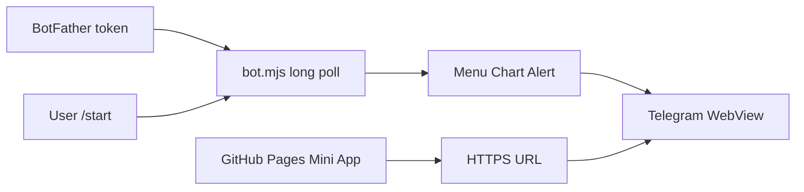

# Telegram Bot and Mini App Deployment

Step-by-step guide to put **BTC Chart Alert** live on Telegram: static Mini App
on GitHub Pages plus a long-polling bot process.

**Companion:** [DEPLOY.vi.md](./DEPLOY.vi.md)  
**Technical reference:** [TECHNICAL.md](./TECHNICAL.md)

## Overview

Telegram deployment has **two parts**:

| Part | What it is | Where it runs |
|------|------------|---------------|
| **Mini App** | `telegram-btc-alert.html` (React, static) | GitHub Pages (HTTPS) |
| **Bot** | `apps/telegram/bot.mjs` (receives `/start`, sets menu) | VPS / cloud process 24/7 |

The Mini App does **not** run inside the bot script. The bot only opens the Web App URL
and answers commands.



## Prerequisites

- Repo cloned, `bun` installed
- GitHub Pages enabled for this repo (`longphu25.github.io/profile/`)
- A Telegram account to talk to [@BotFather](https://t.me/BotFather)

## Step 1: Deploy the Mini App

Build and publish the static site:

```bash
cd /path/to/profile
bun run build
git push origin main
```

Production URL (default in `bot.mjs`):

```text
https://longphu25.github.io/profile/telegram-btc-alert.html
```

Verify in a normal browser: the page loads. Outside Telegram you will see
**Chưa đăng nhập** (expected until opened from the bot).

### Optional: verified login via Convex

For server-verified sessions (`Đã xác thực` in the user bar):

1. Set in Convex dashboard: `TELEGRAM_BOT_TOKEN`, `CLIENT_ORIGIN` (include GitHub Pages origin)
2. `bun run convex:deploy`
3. Rebuild with HTTP Actions URL:

```bash
VITE_CONVEX_SITE_URL=https://your-deployment.convex.site bun run build
git push origin main
```

See [TECHNICAL.md](./TECHNICAL.md#auto-login) and [../decisions/telegram-data-backend.md](../decisions/telegram-data-backend.md).

## Step 2: Create the bot (BotFather)

1. Open [@BotFather](https://t.me/BotFather)
2. Send `/newbot`, follow prompts, save the token: `123456789:AAH...`
3. Optional: `/setdescription`, `/setabouttext`

**Never** commit the token or put it in `VITE_*` env vars.

## Step 3: Run the bot

Script: `apps/telegram/bot.mjs`  
Npm script: `bun run telegram:bot`

### Local test

```bash
export TELEGRAM_BOT_TOKEN="your-token-from-BotFather"
export TELEGRAM_WEBAPP_URL="https://longphu25.github.io/profile/telegram-btc-alert.html"

bun run telegram:bot
```

On startup the bot:

- Calls `setChatMenuButton` → **Chart Alert** opens the Mini App
- Handles `/start` and `/chart` with inline **Mở Chart Alert** button

### Production (24/7)

Long polling stops when your laptop sleeps. Run the bot on a VPS or PaaS:

```bash
export TELEGRAM_BOT_TOKEN="..."
export TELEGRAM_WEBAPP_URL="https://longphu25.github.io/profile/telegram-btc-alert.html"

tmux new -s tg-bot
bun apps/telegram/bot.mjs
# Detach: Ctrl+B, then D
```

Alternatives: systemd, pm2, Fly.io, Railway, or any host with outbound HTTPS.

**Important:** Run **only one** long-polling instance per bot token. Two processes will conflict.

## Step 4: BotFather menu (manual fallback)

If the menu button is missing, configure in BotFather:

1. `/setmenubutton`
2. Select your bot → **Configure menu button**
3. Text: `Chart Alert`
4. URL: `https://longphu25.github.io/profile/telegram-btc-alert.html`

## Step 5: User test

1. Find your bot in Telegram
2. Send `/start`
3. Tap **Mở Chart Alert** (or the menu button below the input)
4. Mini App opens → user name/avatar appears (Telegram auto-login)
5. Change symbol/interval; bias/plan refresh every ~15s

### Deep links (symbol + interval)

| Input | Effect |
|-------|--------|
| `/start REUSDT_5m` | Passes `start_param` to the Web App |
| `https://t.me/YourBot?startapp=REUSDT_5m` | Same via link |

Formats: `BTCUSDT`, `REUSDT_5m`, `ETHUSDT-1h`

## Deployment checklist

| # | Task | Done |
|---|------|------|
| 1 | `telegram-btc-alert.html` reachable over HTTPS | |
| 2 | `TELEGRAM_BOT_TOKEN` obtained from BotFather | |
| 3 | `bun run telegram:bot` running on a 24/7 host | |
| 4 | `/start` shows Web App button | |
| 5 | Mini App shows Telegram user inside WebView | |
| 6 | (Optional) Convex auth + `VITE_CONVEX_SITE_URL` rebuild | |

## Troubleshooting

| Symptom | Likely cause | Fix |
|---------|--------------|-----|
| Bot silent | Bot process not running | Start `telegram:bot` on VPS |
| Web App 404 | Pages not deployed | `bun run build`, push `main`, wait for Pages |
| "Chưa đăng nhập" inside Telegram | Opened URL in browser, not via bot | Use bot button or menu |
| No menu Web App | Bot never started | Run `bot.mjs` once (sets menu) |
| Duplicate updates / lag | Two hosts polling same token | Stop extra instances |
| "Đã xác thực" missing | Convex not configured | Set `VITE_CONVEX_SITE_URL`, deploy Convex |

## Environment variables

| Variable | Where | Purpose |
|----------|-------|---------|
| `TELEGRAM_BOT_TOKEN` | Bot host, Convex dashboard | Bot API + initData HMAC |
| `TELEGRAM_WEBAPP_URL` | Bot host | Menu + inline keyboard URL |
| `VITE_CONVEX_SITE_URL` | Frontend build only | `POST /telegram/auth` |
| `CLIENT_ORIGIN` | Convex dashboard | CORS for Mini App origin |

## Related docs

- [README.md](./README.md) — doc index
- [TECHNICAL.md](./TECHNICAL.md) — architecture and file map
- [ROADMAP.md](./ROADMAP.md) — push alerts, Turso picker (future)
- [apps/telegram/README.md](../../apps/telegram/README.md) — ops quickstart in repo root