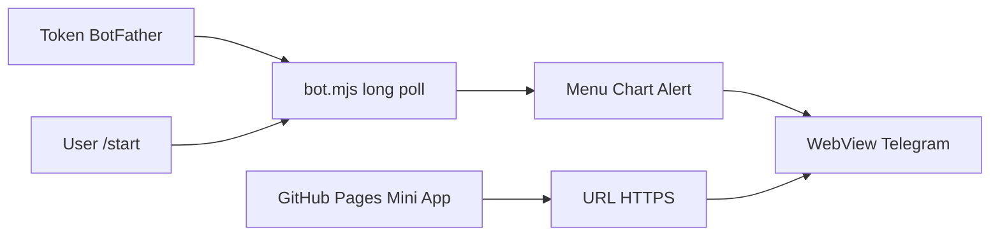

# Triển khai Bot Telegram và Mini App

Hướng dẫn từng bước đưa **BTC Chart Alert** lên Telegram: Mini App tĩnh trên GitHub
Pages và process bot long-polling.

**Bản tiếng Anh:** [DEPLOY.md](./DEPLOY.md)  
**Tham chiếu kỹ thuật:** [TECHNICAL.vi.md](./TECHNICAL.vi.md)

## Tổng quan

Triển khai Telegram có **hai phần**:

| Phần | Là gì | Chạy ở đâu |
|------|--------|------------|
| **Mini App** | `telegram-btc-alert.html` (React, tĩnh) | GitHub Pages (HTTPS) |
| **Bot** | `apps/telegram/bot.mjs` (nhận `/start`, set menu) | VPS / cloud 24/7 |

Mini App **không** chạy trong script bot. Bot chỉ mở URL Web App và trả lời lệnh.



## Điều kiện

- Đã clone repo, cài `bun`
- Bật GitHub Pages cho repo (`longphu25.github.io/profile/`)
- Tài khoản Telegram, [@BotFather](https://t.me/BotFather)

## Bước 1: Deploy Mini App

Build và đẩy site tĩnh:

```bash
cd /path/to/profile
bun run build
git push origin main
```

URL production (mặc định trong `bot.mjs`):

```text
https://longphu25.github.io/profile/telegram-btc-alert.html
```

Kiểm tra trên trình duyệt: trang load được. Ngoài Telegram sẽ thấy **Chưa đăng nhập**
(bình thường).

### Tùy chọn: đăng nhập xác thực qua Convex

Để có badge **Đã xác thực** trên thanh user:

1. Convex dashboard: `TELEGRAM_BOT_TOKEN`, `CLIENT_ORIGIN` (có origin GitHub Pages)
2. `bun run convex:deploy`
3. Build lại:

```bash
VITE_CONVEX_SITE_URL=https://your-deployment.convex.site bun run build
git push origin main
```

Xem [TECHNICAL.vi.md](./TECHNICAL.vi.md) và [../decisions/telegram-data-backend.vi.md](../decisions/telegram-data-backend.vi.md).

## Bước 2: Tạo bot (BotFather)

1. Mở [@BotFather](https://t.me/BotFather)
2. `/newbot` → lưu token: `123456789:AAH...`
3. Tùy chọn: `/setdescription`, `/setabouttext`

**Không** commit token hoặc đưa vào biến `VITE_*`.

## Bước 3: Chạy bot

Script: `apps/telegram/bot.mjs`  
Lệnh npm: `bun run telegram:bot`

### Test local

```bash
export TELEGRAM_BOT_TOKEN="token-từ-BotFather"
export TELEGRAM_WEBAPP_URL="https://longphu25.github.io/profile/telegram-btc-alert.html"

bun run telegram:bot
```

Khi chạy, bot tự:

- Gọi `setChatMenuButton` → **Chart Alert** mở Mini App
- Xử lý `/start` và `/chart` với nút **Mở Chart Alert**

### Production (24/7)

Long polling dừng khi tắt máy. Chạy trên VPS:

```bash
export TELEGRAM_BOT_TOKEN="..."
export TELEGRAM_WEBAPP_URL="https://longphu25.github.io/profile/telegram-btc-alert.html"

tmux new -s tg-bot
bun apps/telegram/bot.mjs
# Thoát nền: Ctrl+B, rồi D
```

Có thể dùng systemd, pm2, Fly.io, Railway, v.v.

**Quan trọng:** Chỉ **một** instance long-polling cho mỗi token. Hai máy cùng chạy sẽ lỗi.

## Bước 4: Menu BotFather (sửa tay nếu thiếu)

1. `/setmenubutton`
2. Chọn bot → **Configure menu button**
3. Text: `Chart Alert`
4. URL: `https://longphu25.github.io/profile/telegram-btc-alert.html`

## Bước 5: Test với user

1. Tìm bot trên Telegram
2. Gửi `/start`
3. Bấm **Mở Chart Alert** (hoặc nút menu dưới ô chat)
4. Mini App mở → thấy tên/avatar (auto-login Telegram)
5. Đổi symbol/interval; bias/plan refresh ~15 giây

### Deep link (symbol + interval)

| Cách | Hiệu ứng |
|------|----------|
| `/start REUSDT_5m` | Truyền `start_param` vào Web App |
| `https://t.me/TenBot?startapp=REUSDT_5m` | Cùng qua link |

Định dạng: `BTCUSDT`, `REUSDT_5m`, `ETHUSDT-1h`

## Checklist triển khai

| # | Việc | Xong |
|---|------|------|
| 1 | `telegram-btc-alert.html` truy cập được qua HTTPS | |
| 2 | Có `TELEGRAM_BOT_TOKEN` từ BotFather | |
| 3 | `bun run telegram:bot` chạy trên host 24/7 | |
| 4 | `/start` có nút Web App | |
| 5 | Trong Mini App thấy user Telegram | |
| 6 | (Tùy chọn) Convex + build `VITE_CONVEX_SITE_URL` | |

## Xử lý lỗi

| Triệu chứng | Nguyên nhân | Cách xử lý |
|-------------|-------------|------------|
| Bot im lặng | Process bot không chạy | Bật `telegram:bot` trên VPS |
| Web App 404 | Pages chưa deploy | `bun run build`, push `main` |
| "Chưa đăng nhập" trong Telegram | Mở link browser, không qua bot | Dùng nút bot hoặc menu |
| Không có menu Web App | Bot chưa chạy lần đầu | Chạy `bot.mjs` |
| Trùng / chậm | Hai host cùng poll token | Tắt instance thừa |
| Thiếu "Đã xác thực" | Chưa cấu hình Convex | `VITE_CONVEX_SITE_URL` + deploy Convex |

## Biến môi trường

| Biến | Đặt ở đâu | Mục đích |
|------|-----------|----------|
| `TELEGRAM_BOT_TOKEN` | Host bot, Convex | Bot API + HMAC initData |
| `TELEGRAM_WEBAPP_URL` | Host bot | URL menu và nút inline |
| `VITE_CONVEX_SITE_URL` | Chỉ lúc build frontend | `POST /telegram/auth` |
| `CLIENT_ORIGIN` | Convex dashboard | CORS cho Mini App |

## Tài liệu liên quan

- [README.vi.md](./README.vi.md)
- [TECHNICAL.vi.md](./TECHNICAL.vi.md)
- [ROADMAP.vi.md](./ROADMAP.vi.md)
- [apps/telegram/README.md](../../apps/telegram/README.md)