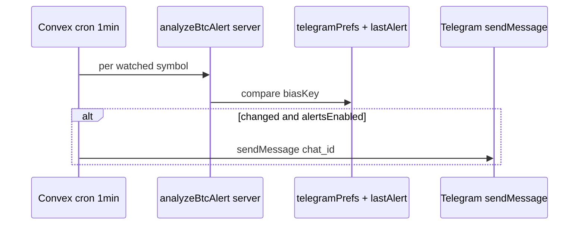

# Telegram BTC Chart Alert — Roadmap

**Status:** Active (post v0.116.0)  
**Companion:** [ROADMAP.vi.md](./ROADMAP.vi.md)  
**Story:** [stories/plans/24-telegram-btc-alert.md](../stories/plans/24-telegram-btc-alert.md)

## Goal

Turn the Mini App into a production alert surface that shares **Turso** (catalog) and
**Convex** (auth, cache, cron) with the btc-chart plugin, without duplicating secrets
in the static bundle.

## Phase summary

| Phase | Theme | Priority | Depends on |
|-------|-------|----------|------------|
| 0 | Mini App + auto-login | **Done** | v0.115.0–v0.116.0 |
| 1 | Turso coin picker | High | `VITE_TURSO_*` in Pages build |
| 2 | User prefs (symbol, interval, alerts) | High | Convex deploy + auth |
| 3 | Push alerts on bias/plan flip | Medium | Bot + Convex cron |
| 4 | Shared market cache | Medium | Convex `marketSnapshots` wired |
| 5 | SMC vote parity (optional) | Low | WASM size budget in WebView |
| 6 | Multi-user watchlists + admin | Stretch | Convex tables |

---

## Phase 0 — Shipped

- [x] Vite entry `telegram-btc-alert.html`
- [x] Analysis: Lux + ML + MA gate + Trade Setup (no SMC)
- [x] 15s poll, haptic edge
- [x] `TelegramUserBar` + `useTelegramAuth`
- [x] Convex `/telegram/auth`, schema, unit tests
- [x] `apps/telegram/bot.mjs` + `bun run telegram:bot`
- [x] Docs under `docs/telegram/`

**Exit criteria:** build green, unit tests pass, manual open from Telegram shows user name.

---

## Phase 1 — Turso coin picker

**Problem:** Mini App accepts free-text symbol; chart plugin already reads `coins` from Turso.

**Work:**

1. Import `fetchCoinsFromTurso` from `@btc-chart/symbols` path (or `plugins/btc-chart/lib/turso.ts`).
2. Replace text input with searchable select (top N enabled coins).
3. Fallback to hardcoded list when `VITE_TURSO_*` unset (same as chart).
4. Show exchange badge from Turso row (`binance`, routing fields).

**Files:**

- `src/telegram-btc-alert/components/AlertScreen.tsx`
- `src/telegram-btc-alert/lib/analyze-alert.ts` (`symbolEntryFromId` → Turso entry)

**Env:** reuse existing `VITE_TURSO_DB_URL`, `VITE_TURSO_DB_READ_TOKEN`.

**Validation:**

- Manual: RE/USDT from Turso list loads klines and bias.
- Unit: mock Turso response maps to `SymbolEntry`.

**Estimate:** 0.5–1 day.

---

## Phase 2 — User preferences (Convex)

**Problem:** Each open resets symbol/interval unless `start_param` is passed.

**Schema addition (Convex):**

```typescript
telegramPrefs: defineTable({
  telegramId: v.number(),
  defaultSymbol: v.string(),
  defaultInterval: v.string(),
  alertsEnabled: v.boolean(),
  updatedAt: v.number(),
}).index('by_telegram_id', ['telegramId'])
```

**HTTP:**

- `GET /telegram/prefs` (Bearer session)
- `PUT /telegram/prefs` (Bearer session, validated body)

**Client:**

- After auth, load prefs and seed `useBtcAlert` initial state.
- Settings row: default symbol, interval, toggle alerts.

**Security:** writes only through Convex after `initData` validation path (session token).

**Validation:**

- E2E manual: change prefs, close Mini App, reopen, prefs restored.

**Estimate:** 1–2 days.

---

## Phase 3 — Push alerts (bot + cron)

**Problem:** User must keep Mini App open to see bias changes.

**Architecture:**



**Work:**

1. Store `telegramChatId` on first `/start` (bot forwards to Convex webhook or mutation via bot-side script).
2. Convex cron: top symbols + users with `alertsEnabled`.
3. Reuse bias key logic from `useBtcAlert` (`biasKey` function, extract to shared module).
4. Rate limit: max 1 message per user per symbol per 15 min.

**Alternative:** bot webhook only (no cron) if user base stays tiny.

**Validation:**

- Staging bot + test user: forced bias flip triggers one message.

**Estimate:** 2–3 days.

---

## Phase 4 — Shared market cache

**Problem:** Full chart will use Convex `GET /btc-chart/market`; Mini App does not yet.

**Work:**

1. Wire `VITE_CONVEX_SITE_URL` market endpoint in alert UI (funding/OI strip, optional).
2. Align with [decisions/btc-chart-exchange-backend.md](../decisions/btc-chart-exchange-backend.md) Phase 2.

**Validation:** Mini App shows same funding snapshot as chart for BTCUSDT.

**Estimate:** 1 day (after chart client wired).

---

## Phase 5 — SMC parity (optional)

**Problem:** Mini App misses SMC confluence votes; Trade Setup may differ from full chart.

**Options:**

| Option | Pros | Cons |
|--------|------|------|
| A. Ship SMC WASM in Mini App | Full parity | Bundle + WebView memory |
| B. Server-side SMC in Convex action | Thin client | Latency, compute cost |
| C. Document gap only | Zero cost | UX confusion |

**Recommendation:** Stay on **C** until Phase 3 push alerts prove demand; then try **B** for alert cron only.

---

## Phase 6 — Stretch

- Watchlist (multiple symbols per user)
- Group alerts (Telegram channel broadcast)
- Link Telegram user to Sui wallet (zkLogin or address binding)
- Paid tier / rate limits per `telegramId`

---

## Recommended order

1. **Phase 1** (Turso): immediate UX win, zero new backend tables.
2. **Phase 2** (prefs): requires Convex live on production.
3. **Phase 3** (push): product differentiator for Telegram channel.
4. **Phase 4** (market): when chart OI backend ships.
5. **Phase 5** (SMC): only if alert accuracy complaints persist.

## Version bump policy

- Patch: bugfix, copy, CSS
- Minor: Phase 1–3 features
- Minor: Convex schema migration with backward-compatible reads

## Open questions

1. Host `bot.mjs` on VPS vs serverless webhook?
2. Single bot token for dev and prod, or separate bots?
3. Vietnamese-only alert copy vs bilingual?

Track answers in [decisions/telegram-data-backend.md](../decisions/telegram-data-backend.md) when locked.