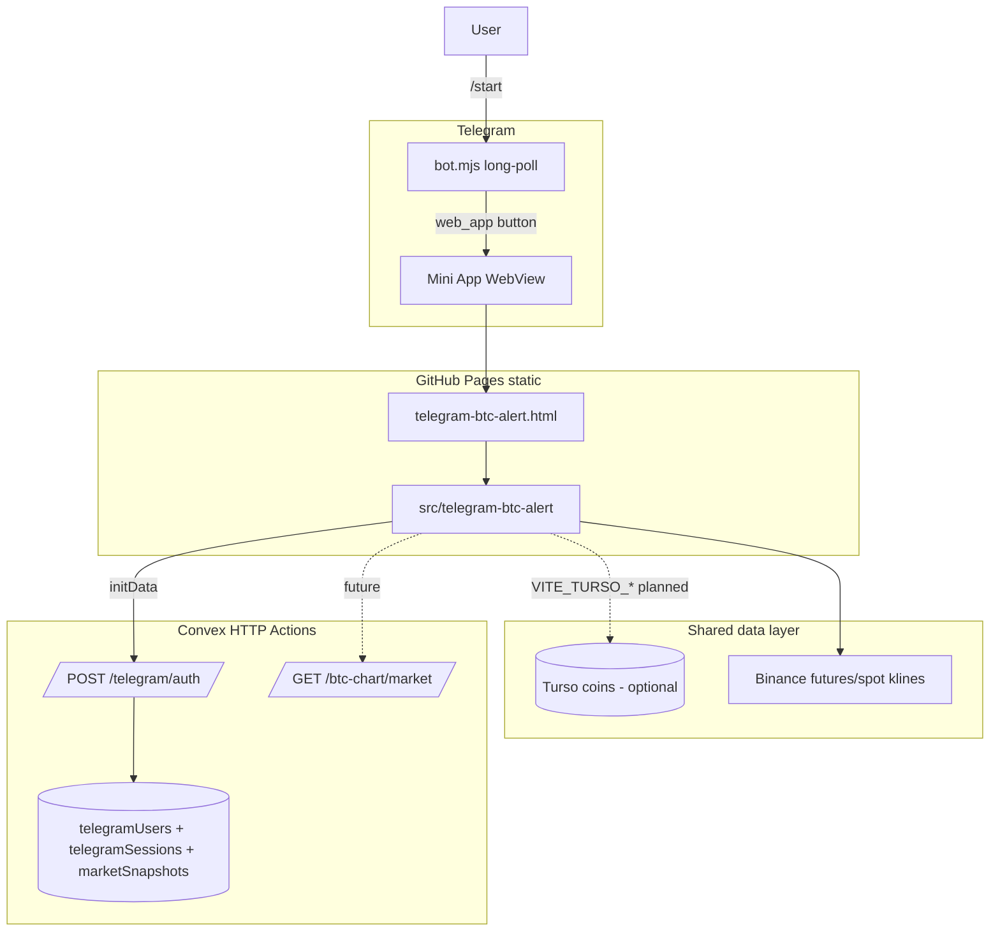

# Telegram BTC Chart Alert — Technical Reference

**Status:** Shipped (v0.115.0 Mini App, v0.116.0 auto-login)  
**Companion:** [TECHNICAL.vi.md](./TECHNICAL.vi.md)

## Overview

The Telegram Mini App is a **standalone Vite entry** (not a Shadow DOM plugin). It
reuses pure logic from `plugins/btc-chart/lib/` via the `@btc-chart/*` alias and
presents a compact mobile UI for bias and trade setup alerts.



## File structure

```
telegram-btc-alert.html          # Vite HTML entry
src/telegram-btc-alert/
├── main.tsx                     # React bootstrap
├── App.tsx                      # Theme + wires hooks
├── telegram-btc-alert.css       # Telegram-themed UI
├── components/
│   ├── AlertScreen.tsx          # Symbol, interval, bias, plan UI
│   └── TelegramUserBar.tsx      # Auto-login user strip
├── hooks/
│   ├── useBtcAlert.ts           # 15s poll + haptic edge
│   └── useTelegramAuth.ts       # initData → session
└── lib/
    ├── analyze-alert.ts         # fetchKlines + Lux + ML + Trade Setup
    ├── telegram-webapp.ts       # Telegram.WebApp bridge
    ├── telegram-user.ts         # User types + localStorage session
    └── telegram-auth.ts         # POST Convex /telegram/auth

apps/telegram/
├── README.md                    # Ops quickstart (links here)
└── bot.mjs                      # /start, menu button, Web App URL

apps/convex/convex/
├── schema.ts                    # telegramUsers, telegramSessions
├── http.ts                      # /telegram/auth, /telegram/me
└── telegram/
    ├── validateInitData.ts      # HMAC verify (official WebApp rules)
    ├── mutations.ts             # createTelegramSession
    └── queries.ts               # getTelegramSession
```

## Build and alias

| Config | Role |
|--------|------|
| `vite.config.ts` | Rollup input `telegram-btc-alert`, alias `@btc-chart` → `plugins/btc-chart/lib` |
| `tsconfig.app.json` | Path mapping `@btc-chart/*` for TypeScript |
| `package.json` | `telegram:bot` script, version bump on ship |

Production bundle: `dist/telegram-btc-alert.html` + `dist/assets/telegram-btc-alert-*.js`
(~10 KB gzip chunk, shares `trade-setup` chunk with chart logic).

## Analysis engine (Mini App scope)

`analyze-alert.ts` mirrors the **lightweight** chart path:

| Module | Included | Notes |
|--------|----------|-------|
| Lux NWE | Yes | Same `calcNadarayaWatson` config as chart |
| ML signal | Yes | `DEFAULT_SIGNAL_CONFIG` Lux+SMC preset weights (SMC votes absent) |
| Adaptive MA gate | Yes | `computeAdaptiveMaSeries` / `snapshotAdaptiveMa` |
| Trade Setup | Yes | `calcTradeSetup` + `stabilizeTradeSetup` |
| SMC WASM | **No** | Too heavy for Telegram WebView; fewer confluence votes |
| ICT / Liquidity | **No** | Not wired in Mini App |
| Turso coin list | **No** (yet) | Symbol typed manually; see ROADMAP Phase 1 |

### Why large red candles may not flip Trade Setup

Trade Setup uses **confluence voting** (`bear >= 2 && bear > bull`), not single-candle
rules. A large dump can push price to the lower Lux band (mean-reversion bull vote),
while ML stays NEUTRAL and SMC votes are missing in the Mini App. See
[btc-chart/trade-setup.md](../btc-chart/trade-setup.md).

## Auto-login

### Client flow

1. User opens Mini App from bot (menu button or inline `web_app` keyboard).
2. Telegram injects signed `Telegram.WebApp.initData` and `initDataUnsafe.user`.
3. `useTelegramAuth`:
   - Restores `localStorage` session if same `telegramId`.
   - If `VITE_CONVEX_SITE_URL` is set: `POST {site}/telegram/auth` with `initData`.
   - On success: session token, `verified: true`, 7-day TTL.
   - On failure or missing Convex: local session from `initDataUnsafe` (`verified: false`).
4. `TelegramUserBar` shows avatar, name, `@username`, and verification hint.

### Server validation (`validateInitData.ts`)

Per [Telegram WebApp docs](https://core.telegram.org/bots/webapps#validating-data-received-via-the-mini-app):

1. Parse `initData` query string, remove `hash`.
2. `data_check_string` = sorted `key=value` joined by `\n`.
3. `secret_key = HMAC_SHA256(key="WebAppData", msg=bot_token)`.
4. `calculated_hash = HMAC_SHA256(secret_key, data_check_string)` hex.
5. Reject if `auth_date` older than 24 hours.

### Convex HTTP routes

| Method | Path | Body / headers | Response |
|--------|------|----------------|----------|
| `POST` | `/telegram/auth` | `{ initData: string }` | `{ token, user, verified, expiresAt }` |
| `GET` | `/telegram/me` | `Authorization: Bearer <token>` | `{ user, verified, expiresAt }` |
| `OPTIONS` | both | CORS preflight | `204` |

Tables:

- `telegramUsers`: profile keyed by `telegramId`
- `telegramSessions`: opaque token, `expiresAt`

## Turso and Convex together

| Concern | Turso | Convex |
|---------|-------|--------|
| Coin catalog (`coins` table) | **Yes** (read token in client) | No |
| `TELEGRAM_BOT_TOKEN` | **Never** (client bundle) | **Yes** (server env) |
| Session tokens | **Never** (client read only) | **Yes** |
| User preferences | Optional via Convex action + admin token | **Preferred** |
| Market snapshot cache | No | **Yes** (`marketSnapshots`) |
| Push alert cron | No | **Planned** |

Full ADR: [decisions/telegram-data-backend.md](../decisions/telegram-data-backend.md).

## Environment variables

### Frontend build (`VITE_*`)

```bash
VITE_CONVEX_SITE_URL=https://<deployment>.convex.site   # optional; enables verified login
VITE_TURSO_DB_URL=libsql://...                        # optional; Phase 1 coin picker
VITE_TURSO_DB_READ_TOKEN=...                          # read-only; safe in bundle
```

### Convex dashboard

```bash
TELEGRAM_BOT_TOKEN=<BotFather token>
CLIENT_ORIGIN=http://localhost:5173,https://longphu25.github.io,https://longphu.com
```

### Bot host (`apps/telegram/bot.mjs`)

```bash
TELEGRAM_BOT_TOKEN=...
TELEGRAM_WEBAPP_URL=https://longphu25.github.io/profile/telegram-btc-alert.html
```

### Turso admin (scripts only, not Mini App)

```bash
TURSO_DB_URL=...
TURSO_ADMIN_TOKEN=...    # bun scripts/turso-coins.mjs
```

## Bot behavior

`bot.mjs` uses Telegram Bot API long polling (no extra npm deps):

- `setChatMenuButton` on startup: **Chart Alert** → Web App URL
- `/start [param]` → welcome + inline `web_app` button; optional `start_param`
- `/chart` → same Web App button

Deep link examples:

- `https://t.me/YourBot/chart?startapp=REUSDT_5m`
- `/start REUSDT_5m` → passes `tgWebAppStartParam` in button URL

`useBtcAlert` parses `start_param` via `parseAlertStartParam`: `BTCUSDT`, `REUSDT_5m`, `ETHUSDT-1h`.

## Polling and UX

| Constant | Value |
|----------|-------|
| `POLL_MS` | 15_000 |
| Haptic | `medium` when bias/plan key changes |
| Intervals | Same `INTERVALS` as btc-chart (`5m` default) |

## Tests

| File | Coverage |
|------|----------|
| `tests/unit/telegram-init-data.test.ts` | HMAC validate accept/reject |
| `tests/unit/telegram-user.test.ts` | User parse helpers |

Run: `bun test tests/unit/telegram-init-data.test.ts tests/unit/telegram-user.test.ts`

## Security notes

1. Never put `TELEGRAM_BOT_TOKEN` or `TURSO_ADMIN_TOKEN` in `VITE_*` vars.
2. Treat `initDataUnsafe` as display-only when Convex auth is unavailable.
3. Validate `initData` server-side before privileged actions (prefs write, paid features).
4. CORS on Convex must include the exact GitHub Pages origin.

## Deploy checklist

1. `bun run build` (set `VITE_CONVEX_SITE_URL` if using verified auth).
2. Push `main` → GitHub Pages publishes `dist/telegram-btc-alert.html`.
3. `bun run convex:deploy` with `TELEGRAM_BOT_TOKEN` in dashboard.
4. `bun run telegram:bot` on a host with outbound HTTPS (VPS, Fly, local tmux).
5. BotFather: confirm menu button URL matches production.

## References

- `apps/telegram/README.md`
- [ROADMAP.md](./ROADMAP.md)
- [stories/plans/24-telegram-btc-alert.md](../stories/plans/24-telegram-btc-alert.md)
- [btc-chart/TECHNICAL.md](../btc-chart/TECHNICAL.md)
- [Convex HTTP Actions](https://docs.convex.dev/functions/http-actions)