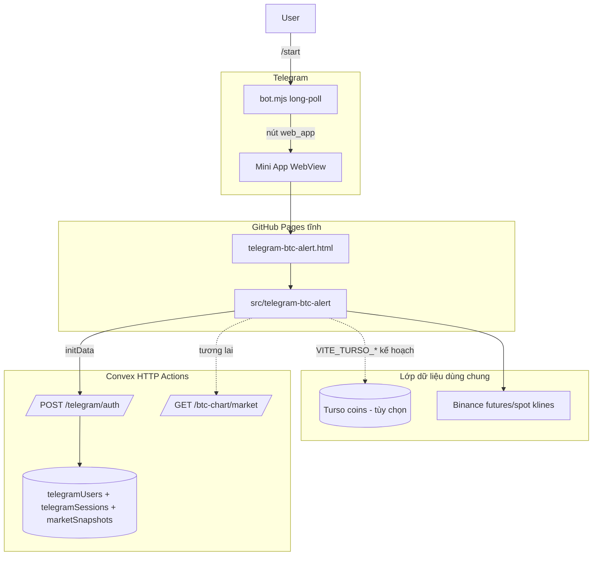

# Telegram BTC Chart Alert — Tài liệu kỹ thuật

**Trạng thái:** Đã ship (v0.115.0 Mini App, v0.116.0 auto-login)  
**Bản tiếng Anh:** [TECHNICAL.md](./TECHNICAL.md)

## Tổng quan

Telegram Mini App là **entry Vite độc lập** (không phải plugin Shadow DOM). App tái sử
dụng logic thuần từ `plugins/btc-chart/lib/` qua alias `@btc-chart/*` và hiển thị UI
gọn cho bias và trade setup.



## Cấu trúc file

```
telegram-btc-alert.html
src/telegram-btc-alert/
├── main.tsx, App.tsx, telegram-btc-alert.css
├── components/AlertScreen.tsx, TelegramUserBar.tsx
├── hooks/useBtcAlert.ts, useTelegramAuth.ts
└── lib/analyze-alert.ts, telegram-*.ts

apps/telegram/bot.mjs
apps/convex/convex/telegram/validateInitData.ts, mutations.ts, queries.ts
```

Chi tiết đầy đủ: [TECHNICAL.md](./TECHNICAL.md) (tiếng Anh, bảng module đầy đủ).

## Build và alias

| File | Vai trò |
|------|---------|
| `vite.config.ts` | Input `telegram-btc-alert`, alias `@btc-chart` |
| `tsconfig.app.json` | Path `@btc-chart/*` |
| `package.json` | Script `telegram:bot` |

Bundle production ~10 KB gzip; dùng chung chunk `trade-setup` với chart.

## Engine phân tích (phạm vi Mini App)

| Module | Có trong Mini App | Ghi chú |
|--------|-------------------|---------|
| Lux NWE | Có | Cùng config với chart |
| ML signal | Có | Không có vote SMC WASM |
| Adaptive MA gate | Có | Chặn plan khi giá lệch EMA |
| Trade Setup | Có | Confluence vote, cần >= 2 vote cùng hướng |
| SMC WASM | **Không** | Nặng cho WebView |
| Turso coin list | **Chưa** | Nhập symbol tay; xem ROADMAP Phase 1 |

### Vì sao nến đỏ lớn có thể không báo Short

Trade Setup dùng **bỏ phiếu confluence**, không phải rule một nến. Dump lớn thường
đẩy giá xuống band Lux dưới (vote bull mean-reversion). Xem
[btc-chart/trade-setup.vi.md](../btc-chart/trade-setup.vi.md).

## Auto-login

### Luồng client

1. User mở Mini App từ bot (menu hoặc nút inline).
2. Telegram inject `initData` (đã ký) và `initDataUnsafe.user`.
3. `useTelegramAuth`:
   - Khôi phục session `localStorage` nếu cùng `telegramId`.
   - Có `VITE_CONVEX_SITE_URL`: `POST /telegram/auth`.
   - Thành công: token, `verified: true`, TTL 7 ngày.
   - Thất bại: session local từ `initDataUnsafe` (`verified: false`).
4. `TelegramUserBar`: avatar, tên, `@username`, trạng thái xác thực.

### Xác thực server

HMAC theo tài liệu chính thức Telegram WebApp. `auth_date` tối đa 24 giờ.
Implementation: `apps/convex/convex/telegram/validateInitData.ts`.

### Route Convex

| Method | Path | Mô tả |
|--------|------|--------|
| `POST` | `/telegram/auth` | Đổi `initData` lấy session |
| `GET` | `/telegram/me` | Bearer token → user |

Bảng: `telegramUsers`, `telegramSessions`.

## Turso và Convex dùng chung

| Nhu cầu | Turso | Convex |
|---------|-------|--------|
| Danh sách coin | **Có** (read token client) | Không |
| Bot token / session | **Không** (không lộ client) | **Có** |
| User prefs | Qua action + admin token | **Ưu tiên** |
| Cache market | Không | **Có** |
| Cron push alert | Không | **Kế hoạch** |

ADR: [decisions/telegram-data-backend.vi.md](../decisions/telegram-data-backend.vi.md).

## Biến môi trường

### Build frontend

```bash
VITE_CONVEX_SITE_URL=https://<deployment>.convex.site
VITE_TURSO_DB_URL=libsql://...
VITE_TURSO_DB_READ_TOKEN=...
```

### Convex dashboard

```bash
TELEGRAM_BOT_TOKEN=...
CLIENT_ORIGIN=http://localhost:5173,https://longphu25.github.io,https://longphu.com
```

### Chạy bot

```bash
TELEGRAM_BOT_TOKEN=...
TELEGRAM_WEBAPP_URL=https://longphu25.github.io/profile/telegram-btc-alert.html
```

## Bot

- `setChatMenuButton`: **Chart Alert**
- `/start [param]`, `/chart`
- Deep link: `REUSDT_5m`, `BTCUSDT`, `ETHUSDT-1h`

## Poll và UX

- Poll mỗi **15 giây**
- Haptic `medium` khi bias hoặc plan đổi
- Interval mặc định `5m`

## Test

```bash
bun test tests/unit/telegram-init-data.test.ts tests/unit/telegram-user.test.ts
```

## Bảo mật

1. Không đưa `TELEGRAM_BOT_TOKEN` vào `VITE_*`.
2. `initDataUnsafe` chỉ tin khi hiển thị nếu chưa verify server.
3. Mọi hành động nhạy cảm phải verify `initData` server-side.

## Checklist deploy

1. `bun run build` (kèm `VITE_CONVEX_SITE_URL` nếu cần verify).
2. Push → GitHub Pages.
3. `bun run convex:deploy`.
4. `bun run telegram:bot` trên host có HTTPS ra ngoài.
5. BotFather: URL menu khớp production.

## Tham chiếu

- [ROADMAP.vi.md](./ROADMAP.vi.md)
- [stories/plans/24-telegram-btc-alert.vi.md](../stories/plans/24-telegram-btc-alert.vi.md)
- `apps/telegram/README.md`